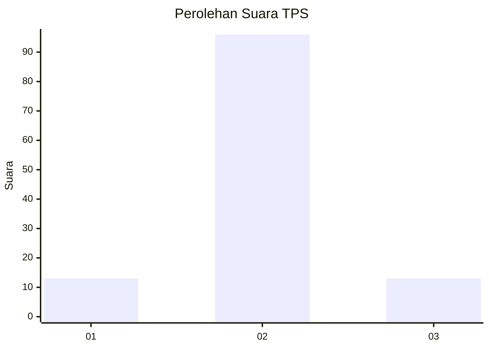
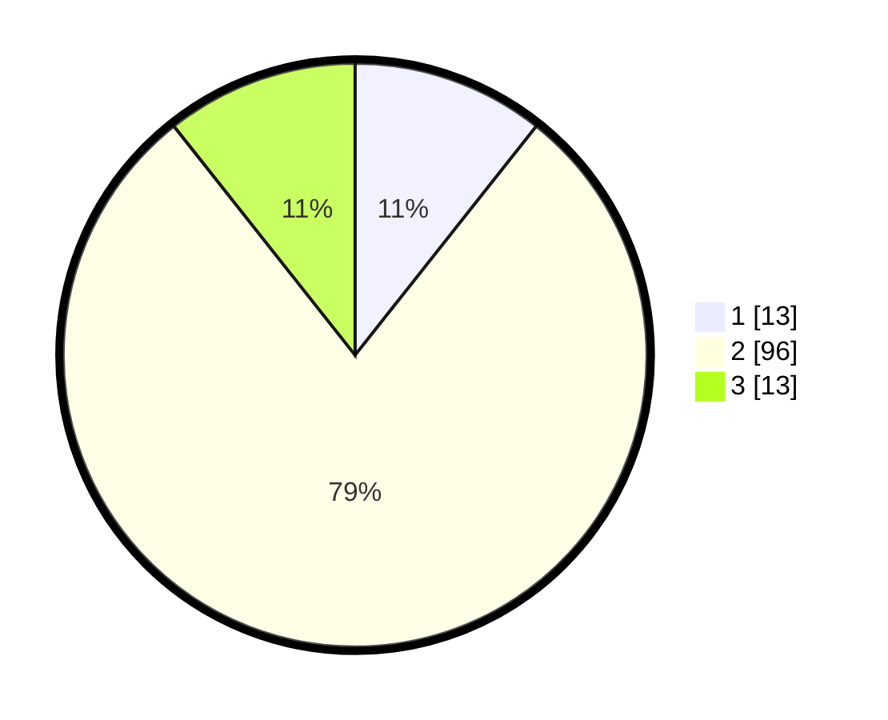

# Hasil

## Grafik

## Tabel

| No. | Nama Paslon    | Suara | Suara (raw) | Persentase |
|:--- |:-------------- | -----:| -----------:| ----------:|
| 1   | ANIES MUHAIMIN | 13    | [13][p-1]   | 10,66      |
| 2   | PRABOWO GIBRAN | 96    | [96][p-2]   | 78,69      |
| 3   | GANJAR MAHFUD  | 13    | [13][p-3]   | 10,66      |

[p-1]: https://github.com/gigit-pemilu/pemilu-2024-35-jawa-timur/blob/main/pilpres/hitung-suara/sub/35-jawa-timur/sub/09-jember/sub/25-jelbuk/sub/2004-jelbuk/sub/010-tps/sub/paslon-1.txt
[p-2]: https://github.com/gigit-pemilu/pemilu-2024-35-jawa-timur/blob/main/pilpres/hitung-suara/sub/35-jawa-timur/sub/09-jember/sub/25-jelbuk/sub/2004-jelbuk/sub/010-tps/sub/paslon-2.txt
[p-3]: https://github.com/gigit-pemilu/pemilu-2024-35-jawa-timur/blob/main/pilpres/hitung-suara/sub/35-jawa-timur/sub/09-jember/sub/25-jelbuk/sub/2004-jelbuk/sub/010-tps/sub/paslon-3.txt

## Foto C Plano

https://sirekap-obj-formc.kpu.go.id/8ff1/pemilu/ppwp/35/09/25/20/04/3509252004010-20240218-123555--5e2ebbb7-d0da-4e36-8994-2bda88618ce9.jpg

https://sirekap-obj-formc.kpu.go.id/8ff1/pemilu/ppwp/35/09/25/20/04/3509252004010-20240218-123651--fb4a4b3d-4e47-4ccf-9b99-976d747c61a0.jpg

https://sirekap-obj-formc.kpu.go.id/8ff1/pemilu/ppwp/35/09/25/20/04/3509252004010-20240218-123822--9a1a8f50-2f0e-4883-9efb-6e1d71d992a3.jpg

## Metadata

| Key        | Value               |
| ---------- | ------------------- |
| Time Stamp | 2024-02-25 14:00:00 |

