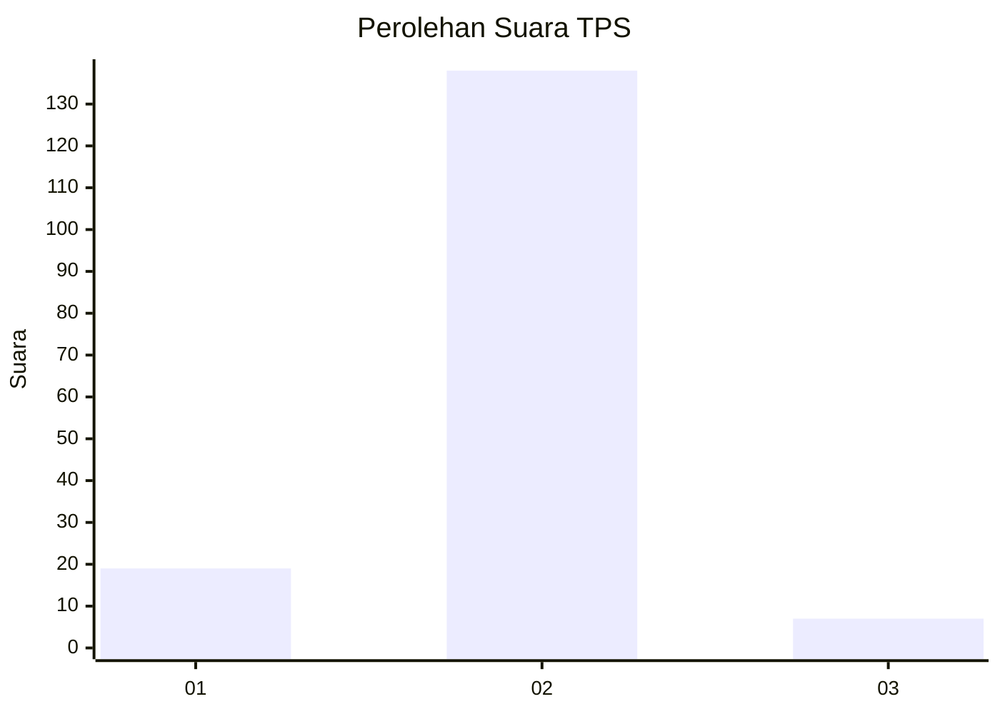
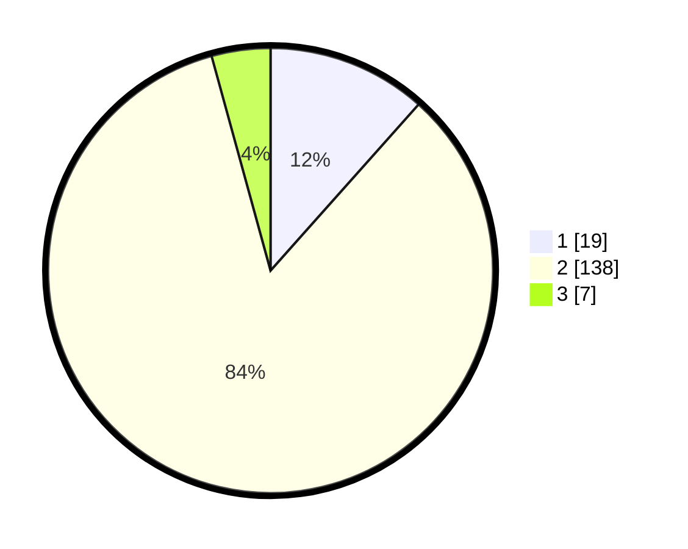

# Hasil

## Grafik

## Tabel

| No. | Nama Paslon    | Suara | Suara (raw) | Persentase |
|:--- |:-------------- | -----:| -----------:| ----------:|
| 1   | ANIES MUHAIMIN | 19    | [19][p-1]   | 11,59      |
| 2   | PRABOWO GIBRAN | 138   | [138][p-2]  | 84,15      |
| 3   | GANJAR MAHFUD  | 7     | [7][p-3]    | 4,27       |

[p-1]: https://github.com/gigit-pemilu/pemilu-2024/blob/main/pilpres/hitung-suara/sub/35-jawa-timur/sub/09-jember/sub/25-jelbuk/sub/2006-sugerkidul/sub/002-tps/sub/paslon-1.txt
[p-2]: https://github.com/gigit-pemilu/pemilu-2024/blob/main/pilpres/hitung-suara/sub/35-jawa-timur/sub/09-jember/sub/25-jelbuk/sub/2006-sugerkidul/sub/002-tps/sub/paslon-2.txt
[p-3]: https://github.com/gigit-pemilu/pemilu-2024/blob/main/pilpres/hitung-suara/sub/35-jawa-timur/sub/09-jember/sub/25-jelbuk/sub/2006-sugerkidul/sub/002-tps/sub/paslon-3.txt

## Foto C Plano

https://sirekap-obj-formc.kpu.go.id/7bf7/pemilu/ppwp/35/09/25/20/06/3509252006002-20240219-112933--716d8318-86db-476b-ac2a-497b5a0a2664.jpg

https://sirekap-obj-formc.kpu.go.id/7bf7/pemilu/ppwp/35/09/25/20/06/3509252006002-20240219-113006--e91abf0a-0fbc-4c33-9c19-dc5e22fa1666.jpg

https://sirekap-obj-formc.kpu.go.id/7bf7/pemilu/ppwp/35/09/25/20/06/3509252006002-20240219-113049--7f596aab-ad4a-43f5-97b4-b5eb32584d6b.jpg

## Metadata

| Key        | Value               |
| ---------- | ------------------- |
| Time Stamp | 2024-02-25 17:00:00 |

