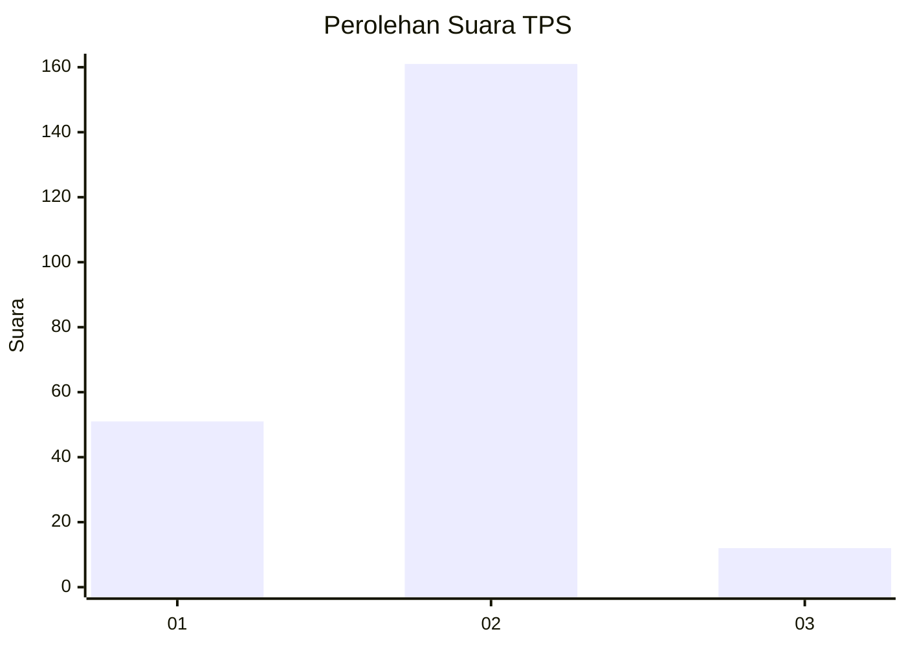
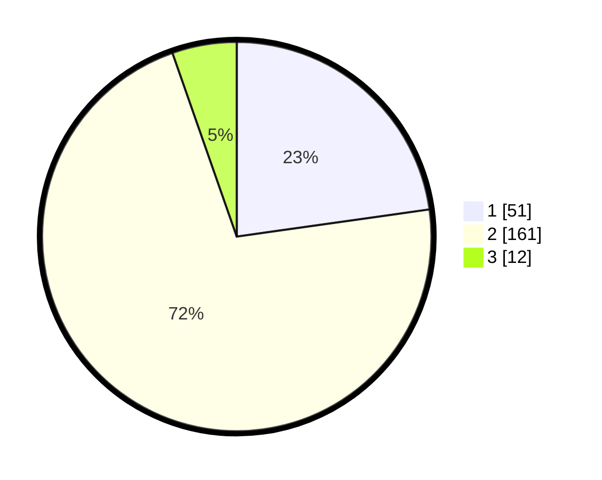

# Hasil

## Grafik

## Tabel

| No. | Nama Paslon    | Suara | Suara (raw) | Persentase |
|:--- |:-------------- | -----:| -----------:| ----------:|
| 1   | ANIES MUHAIMIN | 51    | [51][p-1]   | 22,77      |
| 2   | PRABOWO GIBRAN | 161   | [161][p-2]  | 71,88      |
| 3   | GANJAR MAHFUD  | 12    | [12][p-3]   | 5,36       |

[p-1]: https://github.com/gigit-pemilu/pemilu-2024/blob/main/pilpres/hitung-suara/sub/35-jawa-timur/sub/09-jember/sub/25-jelbuk/sub/2006-sugerkidul/sub/003-tps/sub/paslon-1.txt
[p-2]: https://github.com/gigit-pemilu/pemilu-2024/blob/main/pilpres/hitung-suara/sub/35-jawa-timur/sub/09-jember/sub/25-jelbuk/sub/2006-sugerkidul/sub/003-tps/sub/paslon-2.txt
[p-3]: https://github.com/gigit-pemilu/pemilu-2024/blob/main/pilpres/hitung-suara/sub/35-jawa-timur/sub/09-jember/sub/25-jelbuk/sub/2006-sugerkidul/sub/003-tps/sub/paslon-3.txt

## Foto C Plano

https://sirekap-obj-formc.kpu.go.id/9b87/pemilu/ppwp/35/09/25/20/06/3509252006003-20240219-113231--3c67c3ad-4172-4ec4-b1e6-ae3ece6dcb15.jpg

https://sirekap-obj-formc.kpu.go.id/9b87/pemilu/ppwp/35/09/25/20/06/3509252006003-20240219-113310--0a1f179d-863c-4566-a905-9456866ce235.jpg

https://sirekap-obj-formc.kpu.go.id/9b87/pemilu/ppwp/35/09/25/20/06/3509252006003-20240219-113355--8127b508-35fb-4ea5-92e8-ff24cc5c33b4.jpg

## Metadata

| Key        | Value               |
| ---------- | ------------------- |
| Time Stamp | 2024-02-24 22:31:28 |

