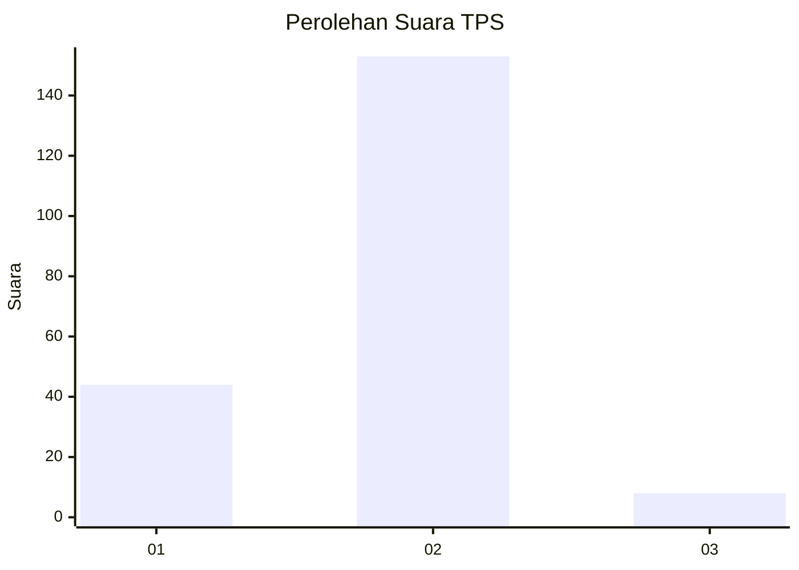

# Hasil

## Grafik

## Tabel

| No. | Nama Paslon    | Suara | Suara (raw) | Persentase |
|:--- |:-------------- | -----:| -----------:| ----------:|
| 1   | ANIES MUHAIMIN | 44    | [44][p-1]   | 21,46      |
| 2   | PRABOWO GIBRAN | 153   | [153][p-2]  | 74,63      |
| 3   | GANJAR MAHFUD  | 8     | [8][p-3]    | 3,90       |

[p-1]: https://github.com/gigit-pemilu/pemilu-2024-35-jawa-timur/blob/main/pilpres/hitung-suara/sub/35-jawa-timur/sub/09-jember/sub/25-jelbuk/sub/2006-sugerkidul/sub/005-tps/sub/paslon-1.txt
[p-2]: https://github.com/gigit-pemilu/pemilu-2024-35-jawa-timur/blob/main/pilpres/hitung-suara/sub/35-jawa-timur/sub/09-jember/sub/25-jelbuk/sub/2006-sugerkidul/sub/005-tps/sub/paslon-2.txt
[p-3]: https://github.com/gigit-pemilu/pemilu-2024-35-jawa-timur/blob/main/pilpres/hitung-suara/sub/35-jawa-timur/sub/09-jember/sub/25-jelbuk/sub/2006-sugerkidul/sub/005-tps/sub/paslon-3.txt

## Foto C Plano

https://sirekap-obj-formc.kpu.go.id/f0b3/pemilu/ppwp/35/09/25/20/06/3509252006005-20240219-113930--e866c0b3-c6cd-498a-9242-618b423416c8.jpg

https://sirekap-obj-formc.kpu.go.id/f0b3/pemilu/ppwp/35/09/25/20/06/3509252006005-20240219-114020--b86623fd-2f61-4caa-a650-3a2cc5adc8f6.jpg

https://sirekap-obj-formc.kpu.go.id/f0b3/pemilu/ppwp/35/09/25/20/06/3509252006005-20240219-114147--d752d76f-0f4c-42b4-874d-6ced7145c547.jpg

## Metadata

| Key        | Value               |
| ---------- | ------------------- |
| Time Stamp | 2024-02-25 20:00:00 |

