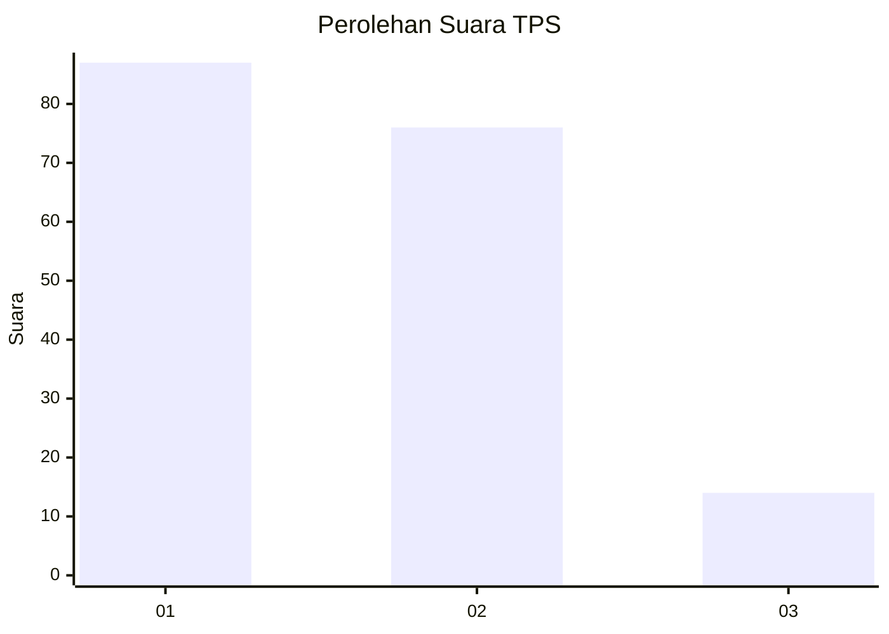
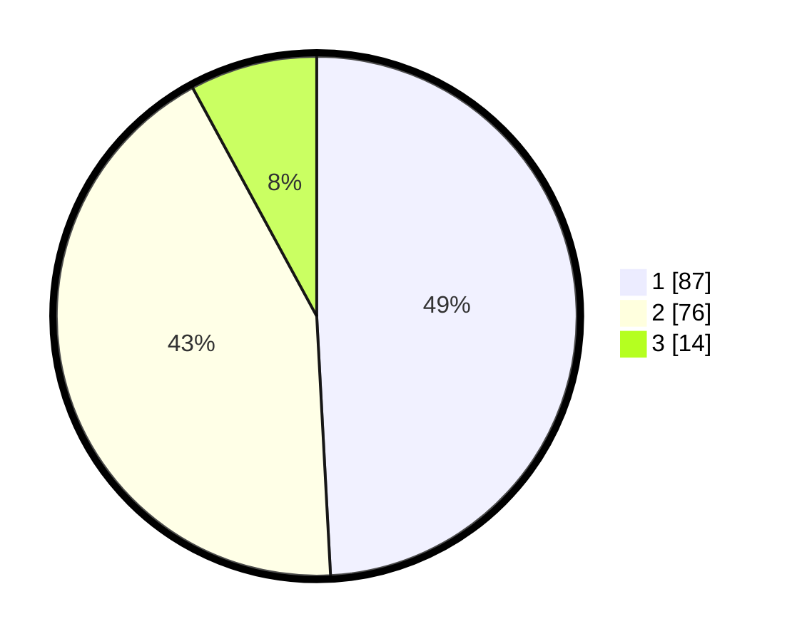

# Hasil

## Grafik

## Tabel

| No. | Nama Paslon    | Suara | Suara (raw) | Persentase |
|:--- |:-------------- | -----:| -----------:| ----------:|
| 1   | ANIES MUHAIMIN | 87    | [87][p-1]   | 49,15      |
| 2   | PRABOWO GIBRAN | 76    | [76][p-2]   | 42,94      |
| 3   | GANJAR MAHFUD  | 14    | [14][p-3]   | 7,91       |

[p-1]: https://github.com/gigit-pemilu/pemilu-2024-35-jawa-timur/blob/main/pilpres/hitung-suara/sub/35-jawa-timur/sub/09-jember/sub/25-jelbuk/sub/2006-sugerkidul/sub/006-tps/sub/paslon-1.txt
[p-2]: https://github.com/gigit-pemilu/pemilu-2024-35-jawa-timur/blob/main/pilpres/hitung-suara/sub/35-jawa-timur/sub/09-jember/sub/25-jelbuk/sub/2006-sugerkidul/sub/006-tps/sub/paslon-2.txt
[p-3]: https://github.com/gigit-pemilu/pemilu-2024-35-jawa-timur/blob/main/pilpres/hitung-suara/sub/35-jawa-timur/sub/09-jember/sub/25-jelbuk/sub/2006-sugerkidul/sub/006-tps/sub/paslon-3.txt

## Foto C Plano

https://sirekap-obj-formc.kpu.go.id/235a/pemilu/ppwp/35/09/25/20/06/3509252006006-20240219-114335--a7154def-7fb4-4726-88d2-ae98052a868e.jpg

https://sirekap-obj-formc.kpu.go.id/235a/pemilu/ppwp/35/09/25/20/06/3509252006006-20240219-114431--93146df3-3a45-486f-b86c-6d3bb7b32159.jpg

https://sirekap-obj-formc.kpu.go.id/235a/pemilu/ppwp/35/09/25/20/06/3509252006006-20240219-114538--c02c1cc6-020d-4de1-aa58-3f7485b8a8ec.jpg

## Metadata

| Key        | Value               |
| ---------- | ------------------- |
| Time Stamp | 2024-02-24 22:31:28 |

