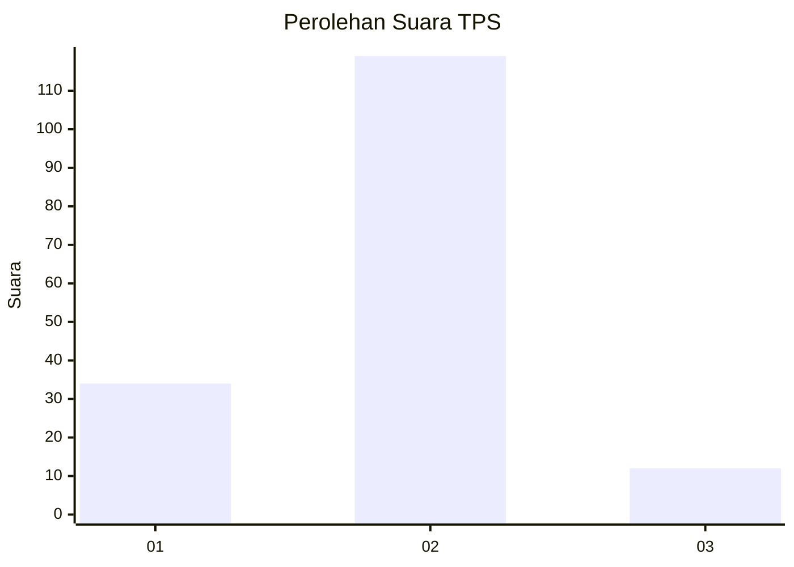
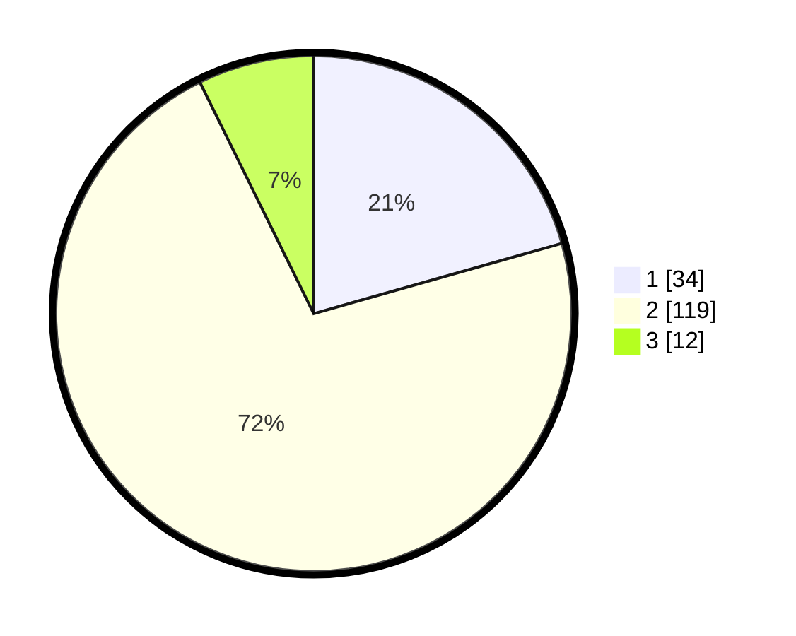

# Hasil

## Grafik

## Tabel

| No. | Nama Paslon    | Suara | Suara (raw) | Persentase |
|:--- |:-------------- | -----:| -----------:| ----------:|
| 1   | ANIES MUHAIMIN | 34    | [34][p-1]   | 20,61      |
| 2   | PRABOWO GIBRAN | 119   | [119][p-2]  | 72,12      |
| 3   | GANJAR MAHFUD  | 12    | [12][p-3]   | 7,27       |

[p-1]: https://github.com/gigit-pemilu/pemilu-2024-35-jawa-timur/blob/main/pilpres/hitung-suara/sub/35-jawa-timur/sub/09-jember/sub/25-jelbuk/sub/2006-sugerkidul/sub/007-tps/sub/paslon-1.txt
[p-2]: https://github.com/gigit-pemilu/pemilu-2024-35-jawa-timur/blob/main/pilpres/hitung-suara/sub/35-jawa-timur/sub/09-jember/sub/25-jelbuk/sub/2006-sugerkidul/sub/007-tps/sub/paslon-2.txt
[p-3]: https://github.com/gigit-pemilu/pemilu-2024-35-jawa-timur/blob/main/pilpres/hitung-suara/sub/35-jawa-timur/sub/09-jember/sub/25-jelbuk/sub/2006-sugerkidul/sub/007-tps/sub/paslon-3.txt

## Foto C Plano

https://sirekap-obj-formc.kpu.go.id/bb45/pemilu/ppwp/35/09/25/20/06/3509252006007-20240219-114839--5203ab6e-ecfb-4cae-936d-1a83ec9c8267.jpg

https://sirekap-obj-formc.kpu.go.id/bb45/pemilu/ppwp/35/09/25/20/06/3509252006007-20240219-114923--b5578da3-3b49-42b4-a753-6172640d951c.jpg

https://sirekap-obj-formc.kpu.go.id/bb45/pemilu/ppwp/35/09/25/20/06/3509252006007-20240219-114958--4173643e-c1ed-4162-85de-aaa55981b9a9.jpg

## Metadata

| Key        | Value               |
| ---------- | ------------------- |
| Time Stamp | 2024-02-25 12:00:00 |

