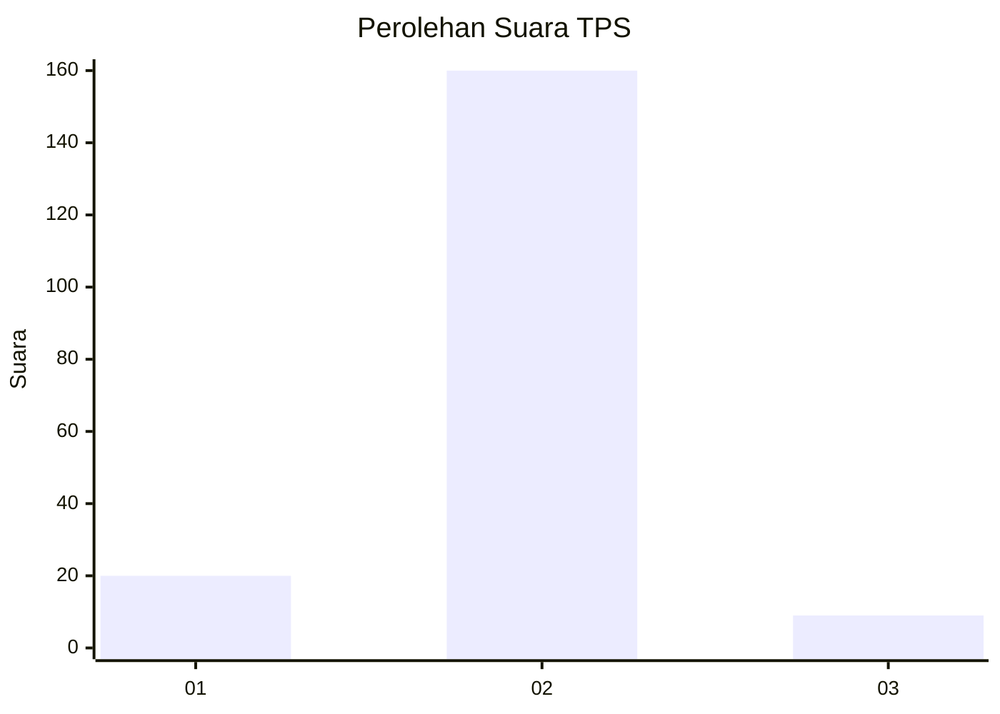
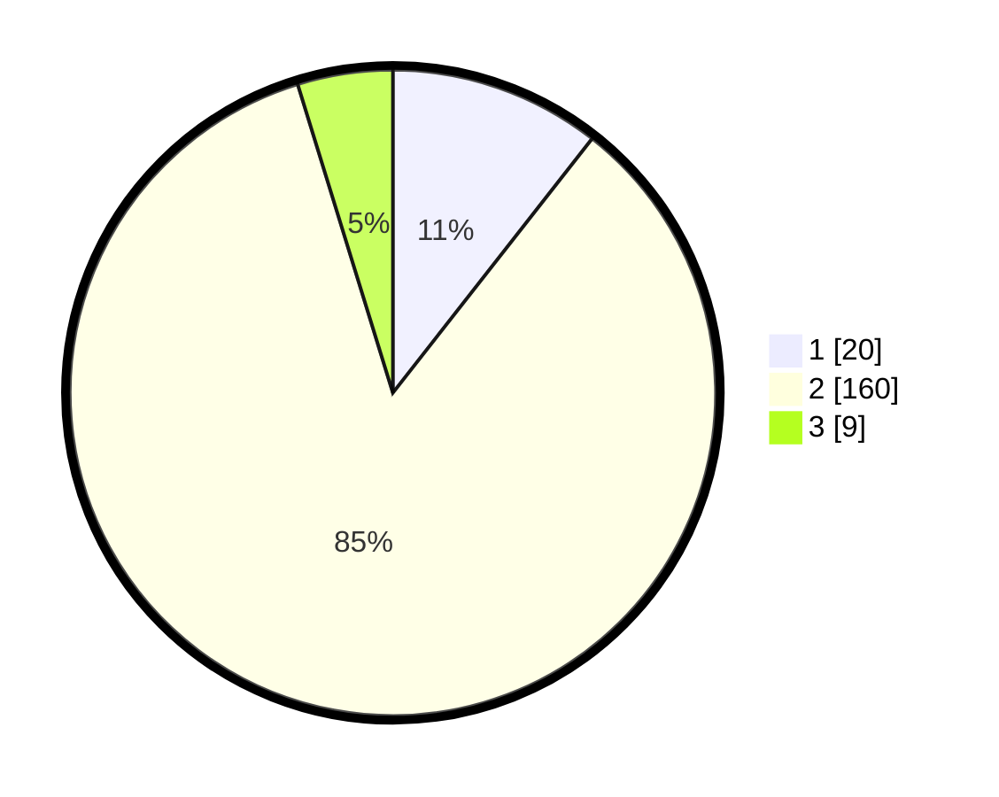

# Hasil

## Grafik

## Tabel

| No. | Nama Paslon    | Suara | Suara (raw) | Persentase |
|:--- |:-------------- | -----:| -----------:| ----------:|
| 1   | ANIES MUHAIMIN | 20    | [20][p-1]   | 10,58      |
| 2   | PRABOWO GIBRAN | 160   | [160][p-2]  | 84,66      |
| 3   | GANJAR MAHFUD  | 9     | [9][p-3]    | 4,76       |

[p-1]: https://github.com/gigit-pemilu/pemilu-2024-35-jawa-timur/blob/main/pilpres/hitung-suara/sub/35-jawa-timur/sub/09-jember/sub/25-jelbuk/sub/2006-sugerkidul/sub/009-tps/sub/paslon-1.txt
[p-2]: https://github.com/gigit-pemilu/pemilu-2024-35-jawa-timur/blob/main/pilpres/hitung-suara/sub/35-jawa-timur/sub/09-jember/sub/25-jelbuk/sub/2006-sugerkidul/sub/009-tps/sub/paslon-2.txt
[p-3]: https://github.com/gigit-pemilu/pemilu-2024-35-jawa-timur/blob/main/pilpres/hitung-suara/sub/35-jawa-timur/sub/09-jember/sub/25-jelbuk/sub/2006-sugerkidul/sub/009-tps/sub/paslon-3.txt

## Foto C Plano

https://sirekap-obj-formc.kpu.go.id/bbf1/pemilu/ppwp/35/09/25/20/06/3509252006009-20240219-115759--47ce40b1-b65c-4c1f-afb9-1622129f30b8.jpg

https://sirekap-obj-formc.kpu.go.id/bbf1/pemilu/ppwp/35/09/25/20/06/3509252006009-20240219-115845--0ea5d176-5736-4ac5-9022-8011036c9b6d.jpg

https://sirekap-obj-formc.kpu.go.id/bbf1/pemilu/ppwp/35/09/25/20/06/3509252006009-20240219-115933--cb46180f-2295-4d10-8ddb-e128e12692f6.jpg

## Metadata

| Key        | Value               |
| ---------- | ------------------- |
| Time Stamp | 2024-02-24 22:31:28 |

