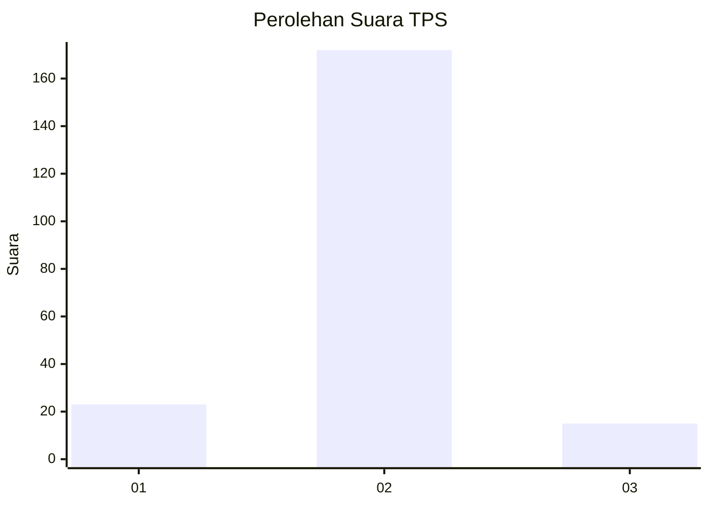
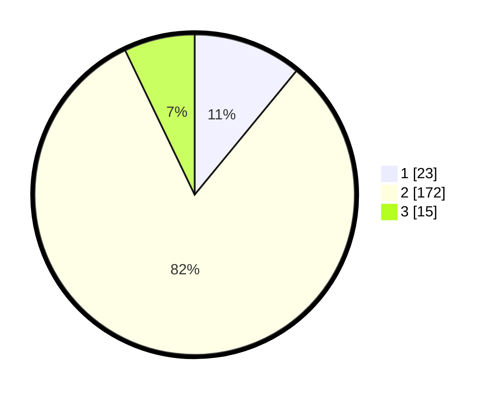

# Hasil

## Grafik

## Tabel

| No. | Nama Paslon    | Suara | Suara (raw) | Persentase |
|:--- |:-------------- | -----:| -----------:| ----------:|
| 1   | ANIES MUHAIMIN | 23    | [23][p-1]   | 10,95      |
| 2   | PRABOWO GIBRAN | 172   | [172][p-2]  | 81,90      |
| 3   | GANJAR MAHFUD  | 15    | [15][p-3]   | 7,14       |

[p-1]: https://github.com/gigit-pemilu/pemilu-2024/blob/main/pilpres/hitung-suara/sub/35-jawa-timur/sub/09-jember/sub/25-jelbuk/sub/2006-sugerkidul/sub/010-tps/sub/paslon-1.txt
[p-2]: https://github.com/gigit-pemilu/pemilu-2024/blob/main/pilpres/hitung-suara/sub/35-jawa-timur/sub/09-jember/sub/25-jelbuk/sub/2006-sugerkidul/sub/010-tps/sub/paslon-2.txt
[p-3]: https://github.com/gigit-pemilu/pemilu-2024/blob/main/pilpres/hitung-suara/sub/35-jawa-timur/sub/09-jember/sub/25-jelbuk/sub/2006-sugerkidul/sub/010-tps/sub/paslon-3.txt

## Foto C Plano

https://sirekap-obj-formc.kpu.go.id/9cfb/pemilu/ppwp/35/09/25/20/06/3509252006010-20240219-120129--857d4e4e-34ab-4d63-938b-920e14a62400.jpg

https://sirekap-obj-formc.kpu.go.id/9cfb/pemilu/ppwp/35/09/25/20/06/3509252006010-20240219-120231--70ccf906-21ea-4413-b961-f39654e46bd6.jpg

https://sirekap-obj-formc.kpu.go.id/9cfb/pemilu/ppwp/35/09/25/20/06/3509252006010-20240219-120310--fc6bed44-0dcb-429c-a2b9-37cdc3caf0fa.jpg

## Metadata

| Key        | Value               |
| ---------- | ------------------- |
| Time Stamp | 2024-02-25 18:00:00 |

