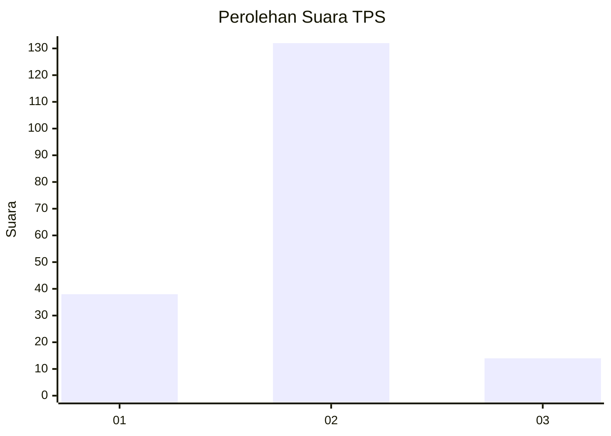
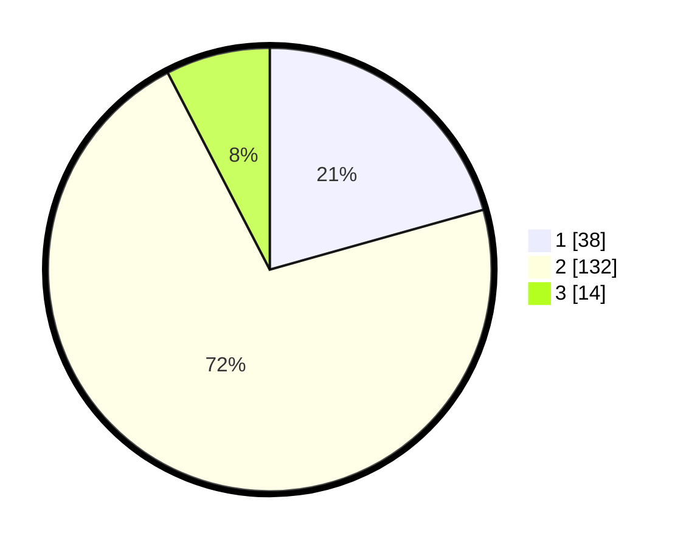

# Hasil

## Grafik

## Tabel

| No. | Nama Paslon    | Suara | Suara (raw) | Persentase |
|:--- |:-------------- | -----:| -----------:| ----------:|
| 1   | ANIES MUHAIMIN | 38    | [38][p-1]   | 20,65      |
| 2   | PRABOWO GIBRAN | 132   | [132][p-2]  | 71,74      |
| 3   | GANJAR MAHFUD  | 14    | [14][p-3]   | 7,61       |

[p-1]: https://github.com/gigit-pemilu/pemilu-2024/blob/main/pilpres/hitung-suara/sub/35-jawa-timur/sub/09-jember/sub/26-mayang/sub/2001-mrawan/sub/002-tps/sub/paslon-1.txt
[p-2]: https://github.com/gigit-pemilu/pemilu-2024/blob/main/pilpres/hitung-suara/sub/35-jawa-timur/sub/09-jember/sub/26-mayang/sub/2001-mrawan/sub/002-tps/sub/paslon-2.txt
[p-3]: https://github.com/gigit-pemilu/pemilu-2024/blob/main/pilpres/hitung-suara/sub/35-jawa-timur/sub/09-jember/sub/26-mayang/sub/2001-mrawan/sub/002-tps/sub/paslon-3.txt

## Foto C Plano

https://sirekap-obj-formc.kpu.go.id/6ccd/pemilu/ppwp/35/09/26/20/01/3509262001002-20240215-032254--2b213162-26a9-41df-9c98-fe0e8e64d0f1.jpg

https://sirekap-obj-formc.kpu.go.id/6ccd/pemilu/ppwp/35/09/26/20/01/3509262001002-20240215-031302--77e4f8f6-70a0-4c52-a8ca-92604f4d0f93.jpg

https://sirekap-obj-formc.kpu.go.id/6ccd/pemilu/ppwp/35/09/26/20/01/3509262001002-20240215-032817--462ff011-4986-4352-86c7-8c66c2bc140b.jpg

## Metadata

| Key        | Value               |
| ---------- | ------------------- |
| Time Stamp | 2024-02-24 22:31:28 |

