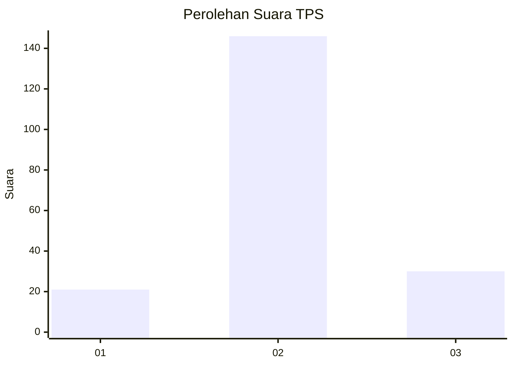
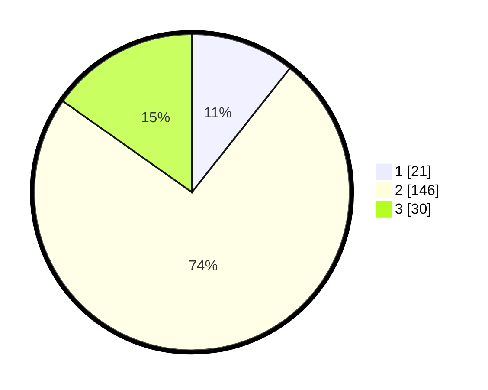

# Hasil

## Grafik

## Tabel

| No. | Nama Paslon    | Suara | Suara (raw) | Persentase |
|:--- |:-------------- | -----:| -----------:| ----------:|
| 1   | ANIES MUHAIMIN | 21    | [21][p-1]   | 10,66      |
| 2   | PRABOWO GIBRAN | 146   | [146][p-2]  | 74,11      |
| 3   | GANJAR MAHFUD  | 30    | [30][p-3]   | 15,23      |

[p-1]: https://github.com/gigit-pemilu/pemilu-2024/blob/main/pilpres/hitung-suara/sub/35-jawa-timur/sub/09-jember/sub/26-mayang/sub/2001-mrawan/sub/006-tps/sub/paslon-1.txt
[p-2]: https://github.com/gigit-pemilu/pemilu-2024/blob/main/pilpres/hitung-suara/sub/35-jawa-timur/sub/09-jember/sub/26-mayang/sub/2001-mrawan/sub/006-tps/sub/paslon-2.txt
[p-3]: https://github.com/gigit-pemilu/pemilu-2024/blob/main/pilpres/hitung-suara/sub/35-jawa-timur/sub/09-jember/sub/26-mayang/sub/2001-mrawan/sub/006-tps/sub/paslon-3.txt

## Foto C Plano

https://sirekap-obj-formc.kpu.go.id/3650/pemilu/ppwp/35/09/26/20/01/3509262001006-20240215-015030--5c7f7922-4af2-499a-ba88-2f39c72d7599.jpg

https://sirekap-obj-formc.kpu.go.id/3650/pemilu/ppwp/35/09/26/20/01/3509262001006-20240215-015249--7a5cdb57-214c-48ab-949b-9d010574c24a.jpg

https://sirekap-obj-formc.kpu.go.id/3650/pemilu/ppwp/35/09/26/20/01/3509262001006-20240215-015809--b9458c5f-fa8a-43b2-90b3-44b881f81c11.jpg

## Metadata

| Key        | Value               |
| ---------- | ------------------- |
| Time Stamp | 2024-02-25 16:00:00 |

