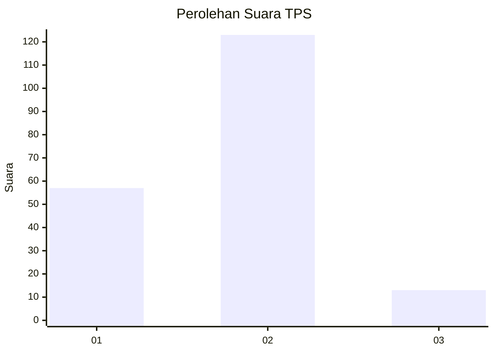
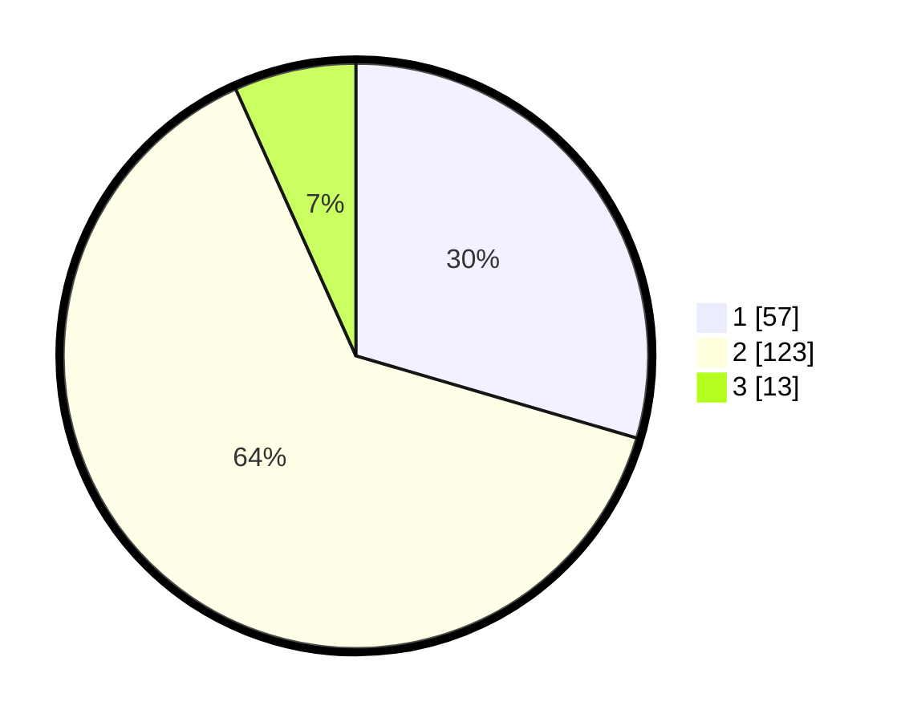

# Hasil

## Grafik

## Tabel

| No. | Nama Paslon    | Suara | Suara (raw) | Persentase |
|:--- |:-------------- | -----:| -----------:| ----------:|
| 1   | ANIES MUHAIMIN | 57    | [57][p-1]   | 29,53      |
| 2   | PRABOWO GIBRAN | 123   | [123][p-2]  | 63,73      |
| 3   | GANJAR MAHFUD  | 13    | [13][p-3]   | 6,74       |

[p-1]: https://github.com/gigit-pemilu/pemilu-2024-35-jawa-timur/blob/main/pilpres/hitung-suara/sub/35-jawa-timur/sub/09-jember/sub/26-mayang/sub/2001-mrawan/sub/007-tps/sub/paslon-1.txt
[p-2]: https://github.com/gigit-pemilu/pemilu-2024-35-jawa-timur/blob/main/pilpres/hitung-suara/sub/35-jawa-timur/sub/09-jember/sub/26-mayang/sub/2001-mrawan/sub/007-tps/sub/paslon-2.txt
[p-3]: https://github.com/gigit-pemilu/pemilu-2024-35-jawa-timur/blob/main/pilpres/hitung-suara/sub/35-jawa-timur/sub/09-jember/sub/26-mayang/sub/2001-mrawan/sub/007-tps/sub/paslon-3.txt

## Foto C Plano

https://sirekap-obj-formc.kpu.go.id/b7df/pemilu/ppwp/35/09/26/20/01/3509262001007-20240215-001939--e7421e57-c3fb-4e34-8c8c-f74f35ec2069.jpg

https://sirekap-obj-formc.kpu.go.id/b7df/pemilu/ppwp/35/09/26/20/01/3509262001007-20240215-002152--ec3bf42e-f49e-4035-a278-c3479194dc8c.jpg

https://sirekap-obj-formc.kpu.go.id/b7df/pemilu/ppwp/35/09/26/20/01/3509262001007-20240215-002310--bbd7832a-7315-4209-8bf0-fa64faf2b534.jpg

## Metadata

| Key        | Value               |
| ---------- | ------------------- |
| Time Stamp | 2024-02-15 21:01:18 |

