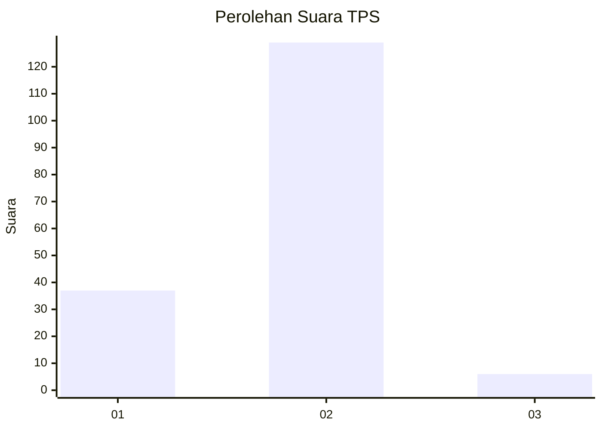

# Hasil

## Grafik

## Tabel

| No. | Nama Paslon    | Suara | Suara (raw) | Persentase |
|:--- |:-------------- | -----:| -----------:| ----------:|
| 1   | ANIES MUHAIMIN | 37    | [37][p-1]   | 21,51      |
| 2   | PRABOWO GIBRAN | 129   | [129][p-2]  | 75,00      |
| 3   | GANJAR MAHFUD  | 6     | [6][p-3]    | 3,49       |

[p-1]: https://github.com/gigit-pemilu/pemilu-2024-35-jawa-timur/blob/main/pilpres/hitung-suara/sub/35-jawa-timur/sub/09-jember/sub/26-mayang/sub/2001-mrawan/sub/014-tps/sub/paslon-1.txt
[p-2]: https://github.com/gigit-pemilu/pemilu-2024-35-jawa-timur/blob/main/pilpres/hitung-suara/sub/35-jawa-timur/sub/09-jember/sub/26-mayang/sub/2001-mrawan/sub/014-tps/sub/paslon-2.txt
[p-3]: https://github.com/gigit-pemilu/pemilu-2024-35-jawa-timur/blob/main/pilpres/hitung-suara/sub/35-jawa-timur/sub/09-jember/sub/26-mayang/sub/2001-mrawan/sub/014-tps/sub/paslon-3.txt

## Foto C Plano

https://sirekap-obj-formc.kpu.go.id/f654/pemilu/ppwp/35/09/26/20/01/3509262001014-20240215-005611--cecd67dd-3b56-4e03-8ac4-99fb407cc50d.jpg

https://sirekap-obj-formc.kpu.go.id/f654/pemilu/ppwp/35/09/26/20/01/3509262001014-20240215-005749--3b6f367d-bd0e-4fd7-80b4-7480c3f5cc8a.jpg

https://sirekap-obj-formc.kpu.go.id/f654/pemilu/ppwp/35/09/26/20/01/3509262001014-20240215-005854--a76904d2-ee00-4f2d-8982-1fcd39bc3938.jpg

## Metadata

| Key        | Value               |
| ---------- | ------------------- |
| Time Stamp | 2024-02-15 15:00:29 |

