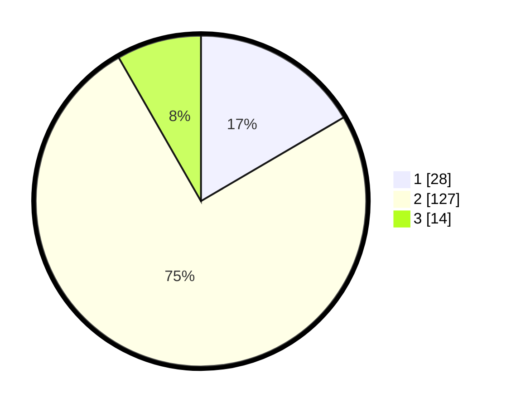

# Hasil

## Grafik

## Tabel

| No. | Nama Paslon    | Suara | Suara (raw) | Persentase |
|:--- |:-------------- | -----:| -----------:| ----------:|
| 1   | ANIES MUHAIMIN | 28    | [28][p-1]   | 16,57      |
| 2   | PRABOWO GIBRAN | 127   | [127][p-2]  | 75,15      |
| 3   | GANJAR MAHFUD  | 14    | [14][p-3]   | 8,28       |

[p-1]: https://github.com/gigit-pemilu/pemilu-2024-35-jawa-timur/blob/main/pilpres/hitung-suara/sub/35-jawa-timur/sub/09-jember/sub/26-mayang/sub/2001-mrawan/sub/021-tps/sub/paslon-1.txt
[p-2]: https://github.com/gigit-pemilu/pemilu-2024-35-jawa-timur/blob/main/pilpres/hitung-suara/sub/35-jawa-timur/sub/09-jember/sub/26-mayang/sub/2001-mrawan/sub/021-tps/sub/paslon-2.txt
[p-3]: https://github.com/gigit-pemilu/pemilu-2024-35-jawa-timur/blob/main/pilpres/hitung-suara/sub/35-jawa-timur/sub/09-jember/sub/26-mayang/sub/2001-mrawan/sub/021-tps/sub/paslon-3.txt

## Foto C Plano

https://sirekap-obj-formc.kpu.go.id/91d1/pemilu/ppwp/35/09/26/20/01/3509262001021-20240215-140147--29f2474e-d04d-44da-9a40-c6be2f3288f5.jpg

https://sirekap-obj-formc.kpu.go.id/91d1/pemilu/ppwp/35/09/26/20/01/3509262001021-20240215-140305--d182ff47-e109-44a9-a51a-37a1f353b860.jpg

https://sirekap-obj-formc.kpu.go.id/91d1/pemilu/ppwp/35/09/26/20/01/3509262001021-20240215-140427--02f2c063-196d-41d4-8586-71faaa758348.jpg

## Metadata

| Key        | Value               |
| ---------- | ------------------- |
| Time Stamp | 2024-02-25 17:00:00 |

