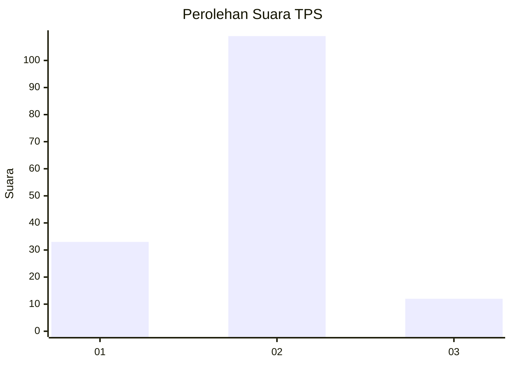
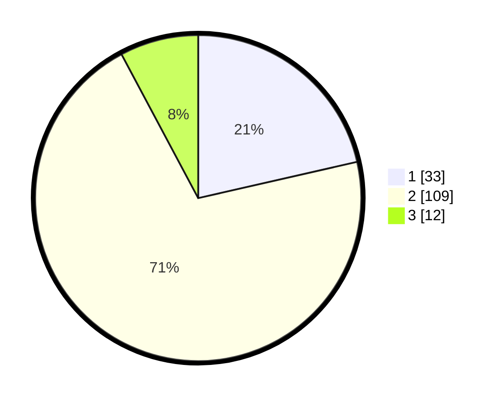

# Hasil

## Grafik

## Tabel

| No. | Nama Paslon    | Suara | Suara (raw) | Persentase |
|:--- |:-------------- | -----:| -----------:| ----------:|
| 1   | ANIES MUHAIMIN | 33    | [33][p-1]   | 21,43      |
| 2   | PRABOWO GIBRAN | 109   | [109][p-2]  | 70,78      |
| 3   | GANJAR MAHFUD  | 12    | [12][p-3]   | 7,79       |

[p-1]: https://github.com/gigit-pemilu/pemilu-2024-35-jawa-timur/blob/main/pilpres/hitung-suara/sub/35-jawa-timur/sub/09-jember/sub/26-mayang/sub/2002-mayang/sub/017-tps/sub/paslon-1.txt
[p-2]: https://github.com/gigit-pemilu/pemilu-2024-35-jawa-timur/blob/main/pilpres/hitung-suara/sub/35-jawa-timur/sub/09-jember/sub/26-mayang/sub/2002-mayang/sub/017-tps/sub/paslon-2.txt
[p-3]: https://github.com/gigit-pemilu/pemilu-2024-35-jawa-timur/blob/main/pilpres/hitung-suara/sub/35-jawa-timur/sub/09-jember/sub/26-mayang/sub/2002-mayang/sub/017-tps/sub/paslon-3.txt

## Foto C Plano

https://sirekap-obj-formc.kpu.go.id/9b0b/pemilu/ppwp/35/09/26/20/02/3509262002017-20240214-202451--897fe82c-131d-4069-bc6d-4550df8853a1.jpg

https://sirekap-obj-formc.kpu.go.id/9b0b/pemilu/ppwp/35/09/26/20/02/3509262002017-20240214-202650--9df7dbbf-7d59-4606-96c1-259d6a9e39e9.jpg

https://sirekap-obj-formc.kpu.go.id/9b0b/pemilu/ppwp/35/09/26/20/02/3509262002017-20240214-211341--baf30dc5-a52e-42da-8b01-3601a15d6d57.jpg

## Metadata

| Key        | Value               |
| ---------- | ------------------- |
| Time Stamp | 2024-02-15 00:41:44 |

