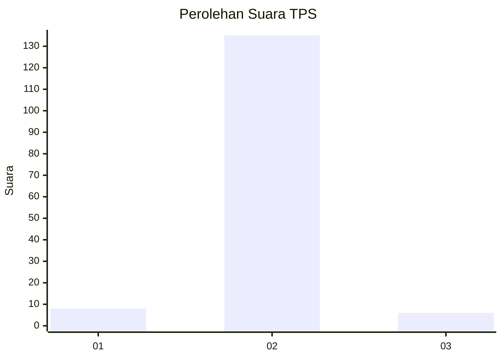
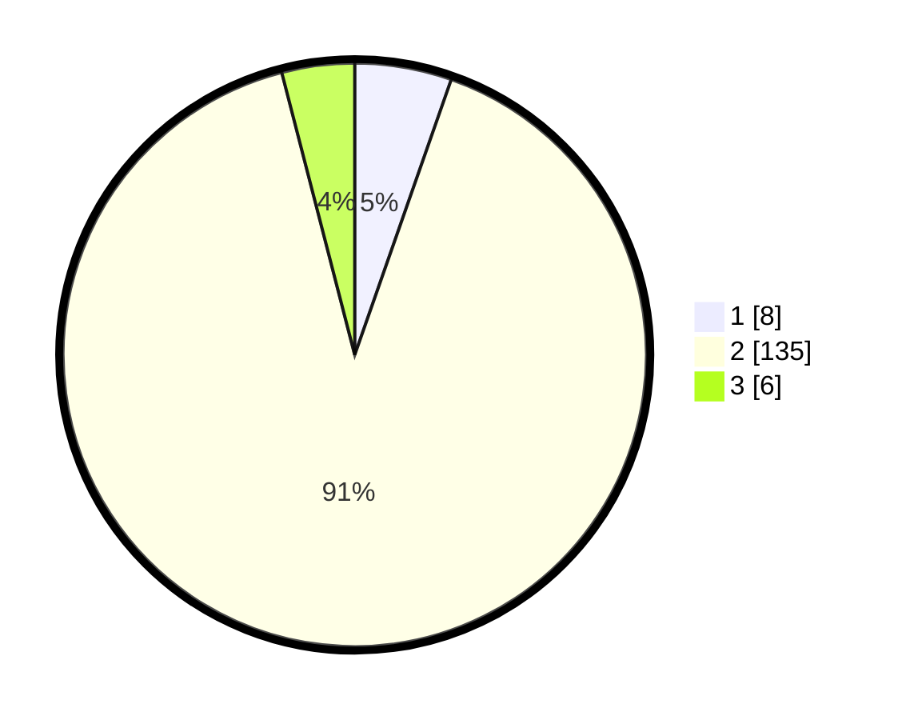

# Hasil

## Grafik

## Tabel

| No. | Nama Paslon    | Suara | Suara (raw) | Persentase |
|:--- |:-------------- | -----:| -----------:| ----------:|
| 1   | ANIES MUHAIMIN | 8     | [8][p-1]    | 5,37       |
| 2   | PRABOWO GIBRAN | 135   | [135][p-2]  | 90,60      |
| 3   | GANJAR MAHFUD  | 6     | [6][p-3]    | 4,03       |

[p-1]: https://github.com/gigit-pemilu/pemilu-2024/blob/main/pilpres/hitung-suara/sub/35-jawa-timur/sub/09-jember/sub/26-mayang/sub/2002-mayang/sub/018-tps/sub/paslon-1.txt
[p-2]: https://github.com/gigit-pemilu/pemilu-2024/blob/main/pilpres/hitung-suara/sub/35-jawa-timur/sub/09-jember/sub/26-mayang/sub/2002-mayang/sub/018-tps/sub/paslon-2.txt
[p-3]: https://github.com/gigit-pemilu/pemilu-2024/blob/main/pilpres/hitung-suara/sub/35-jawa-timur/sub/09-jember/sub/26-mayang/sub/2002-mayang/sub/018-tps/sub/paslon-3.txt

## Foto C Plano

https://sirekap-obj-formc.kpu.go.id/351a/pemilu/ppwp/35/09/26/20/02/3509262002018-20240215-023641--684fcf18-bf9b-487c-9e65-b668b0c1ab9e.jpg

https://sirekap-obj-formc.kpu.go.id/351a/pemilu/ppwp/35/09/26/20/02/3509262002018-20240215-024055--2d91de09-85b6-45dc-94dd-5b4e721fb8b2.jpg

https://sirekap-obj-formc.kpu.go.id/351a/pemilu/ppwp/35/09/26/20/02/3509262002018-20240215-024102--139c42e2-a7bc-451d-9e4f-478ecc8024cd.jpg

## Metadata

| Key        | Value               |
| ---------- | ------------------- |
| Time Stamp | 2024-02-15 12:00:28 |

