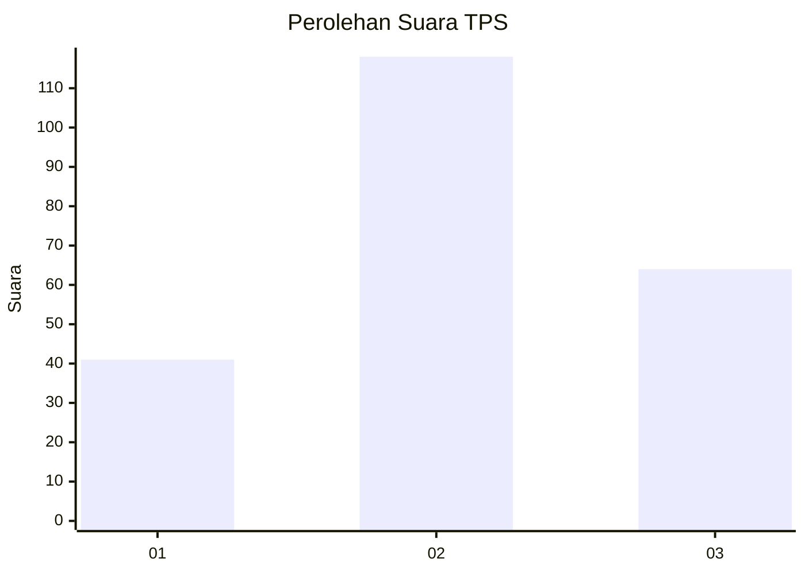
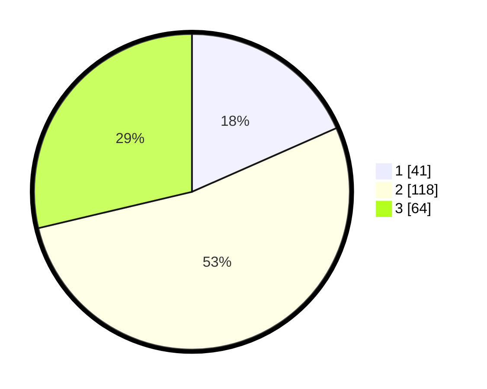

# Hasil

## Grafik

## Tabel

| No. | Nama Paslon    | Suara | Suara (raw) | Persentase |
|:--- |:-------------- | -----:| -----------:| ----------:|
| 1   | ANIES MUHAIMIN | 41    | [41][p-1]   | 18,39      |
| 2   | PRABOWO GIBRAN | 118   | [118][p-2]  | 52,91      |
| 3   | GANJAR MAHFUD  | 64    | [64][p-3]   | 28,70      |

[p-1]: https://github.com/gigit-pemilu/pemilu-2024/blob/main/pilpres/hitung-suara/sub/35-jawa-timur/sub/09-jember/sub/26-mayang/sub/2003-seputih/sub/005-tps/sub/paslon-1.txt
[p-2]: https://github.com/gigit-pemilu/pemilu-2024/blob/main/pilpres/hitung-suara/sub/35-jawa-timur/sub/09-jember/sub/26-mayang/sub/2003-seputih/sub/005-tps/sub/paslon-2.txt
[p-3]: https://github.com/gigit-pemilu/pemilu-2024/blob/main/pilpres/hitung-suara/sub/35-jawa-timur/sub/09-jember/sub/26-mayang/sub/2003-seputih/sub/005-tps/sub/paslon-3.txt

## Foto C Plano

https://sirekap-obj-formc.kpu.go.id/ec4e/pemilu/ppwp/35/09/26/20/03/3509262003005-20240214-201936--bcdc8de6-c8a1-47f8-92f3-b4188e19b1d9.jpg

https://sirekap-obj-formc.kpu.go.id/ec4e/pemilu/ppwp/35/09/26/20/03/3509262003005-20240214-202025--f72c8d12-934d-44dc-8560-67f4e15fd9ca.jpg

https://sirekap-obj-formc.kpu.go.id/ec4e/pemilu/ppwp/35/09/26/20/03/3509262003005-20240214-202130--b134e00d-de2a-4a9d-8fcc-9e3d1e007342.jpg

## Metadata

| Key        | Value               |
| ---------- | ------------------- |
| Time Stamp | 2024-02-15 12:00:28 |

