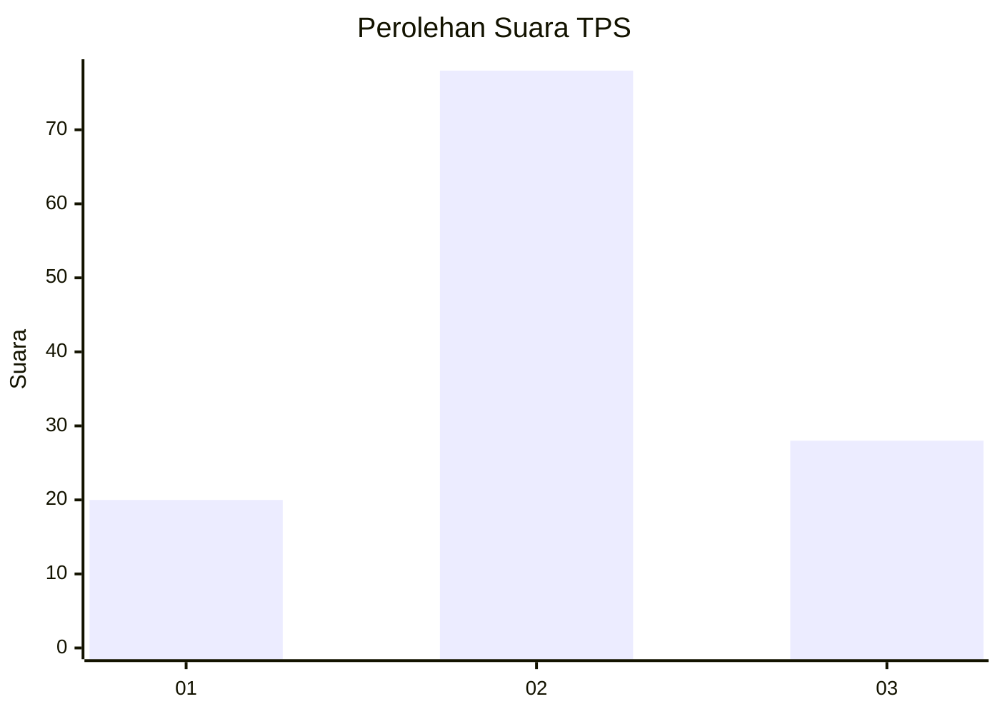
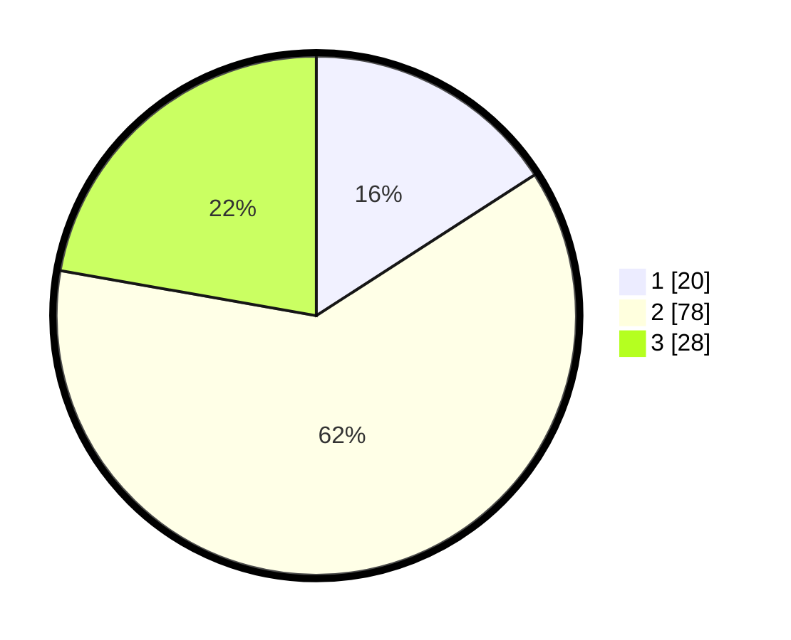

# Hasil

## Grafik

## Tabel

| No. | Nama Paslon    | Suara | Suara (raw) | Persentase |
|:--- |:-------------- | -----:| -----------:| ----------:|
| 1   | ANIES MUHAIMIN | 20    | [20][p-1]   | 15,87      |
| 2   | PRABOWO GIBRAN | 78    | [78][p-2]   | 61,90      |
| 3   | GANJAR MAHFUD  | 28    | [28][p-3]   | 22,22      |

[p-1]: https://github.com/gigit-pemilu/pemilu-2024-35-jawa-timur/blob/main/pilpres/hitung-suara/sub/35-jawa-timur/sub/09-jember/sub/26-mayang/sub/2003-seputih/sub/010-tps/sub/paslon-1.txt
[p-2]: https://github.com/gigit-pemilu/pemilu-2024-35-jawa-timur/blob/main/pilpres/hitung-suara/sub/35-jawa-timur/sub/09-jember/sub/26-mayang/sub/2003-seputih/sub/010-tps/sub/paslon-2.txt
[p-3]: https://github.com/gigit-pemilu/pemilu-2024-35-jawa-timur/blob/main/pilpres/hitung-suara/sub/35-jawa-timur/sub/09-jember/sub/26-mayang/sub/2003-seputih/sub/010-tps/sub/paslon-3.txt

## Foto C Plano

https://sirekap-obj-formc.kpu.go.id/955b/pemilu/ppwp/35/09/26/20/03/3509262003010-20240214-234452--ec45c414-ee50-44a0-90e2-f514b9cf33c8.jpg

https://sirekap-obj-formc.kpu.go.id/955b/pemilu/ppwp/35/09/26/20/03/3509262003010-20240214-234620--5e981765-cb37-4e60-9ce6-a96e6f3d501e.jpg

https://sirekap-obj-formc.kpu.go.id/955b/pemilu/ppwp/35/09/26/20/03/3509262003010-20240214-234706--75abfca5-a0fe-4639-8fcc-a8a53340502b.jpg

## Metadata

| Key        | Value               |
| ---------- | ------------------- |
| Time Stamp | 2024-02-15 12:00:28 |

