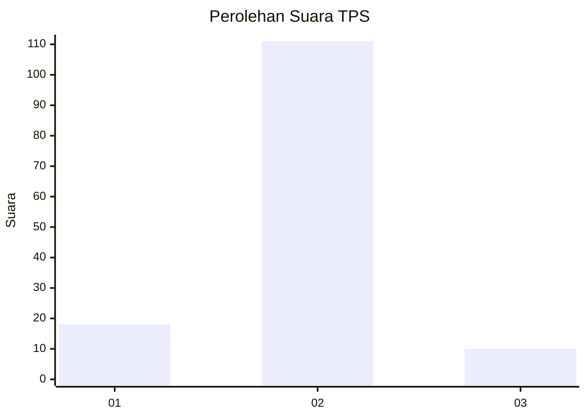
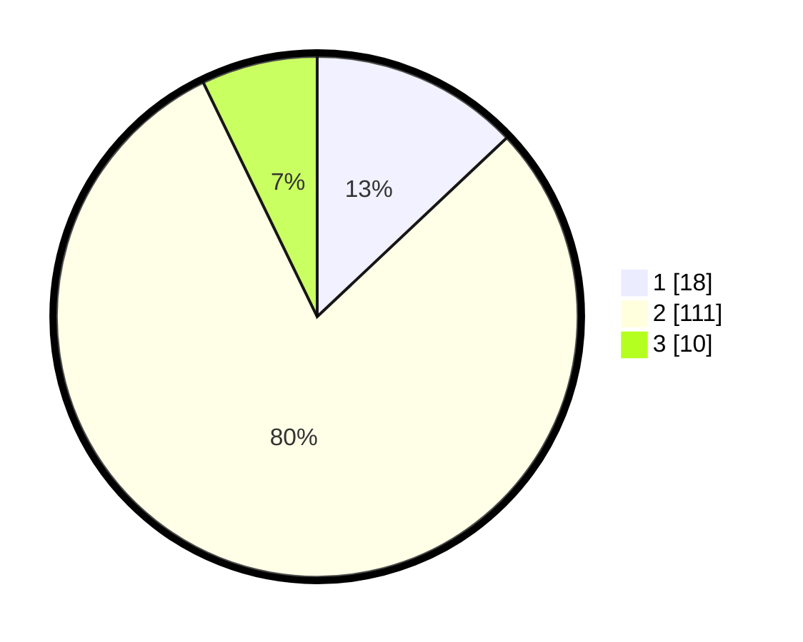

# Hasil

## Grafik

## Tabel

| No. | Nama Paslon    | Suara | Suara (raw) | Persentase |
|:--- |:-------------- | -----:| -----------:| ----------:|
| 1   | ANIES MUHAIMIN | 18    | [18][p-1]   | 12,95      |
| 2   | PRABOWO GIBRAN | 111   | [111][p-2]  | 79,86      |
| 3   | GANJAR MAHFUD  | 10    | [10][p-3]   | 7,19       |

[p-1]: https://github.com/gigit-pemilu/pemilu-2024/blob/main/pilpres/hitung-suara/sub/35-jawa-timur/sub/09-jember/sub/26-mayang/sub/2003-seputih/sub/014-tps/sub/paslon-1.txt
[p-2]: https://github.com/gigit-pemilu/pemilu-2024/blob/main/pilpres/hitung-suara/sub/35-jawa-timur/sub/09-jember/sub/26-mayang/sub/2003-seputih/sub/014-tps/sub/paslon-2.txt
[p-3]: https://github.com/gigit-pemilu/pemilu-2024/blob/main/pilpres/hitung-suara/sub/35-jawa-timur/sub/09-jember/sub/26-mayang/sub/2003-seputih/sub/014-tps/sub/paslon-3.txt

## Foto C Plano

https://sirekap-obj-formc.kpu.go.id/4c06/pemilu/ppwp/35/09/26/20/03/3509262003014-20240214-230304--0e4c1538-633a-4bc4-b8be-575f02673a78.jpg

https://sirekap-obj-formc.kpu.go.id/4c06/pemilu/ppwp/35/09/26/20/03/3509262003014-20240214-231130--82a66044-42d4-4409-a5da-02f39d8e66b7.jpg

https://sirekap-obj-formc.kpu.go.id/4c06/pemilu/ppwp/35/09/26/20/03/3509262003014-20240214-230818--1568e61d-d608-432b-8464-f1195ec62a85.jpg

## Metadata

| Key        | Value               |
| ---------- | ------------------- |
| Time Stamp | 2024-02-15 15:00:29 |

