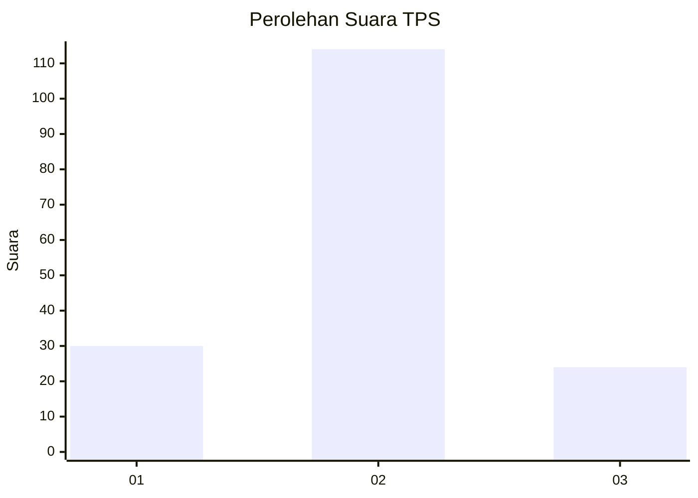
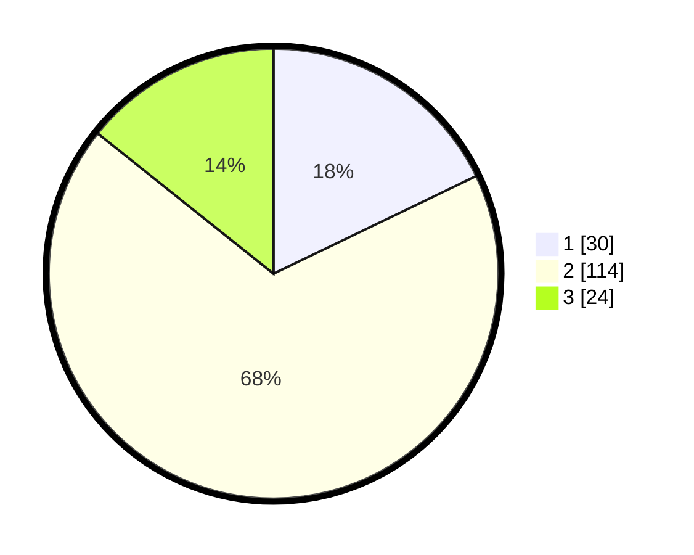

# Hasil

## Grafik

## Tabel

| No. | Nama Paslon    | Suara | Suara (raw) | Persentase |
|:--- |:-------------- | -----:| -----------:| ----------:|
| 1   | ANIES MUHAIMIN | 30    | [30][p-1]   | 17,86      |
| 2   | PRABOWO GIBRAN | 114   | [114][p-2]  | 67,86      |
| 3   | GANJAR MAHFUD  | 24    | [24][p-3]   | 14,29      |

[p-1]: https://github.com/gigit-pemilu/pemilu-2024-35-jawa-timur/blob/main/pilpres/hitung-suara/sub/35-jawa-timur/sub/09-jember/sub/26-mayang/sub/2003-seputih/sub/015-tps/sub/paslon-1.txt
[p-2]: https://github.com/gigit-pemilu/pemilu-2024-35-jawa-timur/blob/main/pilpres/hitung-suara/sub/35-jawa-timur/sub/09-jember/sub/26-mayang/sub/2003-seputih/sub/015-tps/sub/paslon-2.txt
[p-3]: https://github.com/gigit-pemilu/pemilu-2024-35-jawa-timur/blob/main/pilpres/hitung-suara/sub/35-jawa-timur/sub/09-jember/sub/26-mayang/sub/2003-seputih/sub/015-tps/sub/paslon-3.txt

## Foto C Plano

https://sirekap-obj-formc.kpu.go.id/0f9a/pemilu/ppwp/35/09/26/20/03/3509262003015-20240215-024106--d15c5dad-51f3-4797-b64e-5b65af54773a.jpg

https://sirekap-obj-formc.kpu.go.id/0f9a/pemilu/ppwp/35/09/26/20/03/3509262003015-20240215-003515--bc6aec87-b06b-44df-8f19-bd2e4d94afad.jpg

https://sirekap-obj-formc.kpu.go.id/0f9a/pemilu/ppwp/35/09/26/20/03/3509262003015-20240215-002650--9e6c2610-ee2e-4322-bf0d-7407cf66c9f6.jpg

## Metadata

| Key        | Value               |
| ---------- | ------------------- |
| Time Stamp | 2024-02-15 15:00:29 |

