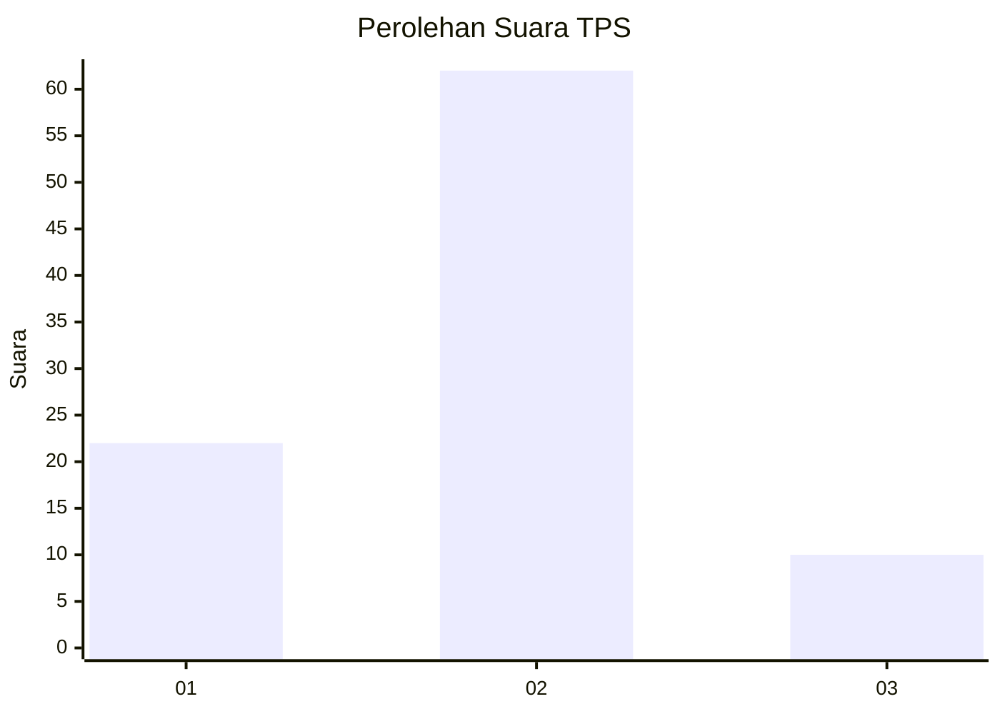

# Hasil

## Grafik

## Tabel

| No. | Nama Paslon    | Suara | Suara (raw) | Persentase |
|:--- |:-------------- | -----:| -----------:| ----------:|
| 1   | ANIES MUHAIMIN | 22    | [22][p-1]   | 23,40      |
| 2   | PRABOWO GIBRAN | 62    | [62][p-2]   | 65,96      |
| 3   | GANJAR MAHFUD  | 10    | [10][p-3]   | 10,64      |

[p-1]: https://github.com/gigit-pemilu/pemilu-2024-35-jawa-timur/blob/main/pilpres/hitung-suara/sub/35-jawa-timur/sub/09-jember/sub/26-mayang/sub/2003-seputih/sub/019-tps/sub/paslon-1.txt
[p-2]: https://github.com/gigit-pemilu/pemilu-2024-35-jawa-timur/blob/main/pilpres/hitung-suara/sub/35-jawa-timur/sub/09-jember/sub/26-mayang/sub/2003-seputih/sub/019-tps/sub/paslon-2.txt
[p-3]: https://github.com/gigit-pemilu/pemilu-2024-35-jawa-timur/blob/main/pilpres/hitung-suara/sub/35-jawa-timur/sub/09-jember/sub/26-mayang/sub/2003-seputih/sub/019-tps/sub/paslon-3.txt

## Foto C Plano

https://sirekap-obj-formc.kpu.go.id/db6a/pemilu/ppwp/35/09/26/20/03/3509262003019-20240215-055522--2749e99f-96d7-4609-87d6-e6790cbc9e8d.jpg

https://sirekap-obj-formc.kpu.go.id/db6a/pemilu/ppwp/35/09/26/20/03/3509262003019-20240215-060038--a2bb49c4-e733-405b-aedd-ca92d12e220f.jpg

https://sirekap-obj-formc.kpu.go.id/db6a/pemilu/ppwp/35/09/26/20/03/3509262003019-20240215-060140--f0184905-ab9d-446d-bb5a-6947dc6c694c.jpg

## Metadata

| Key        | Value               |
| ---------- | ------------------- |
| Time Stamp | 2024-02-15 17:00:25 |

