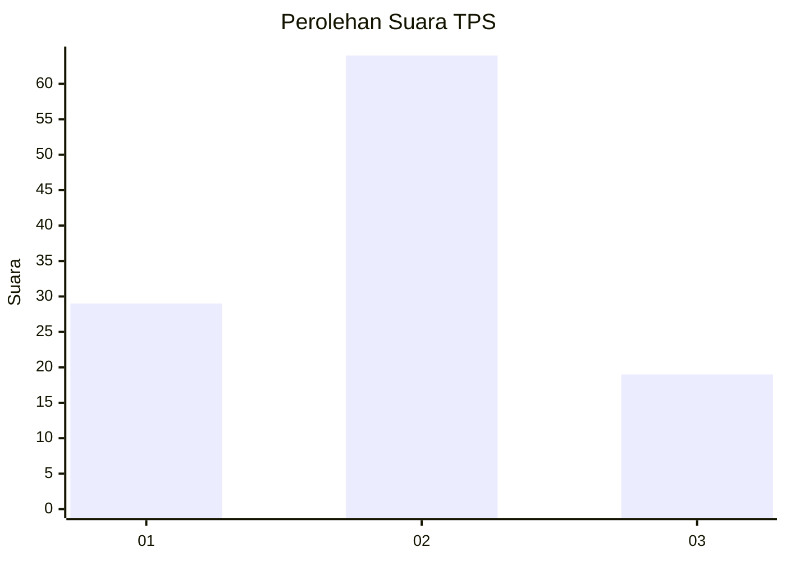

# Hasil

## Grafik

## Tabel

| No. | Nama Paslon    | Suara | Suara (raw) | Persentase |
|:--- |:-------------- | -----:| -----------:| ----------:|
| 1   | ANIES MUHAIMIN | 29    | [29][p-1]   | 25,89      |
| 2   | PRABOWO GIBRAN | 64    | [64][p-2]   | 57,14      |
| 3   | GANJAR MAHFUD  | 19    | [19][p-3]   | 16,96      |

[p-1]: https://github.com/gigit-pemilu/pemilu-2024-35-jawa-timur/blob/main/pilpres/hitung-suara/sub/35-jawa-timur/sub/09-jember/sub/26-mayang/sub/2003-seputih/sub/027-tps/sub/paslon-1.txt
[p-2]: https://github.com/gigit-pemilu/pemilu-2024-35-jawa-timur/blob/main/pilpres/hitung-suara/sub/35-jawa-timur/sub/09-jember/sub/26-mayang/sub/2003-seputih/sub/027-tps/sub/paslon-2.txt
[p-3]: https://github.com/gigit-pemilu/pemilu-2024-35-jawa-timur/blob/main/pilpres/hitung-suara/sub/35-jawa-timur/sub/09-jember/sub/26-mayang/sub/2003-seputih/sub/027-tps/sub/paslon-3.txt

## Foto C Plano

https://sirekap-obj-formc.kpu.go.id/e0e2/pemilu/ppwp/35/09/26/20/03/3509262003027-20240214-224914--88c6d358-aadd-406d-b2a4-1d59372b1347.jpg

https://sirekap-obj-formc.kpu.go.id/e0e2/pemilu/ppwp/35/09/26/20/03/3509262003027-20240214-225416--d8b2dd81-a014-424d-bca4-3429c9f408f0.jpg

https://sirekap-obj-formc.kpu.go.id/e0e2/pemilu/ppwp/35/09/26/20/03/3509262003027-20240214-225737--8218cc8b-a0dd-48ce-88fd-27693535d94b.jpg

## Metadata

| Key        | Value               |
| ---------- | ------------------- |
| Time Stamp | 2024-02-24 22:31:28 |

