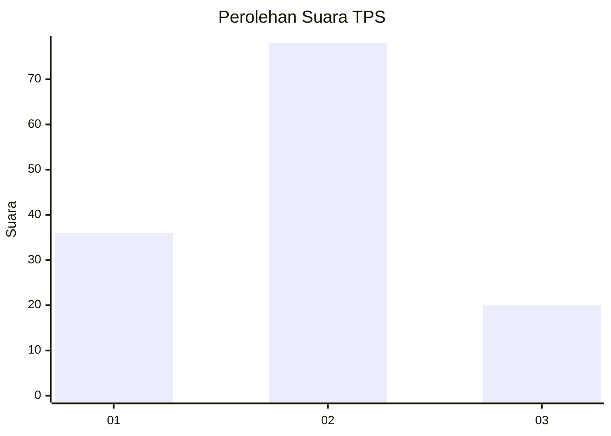
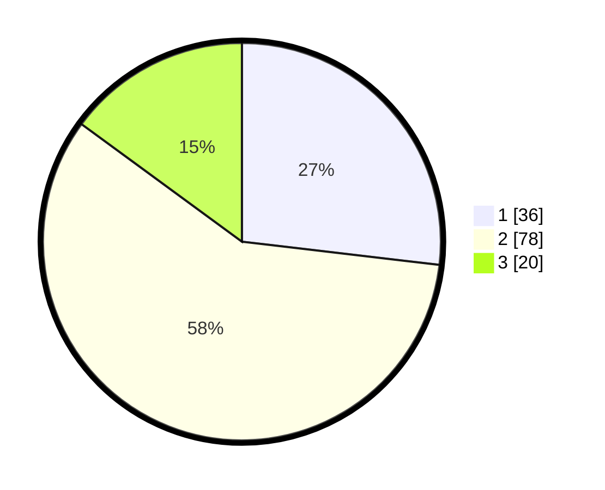

# Hasil

## Grafik

## Tabel

| No. | Nama Paslon    | Suara | Suara (raw) | Persentase |
|:--- |:-------------- | -----:| -----------:| ----------:|
| 1   | ANIES MUHAIMIN | 36    | [36][p-1]   | 26,87      |
| 2   | PRABOWO GIBRAN | 78    | [78][p-2]   | 58,21      |
| 3   | GANJAR MAHFUD  | 20    | [20][p-3]   | 14,93      |

[p-1]: https://github.com/gigit-pemilu/pemilu-2024/blob/main/pilpres/hitung-suara/sub/35-jawa-timur/sub/09-jember/sub/26-mayang/sub/2004-tegalwaru/sub/004-tps/sub/paslon-1.txt
[p-2]: https://github.com/gigit-pemilu/pemilu-2024/blob/main/pilpres/hitung-suara/sub/35-jawa-timur/sub/09-jember/sub/26-mayang/sub/2004-tegalwaru/sub/004-tps/sub/paslon-2.txt
[p-3]: https://github.com/gigit-pemilu/pemilu-2024/blob/main/pilpres/hitung-suara/sub/35-jawa-timur/sub/09-jember/sub/26-mayang/sub/2004-tegalwaru/sub/004-tps/sub/paslon-3.txt

## Foto C Plano

https://sirekap-obj-formc.kpu.go.id/9e43/pemilu/ppwp/35/09/26/20/04/3509262004004-20240214-222504--fd0d2e92-9981-44bd-8971-f723750b621c.jpg

https://sirekap-obj-formc.kpu.go.id/9e43/pemilu/ppwp/35/09/26/20/04/3509262004004-20240214-222555--423ea7c3-d30e-41fa-885d-3511610e4ba5.jpg

https://sirekap-obj-formc.kpu.go.id/9e43/pemilu/ppwp/35/09/26/20/04/3509262004004-20240214-222637--1c3c3274-f6e2-4006-bebb-66917a1e8703.jpg

## Metadata

| Key        | Value               |
| ---------- | ------------------- |
| Time Stamp | 2024-02-15 15:00:29 |

