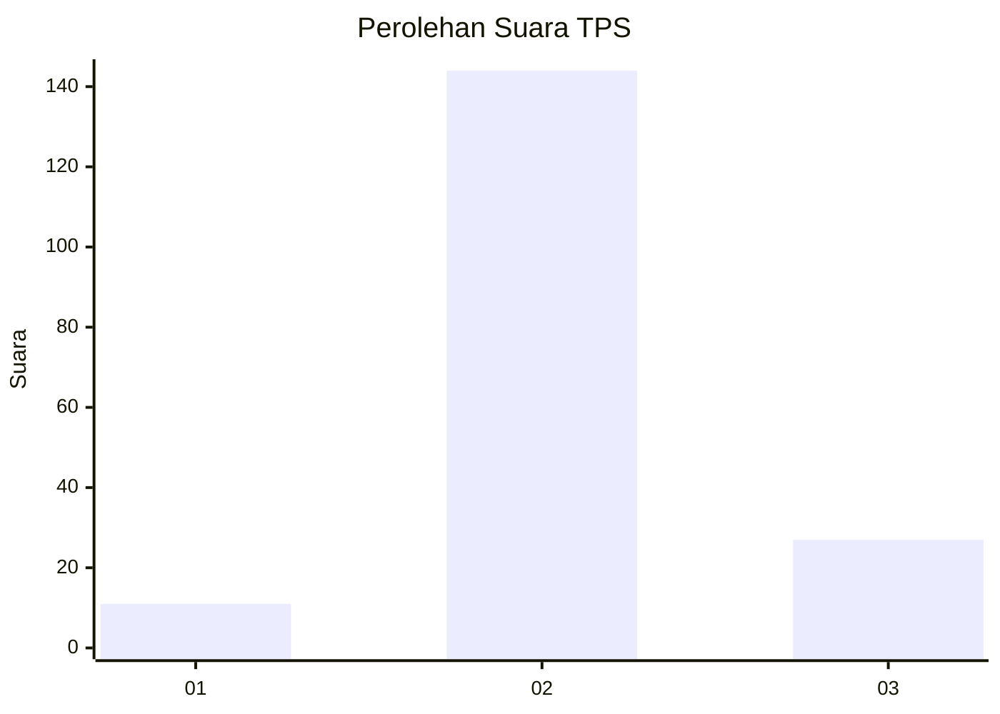

# Hasil

## Grafik

## Tabel

| No. | Nama Paslon    | Suara | Suara (raw) | Persentase |
|:--- |:-------------- | -----:| -----------:| ----------:|
| 1   | ANIES MUHAIMIN | 11    | [11][p-1]   | 6,04       |
| 2   | PRABOWO GIBRAN | 144   | [144][p-2]  | 79,12      |
| 3   | GANJAR MAHFUD  | 27    | [27][p-3]   | 14,84      |

[p-1]: https://github.com/gigit-pemilu/pemilu-2024-35-jawa-timur/blob/main/pilpres/hitung-suara/sub/35-jawa-timur/sub/09-jember/sub/26-mayang/sub/2005-tegalrejo/sub/002-tps/sub/paslon-1.txt
[p-2]: https://github.com/gigit-pemilu/pemilu-2024-35-jawa-timur/blob/main/pilpres/hitung-suara/sub/35-jawa-timur/sub/09-jember/sub/26-mayang/sub/2005-tegalrejo/sub/002-tps/sub/paslon-2.txt
[p-3]: https://github.com/gigit-pemilu/pemilu-2024-35-jawa-timur/blob/main/pilpres/hitung-suara/sub/35-jawa-timur/sub/09-jember/sub/26-mayang/sub/2005-tegalrejo/sub/002-tps/sub/paslon-3.txt

## Foto C Plano

https://sirekap-obj-formc.kpu.go.id/3eda/pemilu/ppwp/35/09/26/20/05/3509262005002-20240215-145147--77c713c7-9179-46e9-90ad-dcf6402894a6.jpg

https://sirekap-obj-formc.kpu.go.id/3eda/pemilu/ppwp/35/09/26/20/05/3509262005002-20240215-193449--4548a4e8-a49d-42d0-b0f3-d79e11b6b22d.jpg

https://sirekap-obj-formc.kpu.go.id/3eda/pemilu/ppwp/35/09/26/20/05/3509262005002-20240215-193537--54fbf5f7-01a2-45a3-88a3-9c402a100c9c.jpg

## Metadata

| Key        | Value               |
| ---------- | ------------------- |
| Time Stamp | 2024-02-24 22:31:28 |

