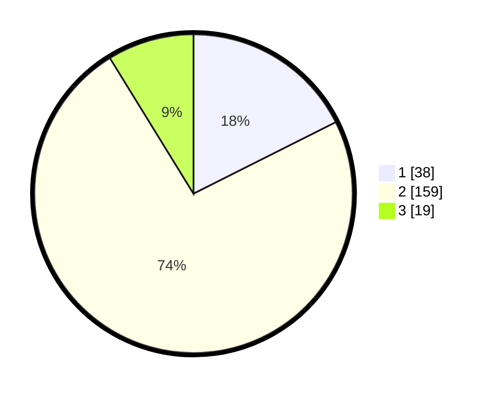

# Hasil

## Grafik

## Tabel

| No. | Nama Paslon    | Suara | Suara (raw) | Persentase |
|:--- |:-------------- | -----:| -----------:| ----------:|
| 1   | ANIES MUHAIMIN | 38    | [38][p-1]   | 17,59      |
| 2   | PRABOWO GIBRAN | 159   | [159][p-2]  | 73,61      |
| 3   | GANJAR MAHFUD  | 19    | [19][p-3]   | 8,80       |

[p-1]: https://github.com/gigit-pemilu/pemilu-2024-35-jawa-timur/blob/main/pilpres/hitung-suara/sub/35-jawa-timur/sub/09-jember/sub/26-mayang/sub/2005-tegalrejo/sub/003-tps/sub/paslon-1.txt
[p-2]: https://github.com/gigit-pemilu/pemilu-2024-35-jawa-timur/blob/main/pilpres/hitung-suara/sub/35-jawa-timur/sub/09-jember/sub/26-mayang/sub/2005-tegalrejo/sub/003-tps/sub/paslon-2.txt
[p-3]: https://github.com/gigit-pemilu/pemilu-2024-35-jawa-timur/blob/main/pilpres/hitung-suara/sub/35-jawa-timur/sub/09-jember/sub/26-mayang/sub/2005-tegalrejo/sub/003-tps/sub/paslon-3.txt

## Foto C Plano

https://sirekap-obj-formc.kpu.go.id/69de/pemilu/ppwp/35/09/26/20/05/3509262005003-20240215-010721--ce55e2bc-b7f4-4fb9-bf38-ceb0349cf5fa.jpg

https://sirekap-obj-formc.kpu.go.id/69de/pemilu/ppwp/35/09/26/20/05/3509262005003-20240215-010920--37ceebbb-c5df-4ffb-b201-4d052eba9703.jpg

https://sirekap-obj-formc.kpu.go.id/69de/pemilu/ppwp/35/09/26/20/05/3509262005003-20240215-011056--680b25ac-5000-4b23-bbdb-c719e4cfd7b3.jpg

## Metadata

| Key        | Value               |
| ---------- | ------------------- |
| Time Stamp | 2024-02-15 21:30:27 |

