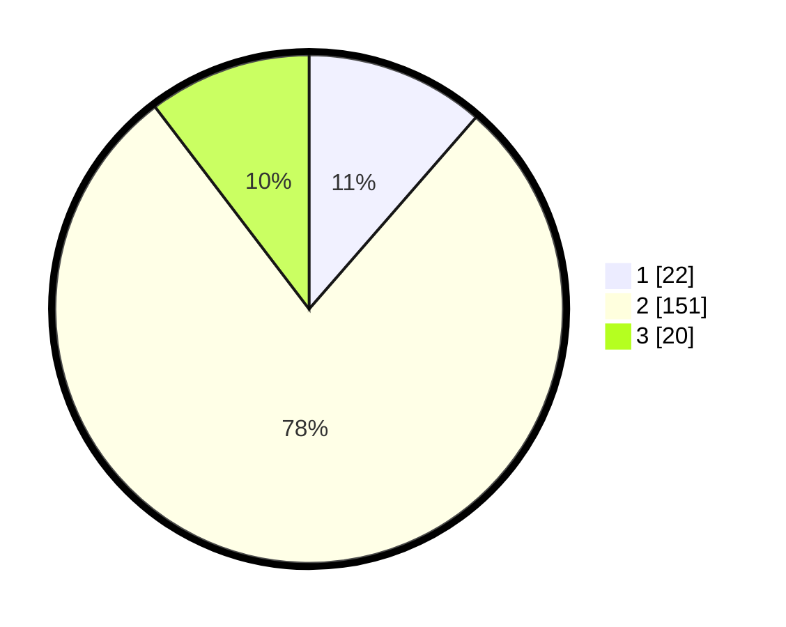

# Hasil

## Grafik

## Tabel

| No. | Nama Paslon    | Suara | Suara (raw) | Persentase |
|:--- |:-------------- | -----:| -----------:| ----------:|
| 1   | ANIES MUHAIMIN | 22    | [22][p-1]   | 11,40      |
| 2   | PRABOWO GIBRAN | 151   | [151][p-2]  | 78,24      |
| 3   | GANJAR MAHFUD  | 20    | [20][p-3]   | 10,36      |

[p-1]: https://github.com/gigit-pemilu/pemilu-2024/blob/main/pilpres/hitung-suara/sub/35-jawa-timur/sub/09-jember/sub/26-mayang/sub/2005-tegalrejo/sub/016-tps/sub/paslon-1.txt
[p-2]: https://github.com/gigit-pemilu/pemilu-2024/blob/main/pilpres/hitung-suara/sub/35-jawa-timur/sub/09-jember/sub/26-mayang/sub/2005-tegalrejo/sub/016-tps/sub/paslon-2.txt
[p-3]: https://github.com/gigit-pemilu/pemilu-2024/blob/main/pilpres/hitung-suara/sub/35-jawa-timur/sub/09-jember/sub/26-mayang/sub/2005-tegalrejo/sub/016-tps/sub/paslon-3.txt

## Foto C Plano

https://sirekap-obj-formc.kpu.go.id/4afe/pemilu/ppwp/35/09/26/20/05/3509262005016-20240215-024626--e4ff6335-2d97-4116-8ed7-c27ff80e3b96.jpg

https://sirekap-obj-formc.kpu.go.id/4afe/pemilu/ppwp/35/09/26/20/05/3509262005016-20240215-024732--c540b54a-063a-4155-aacf-494b4a982df9.jpg

https://sirekap-obj-formc.kpu.go.id/4afe/pemilu/ppwp/35/09/26/20/05/3509262005016-20240215-024820--5b91a51a-8f4d-4bcd-b200-f5df24c6c0cc.jpg

## Metadata

| Key        | Value               |
| ---------- | ------------------- |
| Time Stamp | 2024-02-24 22:31:28 |

