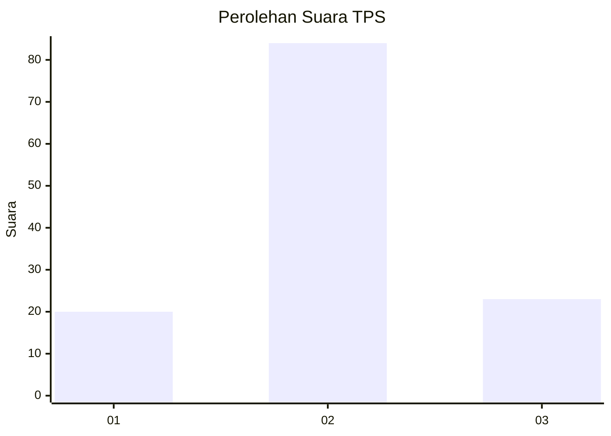
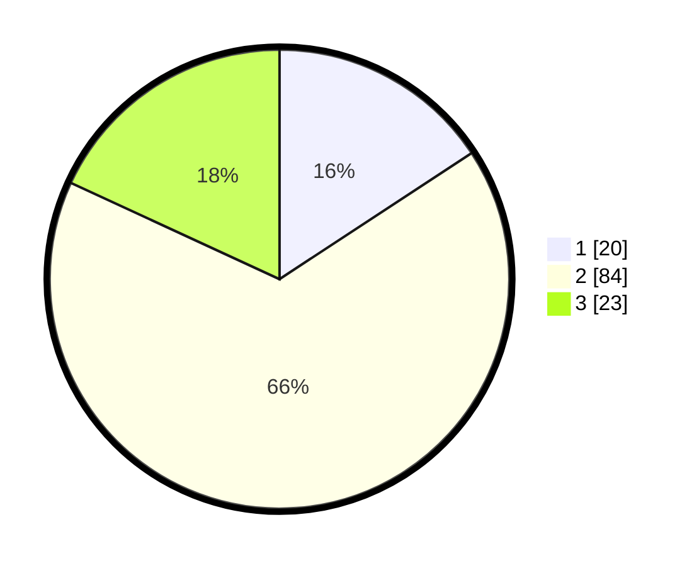

# Hasil

## Grafik

## Tabel

| No. | Nama Paslon    | Suara | Suara (raw) | Persentase |
|:--- |:-------------- | -----:| -----------:| ----------:|
| 1   | ANIES MUHAIMIN | 20    | [20][p-1]   | 15,75      |
| 2   | PRABOWO GIBRAN | 84    | [84][p-2]   | 66,14      |
| 3   | GANJAR MAHFUD  | 23    | [23][p-3]   | 18,11      |

[p-1]: https://github.com/gigit-pemilu/pemilu-2024-35-jawa-timur/blob/main/pilpres/hitung-suara/sub/35-jawa-timur/sub/09-jember/sub/26-mayang/sub/2005-tegalrejo/sub/017-tps/sub/paslon-1.txt
[p-2]: https://github.com/gigit-pemilu/pemilu-2024-35-jawa-timur/blob/main/pilpres/hitung-suara/sub/35-jawa-timur/sub/09-jember/sub/26-mayang/sub/2005-tegalrejo/sub/017-tps/sub/paslon-2.txt
[p-3]: https://github.com/gigit-pemilu/pemilu-2024-35-jawa-timur/blob/main/pilpres/hitung-suara/sub/35-jawa-timur/sub/09-jember/sub/26-mayang/sub/2005-tegalrejo/sub/017-tps/sub/paslon-3.txt

## Foto C Plano

https://sirekap-obj-formc.kpu.go.id/f904/pemilu/ppwp/35/09/26/20/05/3509262005017-20240215-044457--2046091b-0185-45d6-bccb-6ab455d550d1.jpg

https://sirekap-obj-formc.kpu.go.id/f904/pemilu/ppwp/35/09/26/20/05/3509262005017-20240215-044645--b2006d9e-9ec0-4db0-8487-cb1dddfb8ce6.jpg

https://sirekap-obj-formc.kpu.go.id/f904/pemilu/ppwp/35/09/26/20/05/3509262005017-20240215-044734--0e07af51-8be4-4423-b6a2-4f5e7efb2074.jpg

## Metadata

| Key        | Value               |
| ---------- | ------------------- |
| Time Stamp | 2024-02-25 22:00:00 |

