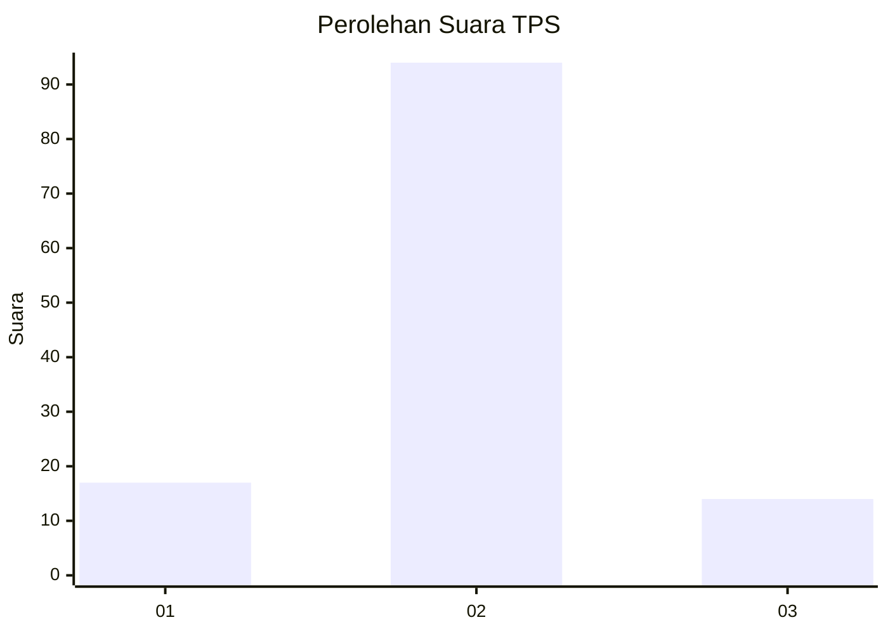
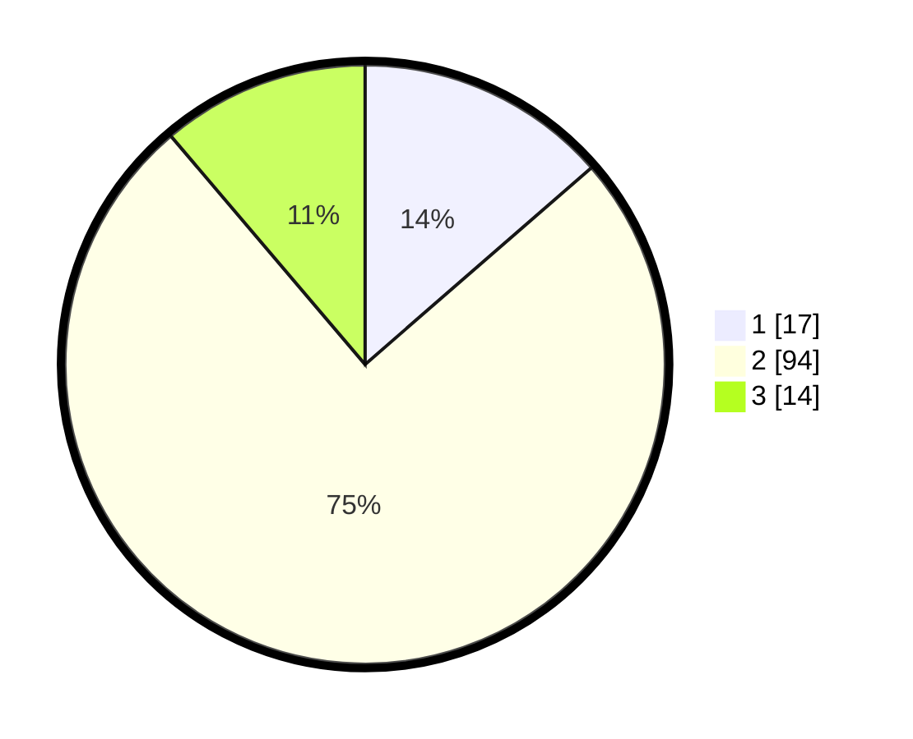

# Hasil

## Grafik

## Tabel

| No. | Nama Paslon    | Suara | Suara (raw) | Persentase |
|:--- |:-------------- | -----:| -----------:| ----------:|
| 1   | ANIES MUHAIMIN | 17    | [17][p-1]   | 13,60      |
| 2   | PRABOWO GIBRAN | 94    | [94][p-2]   | 75,20      |
| 3   | GANJAR MAHFUD  | 14    | [14][p-3]   | 11,20      |

[p-1]: https://github.com/gigit-pemilu/pemilu-2024-35-jawa-timur/blob/main/pilpres/hitung-suara/sub/35-jawa-timur/sub/09-jember/sub/26-mayang/sub/2006-sumberkejayan/sub/017-tps/sub/paslon-1.txt
[p-2]: https://github.com/gigit-pemilu/pemilu-2024-35-jawa-timur/blob/main/pilpres/hitung-suara/sub/35-jawa-timur/sub/09-jember/sub/26-mayang/sub/2006-sumberkejayan/sub/017-tps/sub/paslon-2.txt
[p-3]: https://github.com/gigit-pemilu/pemilu-2024-35-jawa-timur/blob/main/pilpres/hitung-suara/sub/35-jawa-timur/sub/09-jember/sub/26-mayang/sub/2006-sumberkejayan/sub/017-tps/sub/paslon-3.txt

## Foto C Plano

https://sirekap-obj-formc.kpu.go.id/354e/pemilu/ppwp/35/09/26/20/06/3509262006017-20240215-075239--0a5ae463-8d26-491c-8a7c-f639ab484f61.jpg

https://sirekap-obj-formc.kpu.go.id/354e/pemilu/ppwp/35/09/26/20/06/3509262006017-20240215-075411--d6be3aea-7139-4ad0-8996-2db019bee123.jpg

https://sirekap-obj-formc.kpu.go.id/354e/pemilu/ppwp/35/09/26/20/06/3509262006017-20240215-075516--3dc1e6b4-8614-40ad-8517-24e233d7cb8f.jpg

## Metadata

| Key        | Value               |
| ---------- | ------------------- |
| Time Stamp | 2024-02-25 21:00:00 |

