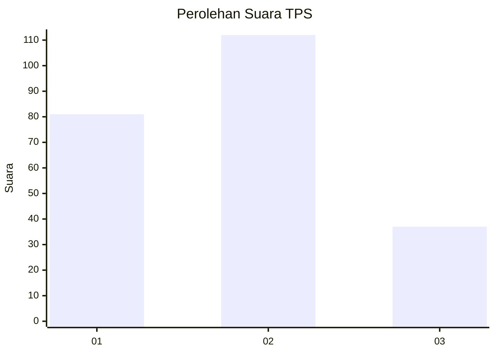
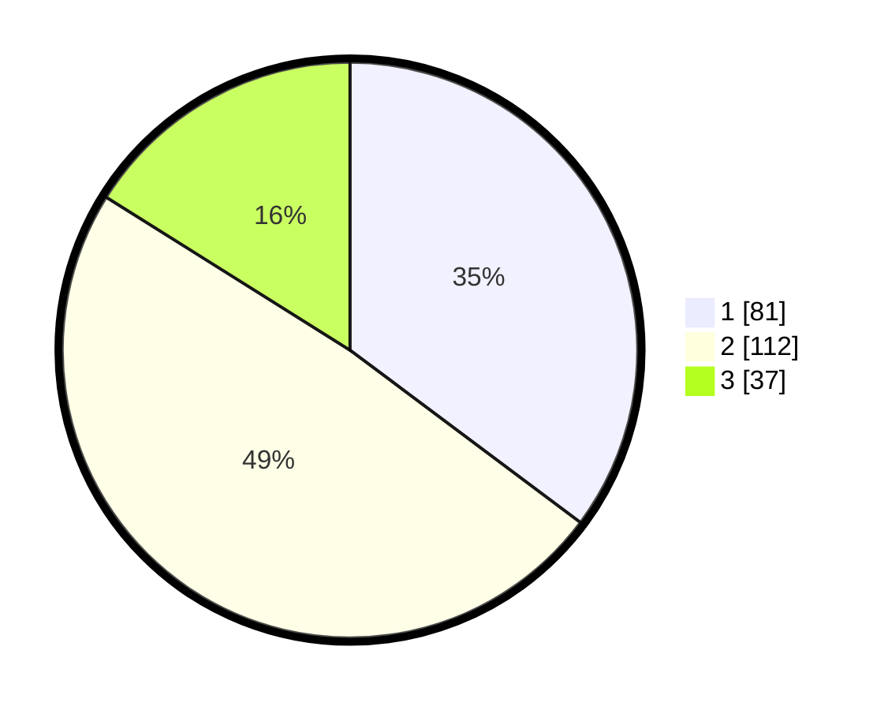

# Hasil

## Grafik

## Tabel

| No. | Nama Paslon    | Suara | Suara (raw) | Persentase |
|:--- |:-------------- | -----:| -----------:| ----------:|
| 1   | ANIES MUHAIMIN | 81    | [81][p-1]   | 35,22      |
| 2   | PRABOWO GIBRAN | 112   | [112][p-2]  | 48,70      |
| 3   | GANJAR MAHFUD  | 37    | [37][p-3]   | 16,09      |

[p-1]: https://github.com/gigit-pemilu/pemilu-2024/blob/main/pilpres/hitung-suara/sub/35-jawa-timur/sub/09-jember/sub/26-mayang/sub/2007-sidomukti/sub/004-tps/sub/paslon-1.txt
[p-2]: https://github.com/gigit-pemilu/pemilu-2024/blob/main/pilpres/hitung-suara/sub/35-jawa-timur/sub/09-jember/sub/26-mayang/sub/2007-sidomukti/sub/004-tps/sub/paslon-2.txt
[p-3]: https://github.com/gigit-pemilu/pemilu-2024/blob/main/pilpres/hitung-suara/sub/35-jawa-timur/sub/09-jember/sub/26-mayang/sub/2007-sidomukti/sub/004-tps/sub/paslon-3.txt

## Foto C Plano

https://sirekap-obj-formc.kpu.go.id/9a54/pemilu/ppwp/35/09/26/20/07/3509262007004-20240215-083528--330f30a3-9a1f-4b88-9961-063f63568467.jpg

https://sirekap-obj-formc.kpu.go.id/9a54/pemilu/ppwp/35/09/26/20/07/3509262007004-20240215-083555--6c7bfd83-def4-4b7a-8964-9cfb410c5a5d.jpg

https://sirekap-obj-formc.kpu.go.id/9a54/pemilu/ppwp/35/09/26/20/07/3509262007004-20240215-083626--bbd3aa82-d4b2-4dea-a995-e187fe11cdf4.jpg

## Metadata

| Key        | Value               |
| ---------- | ------------------- |
| Time Stamp | 2024-02-24 22:31:28 |

