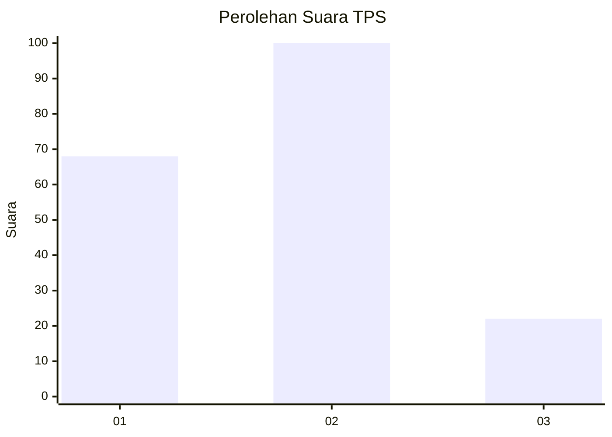
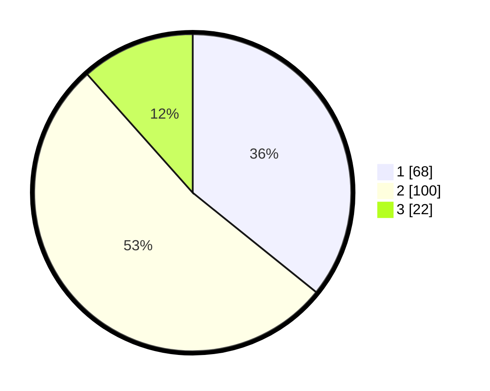

# Hasil

## Grafik

## Tabel

| No. | Nama Paslon    | Suara | Suara (raw) | Persentase |
|:--- |:-------------- | -----:| -----------:| ----------:|
| 1   | ANIES MUHAIMIN | 68    | [68][p-1]   | 35,79      |
| 2   | PRABOWO GIBRAN | 100   | [100][p-2]  | 52,63      |
| 3   | GANJAR MAHFUD  | 22    | [22][p-3]   | 11,58      |

[p-1]: https://github.com/gigit-pemilu/pemilu-2024-35-jawa-timur/blob/main/pilpres/hitung-suara/sub/35-jawa-timur/sub/09-jember/sub/26-mayang/sub/2007-sidomukti/sub/008-tps/sub/paslon-1.txt
[p-2]: https://github.com/gigit-pemilu/pemilu-2024-35-jawa-timur/blob/main/pilpres/hitung-suara/sub/35-jawa-timur/sub/09-jember/sub/26-mayang/sub/2007-sidomukti/sub/008-tps/sub/paslon-2.txt
[p-3]: https://github.com/gigit-pemilu/pemilu-2024-35-jawa-timur/blob/main/pilpres/hitung-suara/sub/35-jawa-timur/sub/09-jember/sub/26-mayang/sub/2007-sidomukti/sub/008-tps/sub/paslon-3.txt

## Foto C Plano

https://sirekap-obj-formc.kpu.go.id/829f/pemilu/ppwp/35/09/26/20/07/3509262007008-20240215-033935--24e1fad8-2ee2-4806-bd51-2b3f2ff6374c.jpg

https://sirekap-obj-formc.kpu.go.id/829f/pemilu/ppwp/35/09/26/20/07/3509262007008-20240215-033847--5b92aaf8-3ab7-42c2-9761-b974f2c9fe81.jpg

https://sirekap-obj-formc.kpu.go.id/829f/pemilu/ppwp/35/09/26/20/07/3509262007008-20240214-200239--655f7b00-3bc6-46c1-bb23-064105f6fcc9.jpg

## Metadata

| Key        | Value               |
| ---------- | ------------------- |
| Time Stamp | 2024-02-15 15:00:29 |

