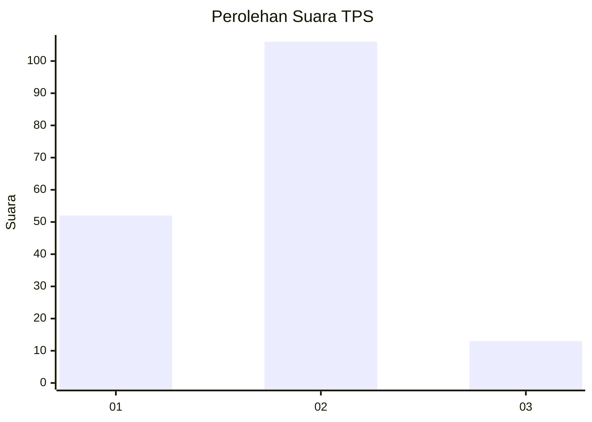
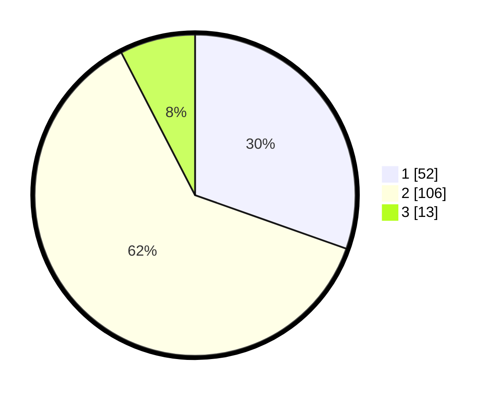

# Hasil

## Grafik

## Tabel

| No. | Nama Paslon    | Suara | Suara (raw) | Persentase |
|:--- |:-------------- | -----:| -----------:| ----------:|
| 1   | ANIES MUHAIMIN | 52    | [52][p-1]   | 30,41      |
| 2   | PRABOWO GIBRAN | 106   | [106][p-2]  | 61,99      |
| 3   | GANJAR MAHFUD  | 13    | [13][p-3]   | 7,60       |

[p-1]: https://github.com/gigit-pemilu/pemilu-2024/blob/main/pilpres/hitung-suara/sub/35-jawa-timur/sub/09-jember/sub/26-mayang/sub/2007-sidomukti/sub/013-tps/sub/paslon-1.txt
[p-2]: https://github.com/gigit-pemilu/pemilu-2024/blob/main/pilpres/hitung-suara/sub/35-jawa-timur/sub/09-jember/sub/26-mayang/sub/2007-sidomukti/sub/013-tps/sub/paslon-2.txt
[p-3]: https://github.com/gigit-pemilu/pemilu-2024/blob/main/pilpres/hitung-suara/sub/35-jawa-timur/sub/09-jember/sub/26-mayang/sub/2007-sidomukti/sub/013-tps/sub/paslon-3.txt

## Foto C Plano

https://sirekap-obj-formc.kpu.go.id/e774/pemilu/ppwp/35/09/26/20/07/3509262007013-20240215-094519--f63721f8-0ddc-4d3a-afcb-7c1a80095f45.jpg

https://sirekap-obj-formc.kpu.go.id/e774/pemilu/ppwp/35/09/26/20/07/3509262007013-20240215-093500--9af3d78e-742a-4e97-8bdc-f438d81bf302.jpg

https://sirekap-obj-formc.kpu.go.id/e774/pemilu/ppwp/35/09/26/20/07/3509262007013-20240215-005802--de6c85a8-beea-45ba-95fe-1b4d495e3503.jpg

## Metadata

| Key        | Value               |
| ---------- | ------------------- |
| Time Stamp | 2024-02-25 13:00:00 |

