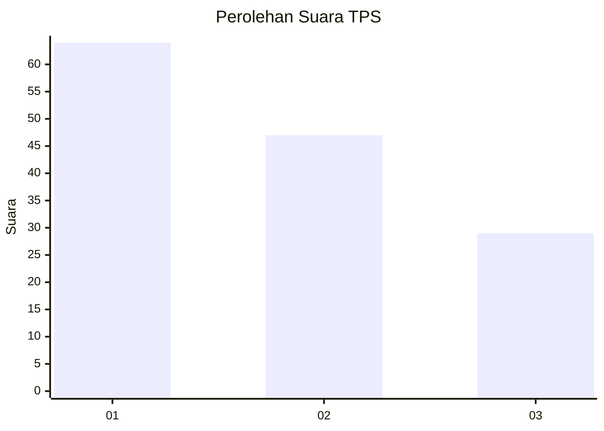
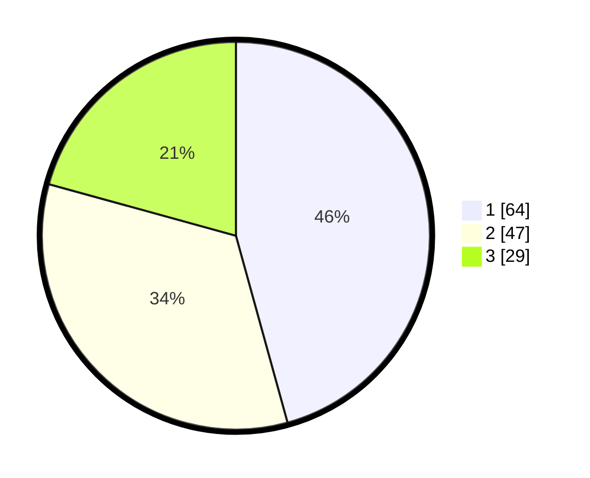

# Hasil

## Grafik

## Tabel

| No. | Nama Paslon    | Suara | Suara (raw) | Persentase |
|:--- |:-------------- | -----:| -----------:| ----------:|
| 1   | ANIES MUHAIMIN | 64    | [64][p-1]   | 45,71      |
| 2   | PRABOWO GIBRAN | 47    | [47][p-2]   | 33,57      |
| 3   | GANJAR MAHFUD  | 29    | [29][p-3]   | 20,71      |

[p-1]: https://github.com/gigit-pemilu/pemilu-2024/blob/main/pilpres/hitung-suara/sub/35-jawa-timur/sub/09-jember/sub/26-mayang/sub/2007-sidomukti/sub/015-tps/sub/paslon-1.txt
[p-2]: https://github.com/gigit-pemilu/pemilu-2024/blob/main/pilpres/hitung-suara/sub/35-jawa-timur/sub/09-jember/sub/26-mayang/sub/2007-sidomukti/sub/015-tps/sub/paslon-2.txt
[p-3]: https://github.com/gigit-pemilu/pemilu-2024/blob/main/pilpres/hitung-suara/sub/35-jawa-timur/sub/09-jember/sub/26-mayang/sub/2007-sidomukti/sub/015-tps/sub/paslon-3.txt

## Foto C Plano

https://sirekap-obj-formc.kpu.go.id/9894/pemilu/ppwp/35/09/26/20/07/3509262007015-20240214-141558--6b7f5059-18f4-4fc5-a59f-0e299e39d70c.jpg

https://sirekap-obj-formc.kpu.go.id/9894/pemilu/ppwp/35/09/26/20/07/3509262007015-20240214-141714--62b57276-2b3c-40fd-9ec2-076c1947e717.jpg

https://sirekap-obj-formc.kpu.go.id/9894/pemilu/ppwp/35/09/26/20/07/3509262007015-20240214-160145--025c80e9-cf56-4a39-a6ce-e42dc85e83b2.jpg

## Metadata

| Key        | Value               |
| ---------- | ------------------- |
| Time Stamp | 2024-02-15 15:00:29 |

