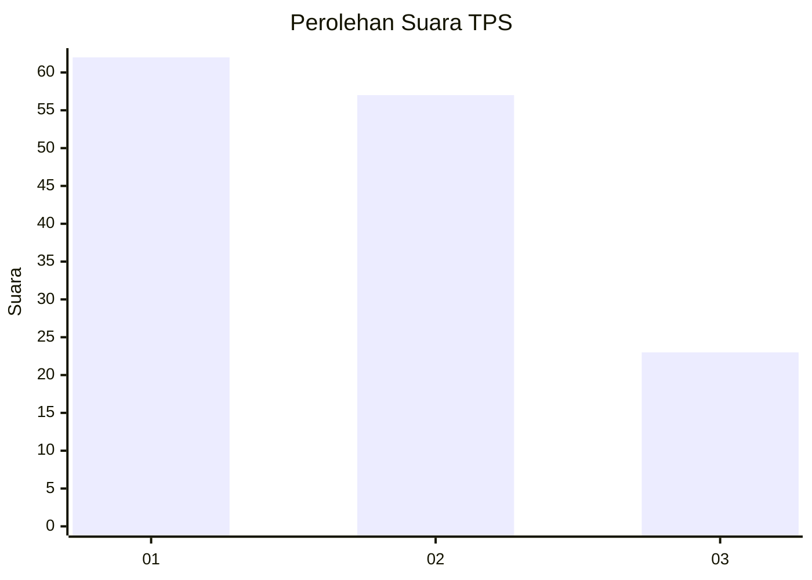
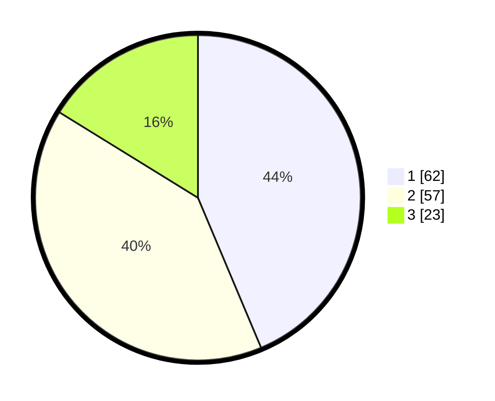

# Hasil

## Grafik

## Tabel

| No. | Nama Paslon    | Suara | Suara (raw) | Persentase |
|:--- |:-------------- | -----:| -----------:| ----------:|
| 1   | ANIES MUHAIMIN | 62    | [62][p-1]   | 43,66      |
| 2   | PRABOWO GIBRAN | 57    | [57][p-2]   | 40,14      |
| 3   | GANJAR MAHFUD  | 23    | [23][p-3]   | 16,20      |

[p-1]: https://github.com/gigit-pemilu/pemilu-2024-35-jawa-timur/blob/main/pilpres/hitung-suara/sub/35-jawa-timur/sub/09-jember/sub/26-mayang/sub/2007-sidomukti/sub/018-tps/sub/paslon-1.txt
[p-2]: https://github.com/gigit-pemilu/pemilu-2024-35-jawa-timur/blob/main/pilpres/hitung-suara/sub/35-jawa-timur/sub/09-jember/sub/26-mayang/sub/2007-sidomukti/sub/018-tps/sub/paslon-2.txt
[p-3]: https://github.com/gigit-pemilu/pemilu-2024-35-jawa-timur/blob/main/pilpres/hitung-suara/sub/35-jawa-timur/sub/09-jember/sub/26-mayang/sub/2007-sidomukti/sub/018-tps/sub/paslon-3.txt

## Foto C Plano

https://sirekap-obj-formc.kpu.go.id/13b1/pemilu/ppwp/35/09/26/20/07/3509262007018-20240216-070101--3c3a7249-46d2-407a-8627-156dc9b5444a.jpg

https://sirekap-obj-formc.kpu.go.id/13b1/pemilu/ppwp/35/09/26/20/07/3509262007018-20240216-070122--541b47fd-271b-46bf-8ca0-1fbcf776bfa1.jpg

https://sirekap-obj-formc.kpu.go.id/13b1/pemilu/ppwp/35/09/26/20/07/3509262007018-20240215-065236--a4ef6dc4-d116-41e2-9d2f-f7e3775c913e.jpg

## Metadata

| Key        | Value               |
| ---------- | ------------------- |
| Time Stamp | 2024-02-24 22:31:28 |

