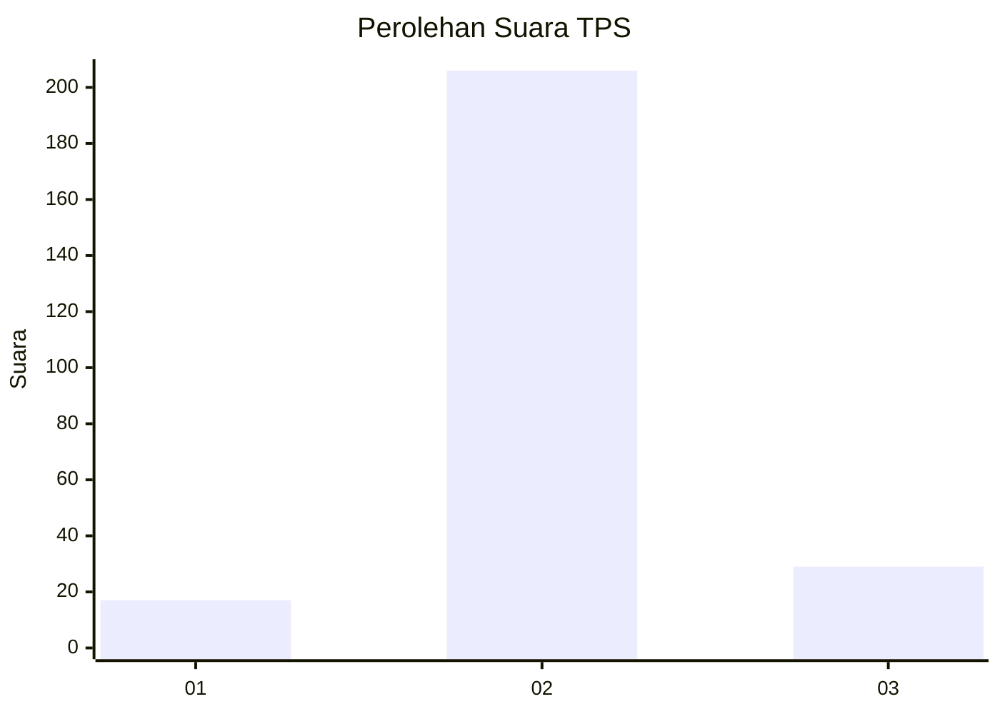
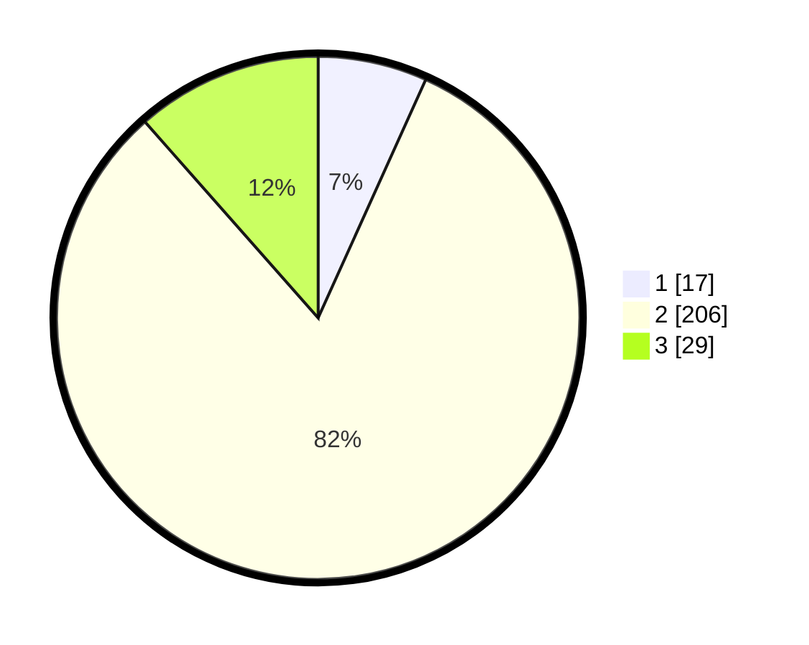

# Hasil

## Grafik

## Tabel

| No. | Nama Paslon    | Suara | Suara (raw) | Persentase |
|:--- |:-------------- | -----:| -----------:| ----------:|
| 1   | ANIES MUHAIMIN | 17    | [17][p-1]   | 6,75       |
| 2   | PRABOWO GIBRAN | 206   | [206][p-2]  | 81,75      |
| 3   | GANJAR MAHFUD  | 29    | [29][p-3]   | 11,51      |

[p-1]: https://github.com/gigit-pemilu/pemilu-2024/blob/main/pilpres/hitung-suara/sub/35-jawa-timur/sub/09-jember/sub/27-kalisat/sub/2001-gumuksari/sub/005-tps/sub/paslon-1.txt
[p-2]: https://github.com/gigit-pemilu/pemilu-2024/blob/main/pilpres/hitung-suara/sub/35-jawa-timur/sub/09-jember/sub/27-kalisat/sub/2001-gumuksari/sub/005-tps/sub/paslon-2.txt
[p-3]: https://github.com/gigit-pemilu/pemilu-2024/blob/main/pilpres/hitung-suara/sub/35-jawa-timur/sub/09-jember/sub/27-kalisat/sub/2001-gumuksari/sub/005-tps/sub/paslon-3.txt

## Foto C Plano

https://sirekap-obj-formc.kpu.go.id/c92a/pemilu/ppwp/35/09/27/20/01/3509272001005-20240215-014134--1ef514a7-7ee0-4291-a74b-475e988aa8c6.jpg

https://sirekap-obj-formc.kpu.go.id/c92a/pemilu/ppwp/35/09/27/20/01/3509272001005-20240215-014243--6977951c-d136-464f-8b1a-dc2e395f5c3a.jpg

https://sirekap-obj-formc.kpu.go.id/c92a/pemilu/ppwp/35/09/27/20/01/3509272001005-20240215-014341--02ca0650-6d01-4880-9c65-ad1b8ac5aa7a.jpg

## Metadata

| Key        | Value               |
| ---------- | ------------------- |
| Time Stamp | 2024-02-17 16:36:25 |

## DATA PEMILIH TETAP

Jumlah pemilih dalam DPT: **284**.
 * L: **139**.
 * P: **145**.

## DATA PENGGUNA HAK PILIH

Jumlah pengguna hak pilih dalam DPT: **260**.
 * L: **129**.
 * P: **131**.

Jumlah pengguna hak pilih dalam DPTb: **0**.
 * L: **0**.
 * P: **0**.

Jumlah pengguna hak pilih dalam DPK: **0**.
 * L: **0**.
 * P: **0**.

Jumlah pengguna hak pilih: **260**.
 * L: **129**.
 * P: **131**.

## JUMLAH SUARA SAH DAN TIDAK SAH

JUMLAH SELURUH SUARA SAH: **252**.

JUMLAH SUARA TIDAK SAH: **8**.

JUMLAH SELURUH SUARA SAH DAN SUARA TIDAK SAH: **260**.

