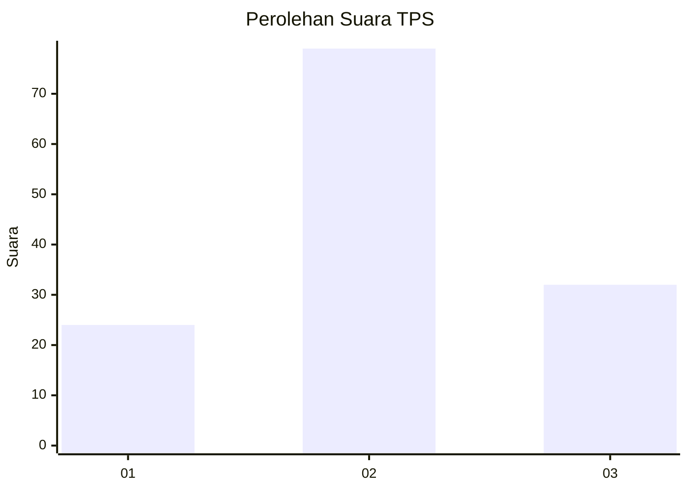
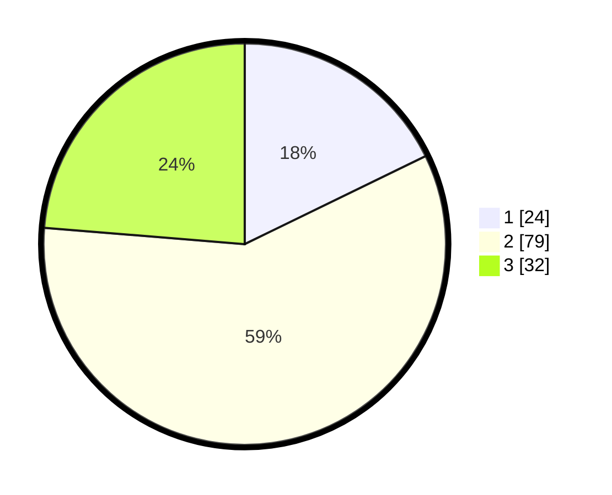

# Hasil

## Grafik

## Tabel

| No. | Nama Paslon    | Suara | Suara (raw) | Persentase |
|:--- |:-------------- | -----:| -----------:| ----------:|
| 1   | ANIES MUHAIMIN | 24    | [24][p-1]   | 17,78      |
| 2   | PRABOWO GIBRAN | 79    | [79][p-2]   | 58,52      |
| 3   | GANJAR MAHFUD  | 32    | [32][p-3]   | 23,70      |

[p-1]: https://github.com/gigit-pemilu/pemilu-2024-35-jawa-timur/blob/main/pilpres/hitung-suara/sub/35-jawa-timur/sub/09-jember/sub/27-kalisat/sub/2001-gumuksari/sub/008-tps/sub/paslon-1.txt
[p-2]: https://github.com/gigit-pemilu/pemilu-2024-35-jawa-timur/blob/main/pilpres/hitung-suara/sub/35-jawa-timur/sub/09-jember/sub/27-kalisat/sub/2001-gumuksari/sub/008-tps/sub/paslon-2.txt
[p-3]: https://github.com/gigit-pemilu/pemilu-2024-35-jawa-timur/blob/main/pilpres/hitung-suara/sub/35-jawa-timur/sub/09-jember/sub/27-kalisat/sub/2001-gumuksari/sub/008-tps/sub/paslon-3.txt

## Foto C Plano

https://sirekap-obj-formc.kpu.go.id/8e39/pemilu/ppwp/35/09/27/20/01/3509272001008-20240215-023158--008e210a-1f4f-4772-9648-60278d346fd4.jpg

https://sirekap-obj-formc.kpu.go.id/8e39/pemilu/ppwp/35/09/27/20/01/3509272001008-20240214-212107--3b0d25fc-fb65-4d26-b9a5-bc7a6eede99b.jpg

https://sirekap-obj-formc.kpu.go.id/8e39/pemilu/ppwp/35/09/27/20/01/3509272001008-20240215-042648--1724f255-bdc6-435a-ace1-3208ed60b4c7.jpg

## Metadata

| Key        | Value               |
| ---------- | ------------------- |
| Time Stamp | 2024-02-15 20:00:44 |

