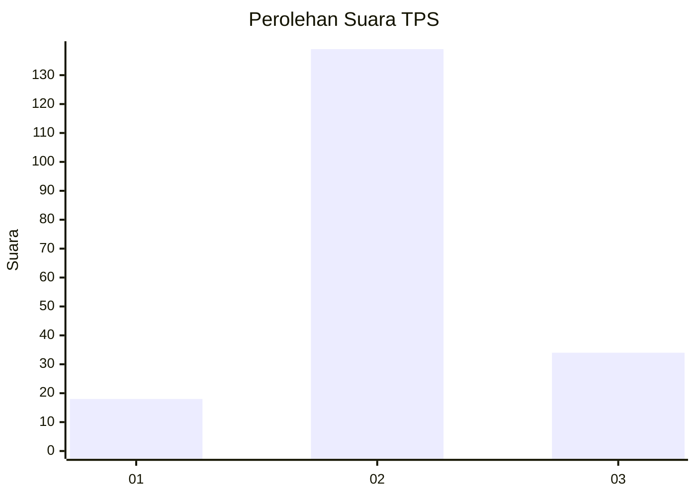
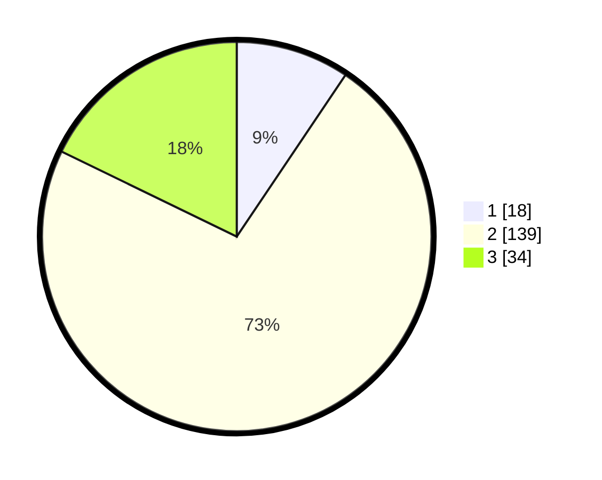

# Hasil

## Grafik

## Tabel

| No. | Nama Paslon    | Suara | Suara (raw) | Persentase |
|:--- |:-------------- | -----:| -----------:| ----------:|
| 1   | ANIES MUHAIMIN | 18    | [18][p-1]   | 9,42       |
| 2   | PRABOWO GIBRAN | 139   | [139][p-2]  | 72,77      |
| 3   | GANJAR MAHFUD  | 34    | [34][p-3]   | 17,80      |

[p-1]: https://github.com/gigit-pemilu/pemilu-2024/blob/main/pilpres/hitung-suara/sub/35-jawa-timur/sub/09-jember/sub/27-kalisat/sub/2002-sukoreno/sub/003-tps/sub/paslon-1.txt
[p-2]: https://github.com/gigit-pemilu/pemilu-2024/blob/main/pilpres/hitung-suara/sub/35-jawa-timur/sub/09-jember/sub/27-kalisat/sub/2002-sukoreno/sub/003-tps/sub/paslon-2.txt
[p-3]: https://github.com/gigit-pemilu/pemilu-2024/blob/main/pilpres/hitung-suara/sub/35-jawa-timur/sub/09-jember/sub/27-kalisat/sub/2002-sukoreno/sub/003-tps/sub/paslon-3.txt

## Foto C Plano

https://sirekap-obj-formc.kpu.go.id/22a9/pemilu/ppwp/35/09/27/20/02/3509272002003-20240215-110710--95323a46-42bf-4a24-b920-a38f15e6197f.jpg

https://sirekap-obj-formc.kpu.go.id/22a9/pemilu/ppwp/35/09/27/20/02/3509272002003-20240215-111400--a1adbc5f-32ab-4af4-831b-611f3d0398b4.jpg

https://sirekap-obj-formc.kpu.go.id/22a9/pemilu/ppwp/35/09/27/20/02/3509272002003-20240215-095805--55871468-8c3b-4b58-806e-013d9e49ce8b.jpg

## Metadata

| Key        | Value               |
| ---------- | ------------------- |
| Time Stamp | 2024-02-15 19:00:26 |

