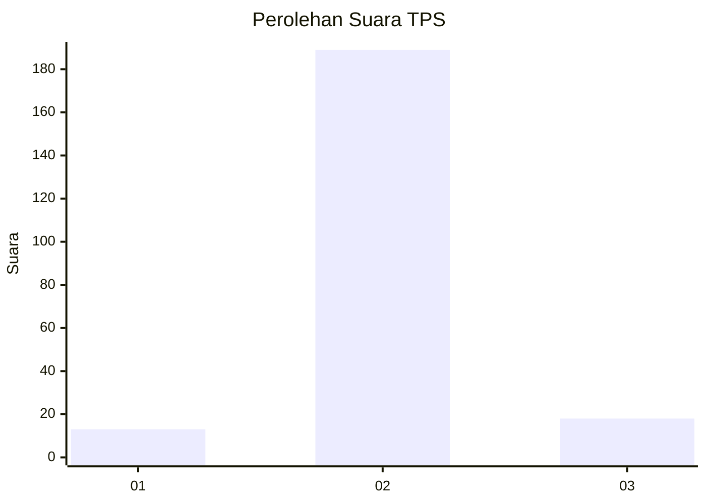
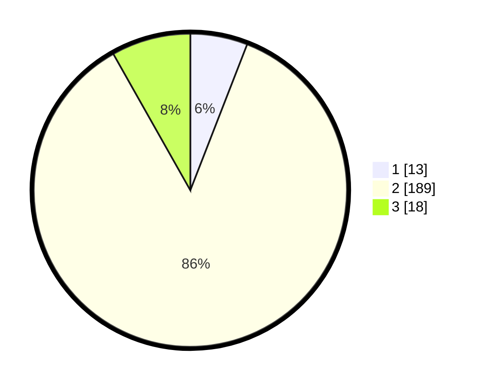

# Hasil

## Grafik

## Tabel

| No. | Nama Paslon    | Suara | Suara (raw) | Persentase |
|:--- |:-------------- | -----:| -----------:| ----------:|
| 1   | ANIES MUHAIMIN | 13    | [13][p-1]   | 5,91       |
| 2   | PRABOWO GIBRAN | 189   | [189][p-2]  | 85,91      |
| 3   | GANJAR MAHFUD  | 18    | [18][p-3]   | 8,18       |

[p-1]: https://github.com/gigit-pemilu/pemilu-2024-35-jawa-timur/blob/main/pilpres/hitung-suara/sub/35-jawa-timur/sub/09-jember/sub/27-kalisat/sub/2002-sukoreno/sub/013-tps/sub/paslon-1.txt
[p-2]: https://github.com/gigit-pemilu/pemilu-2024-35-jawa-timur/blob/main/pilpres/hitung-suara/sub/35-jawa-timur/sub/09-jember/sub/27-kalisat/sub/2002-sukoreno/sub/013-tps/sub/paslon-2.txt
[p-3]: https://github.com/gigit-pemilu/pemilu-2024-35-jawa-timur/blob/main/pilpres/hitung-suara/sub/35-jawa-timur/sub/09-jember/sub/27-kalisat/sub/2002-sukoreno/sub/013-tps/sub/paslon-3.txt

## Foto C Plano

https://sirekap-obj-formc.kpu.go.id/4b07/pemilu/ppwp/35/09/27/20/02/3509272002013-20240215-004854--d996b8e8-4f9f-4bfb-a612-6e4ce2ab406d.jpg

https://sirekap-obj-formc.kpu.go.id/4b07/pemilu/ppwp/35/09/27/20/02/3509272002013-20240215-021528--a3dcb8e0-c5c5-4113-b068-02abc1c2bccf.jpg

https://sirekap-obj-formc.kpu.go.id/4b07/pemilu/ppwp/35/09/27/20/02/3509272002013-20240215-071433--b9b101ac-282e-4375-ada5-5dfe0203ba71.jpg

## Metadata

| Key        | Value               |
| ---------- | ------------------- |
| Time Stamp | 2024-02-15 15:00:29 |

