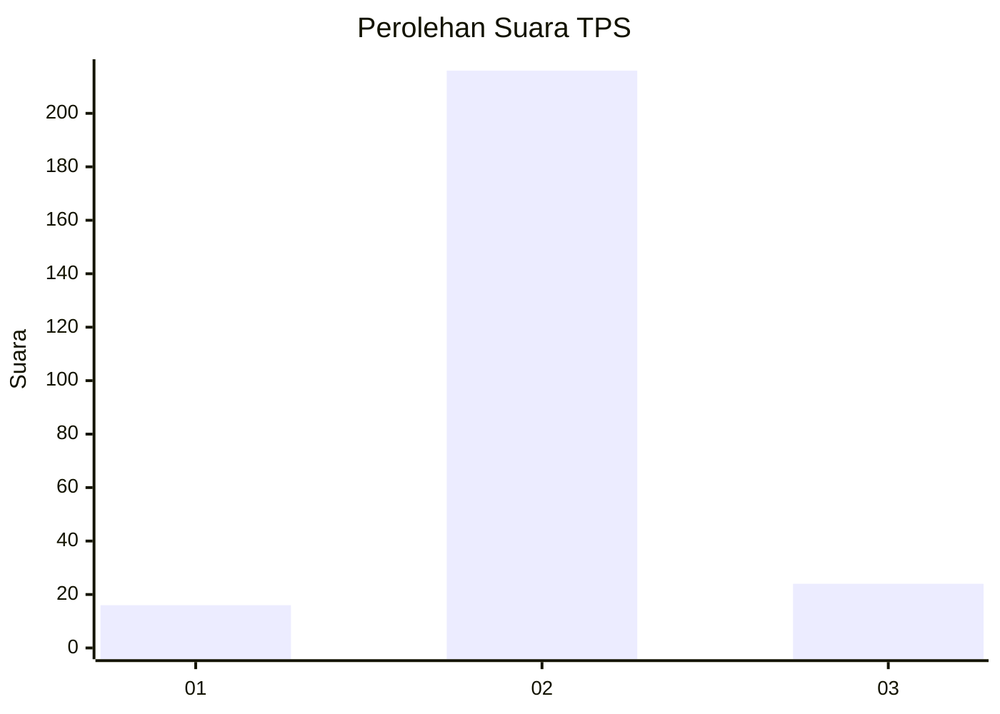
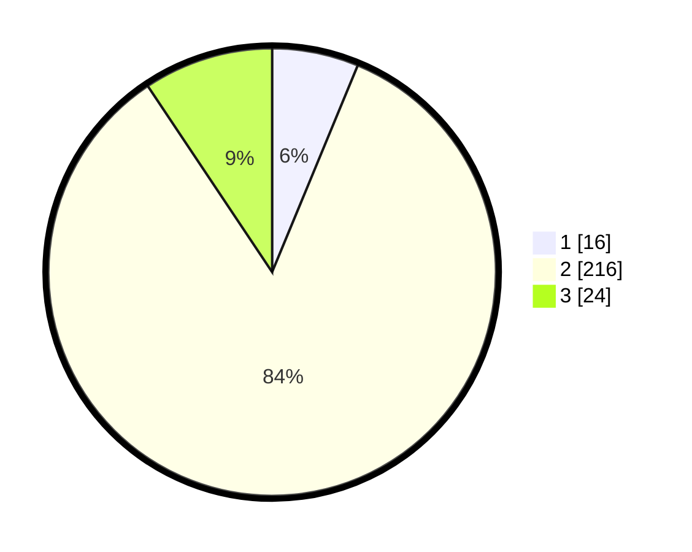

# Hasil

## Grafik

## Tabel

| No. | Nama Paslon    | Suara | Suara (raw) | Persentase |
|:--- |:-------------- | -----:| -----------:| ----------:|
| 1   | ANIES MUHAIMIN | 16    | [16][p-1]   | 6,25       |
| 2   | PRABOWO GIBRAN | 216   | [216][p-2]  | 84,38      |
| 3   | GANJAR MAHFUD  | 24    | [24][p-3]   | 9,38       |

[p-1]: https://github.com/gigit-pemilu/pemilu-2024-35-jawa-timur/blob/main/pilpres/hitung-suara/sub/35-jawa-timur/sub/09-jember/sub/27-kalisat/sub/2002-sukoreno/sub/014-tps/sub/paslon-1.txt
[p-2]: https://github.com/gigit-pemilu/pemilu-2024-35-jawa-timur/blob/main/pilpres/hitung-suara/sub/35-jawa-timur/sub/09-jember/sub/27-kalisat/sub/2002-sukoreno/sub/014-tps/sub/paslon-2.txt
[p-3]: https://github.com/gigit-pemilu/pemilu-2024-35-jawa-timur/blob/main/pilpres/hitung-suara/sub/35-jawa-timur/sub/09-jember/sub/27-kalisat/sub/2002-sukoreno/sub/014-tps/sub/paslon-3.txt

## Foto C Plano

https://sirekap-obj-formc.kpu.go.id/dc38/pemilu/ppwp/35/09/27/20/02/3509272002014-20240214-221932--a40c64a5-616c-4549-94bc-22c433dda44d.jpg

https://sirekap-obj-formc.kpu.go.id/dc38/pemilu/ppwp/35/09/27/20/02/3509272002014-20240214-222401--197f5fa1-be2e-4c63-9a5f-91bfbf65dc8c.jpg

https://sirekap-obj-formc.kpu.go.id/dc38/pemilu/ppwp/35/09/27/20/02/3509272002014-20240214-222730--f51f5a52-4e9f-4416-b66d-46174d1403f6.jpg

## Metadata

| Key        | Value               |
| ---------- | ------------------- |
| Time Stamp | 2024-02-15 15:00:29 |

