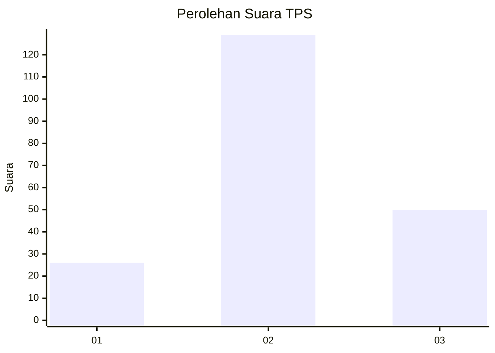
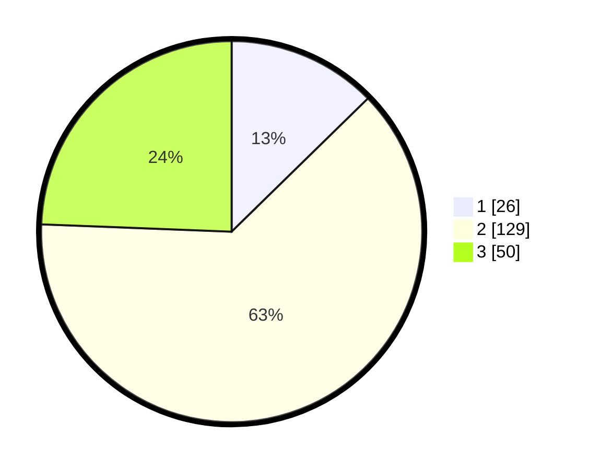

# Hasil

## Grafik

## Tabel

| No. | Nama Paslon    | Suara | Suara (raw) | Persentase |
|:--- |:-------------- | -----:| -----------:| ----------:|
| 1   | ANIES MUHAIMIN | 26    | [26][p-1]   | 12,68      |
| 2   | PRABOWO GIBRAN | 129   | [129][p-2]  | 62,93      |
| 3   | GANJAR MAHFUD  | 50    | [50][p-3]   | 24,39      |

[p-1]: https://github.com/gigit-pemilu/pemilu-2024/blob/main/pilpres/hitung-suara/sub/35-jawa-timur/sub/09-jember/sub/27-kalisat/sub/2003-patempuran/sub/004-tps/sub/paslon-1.txt
[p-2]: https://github.com/gigit-pemilu/pemilu-2024/blob/main/pilpres/hitung-suara/sub/35-jawa-timur/sub/09-jember/sub/27-kalisat/sub/2003-patempuran/sub/004-tps/sub/paslon-2.txt
[p-3]: https://github.com/gigit-pemilu/pemilu-2024/blob/main/pilpres/hitung-suara/sub/35-jawa-timur/sub/09-jember/sub/27-kalisat/sub/2003-patempuran/sub/004-tps/sub/paslon-3.txt

## Foto C Plano

https://sirekap-obj-formc.kpu.go.id/d4a3/pemilu/ppwp/35/09/27/20/03/3509272003004-20240214-233700--f231064b-c6a8-4302-ba85-5db44aea7227.jpg

https://sirekap-obj-formc.kpu.go.id/d4a3/pemilu/ppwp/35/09/27/20/03/3509272003004-20240216-105023--c7b010d6-b65e-4ed5-b881-95c29cca7099.jpg

https://sirekap-obj-formc.kpu.go.id/d4a3/pemilu/ppwp/35/09/27/20/03/3509272003004-20240216-103655--bfb8ef39-1fc2-4de6-8564-9e49f653aa86.jpg

## Metadata

| Key        | Value               |
| ---------- | ------------------- |
| Time Stamp | 2024-02-24 22:31:28 |

