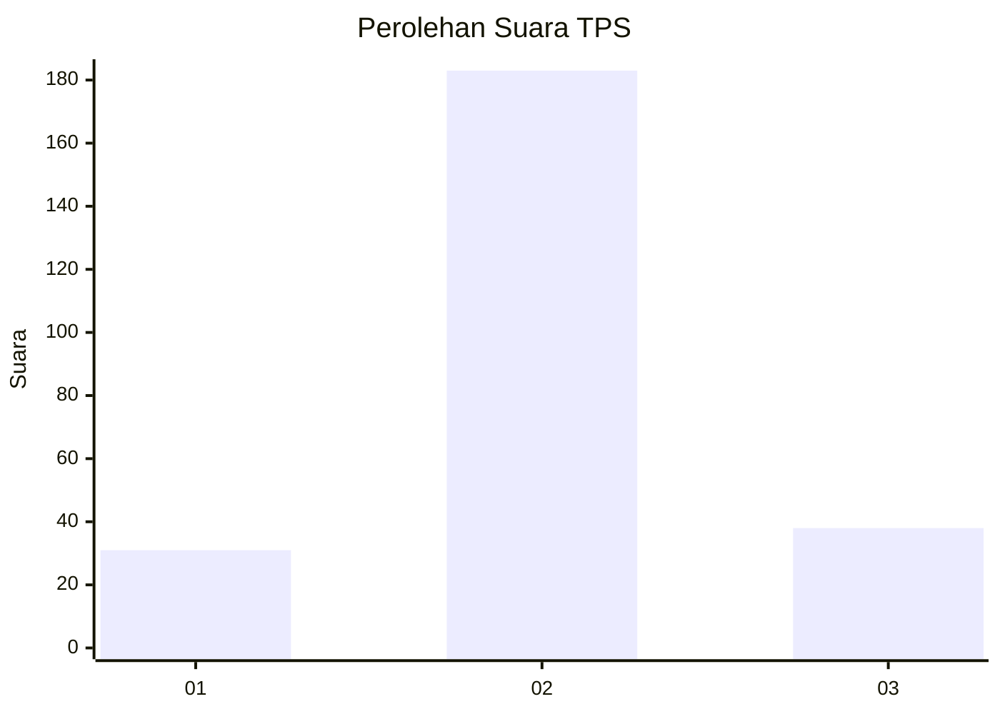
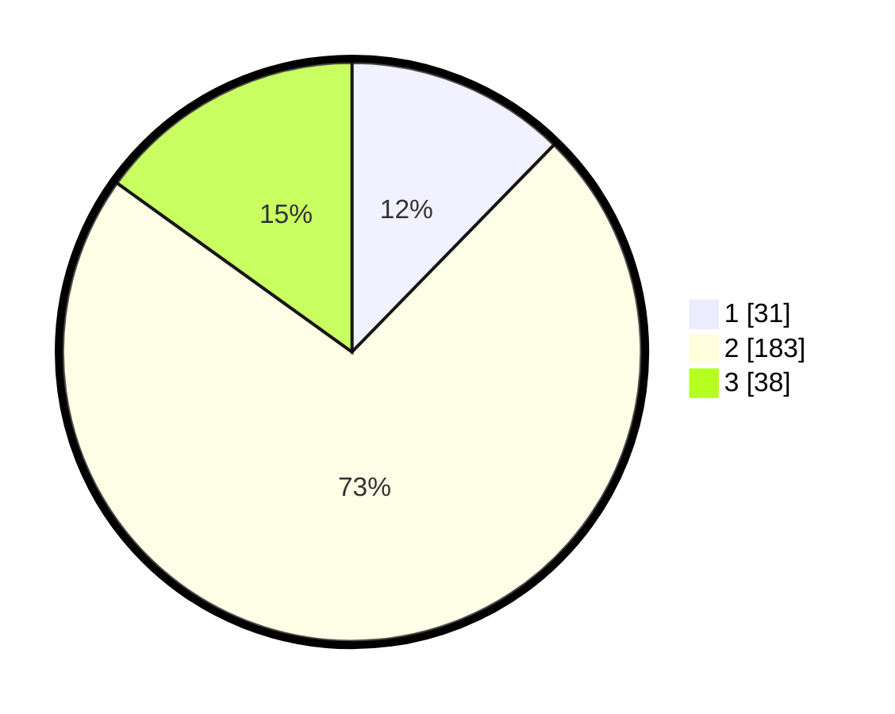

# Hasil

## Grafik

## Tabel

| No. | Nama Paslon    | Suara | Suara (raw) | Persentase |
|:--- |:-------------- | -----:| -----------:| ----------:|
| 1   | ANIES MUHAIMIN | 31    | [31][p-1]   | 12,30      |
| 2   | PRABOWO GIBRAN | 183   | [183][p-2]  | 72,62      |
| 3   | GANJAR MAHFUD  | 38    | [38][p-3]   | 15,08      |

[p-1]: https://github.com/gigit-pemilu/pemilu-2024-35-jawa-timur/blob/main/pilpres/hitung-suara/sub/35-jawa-timur/sub/09-jember/sub/27-kalisat/sub/2003-patempuran/sub/010-tps/sub/paslon-1.txt
[p-2]: https://github.com/gigit-pemilu/pemilu-2024-35-jawa-timur/blob/main/pilpres/hitung-suara/sub/35-jawa-timur/sub/09-jember/sub/27-kalisat/sub/2003-patempuran/sub/010-tps/sub/paslon-2.txt
[p-3]: https://github.com/gigit-pemilu/pemilu-2024-35-jawa-timur/blob/main/pilpres/hitung-suara/sub/35-jawa-timur/sub/09-jember/sub/27-kalisat/sub/2003-patempuran/sub/010-tps/sub/paslon-3.txt

## Foto C Plano

https://sirekap-obj-formc.kpu.go.id/8047/pemilu/ppwp/35/09/27/20/03/3509272003010-20240214-223147--81a67675-b4f7-404a-bc61-c1eb330cb273.jpg

https://sirekap-obj-formc.kpu.go.id/8047/pemilu/ppwp/35/09/27/20/03/3509272003010-20240214-223254--dd7e57e0-43b6-41e4-9544-5eeb167a9f75.jpg

https://sirekap-obj-formc.kpu.go.id/8047/pemilu/ppwp/35/09/27/20/03/3509272003010-20240214-223429--a8ede658-26ca-4a16-99a4-007dc53ccb2c.jpg

## Metadata

| Key        | Value               |
| ---------- | ------------------- |
| Time Stamp | 2024-02-15 12:00:28 |

