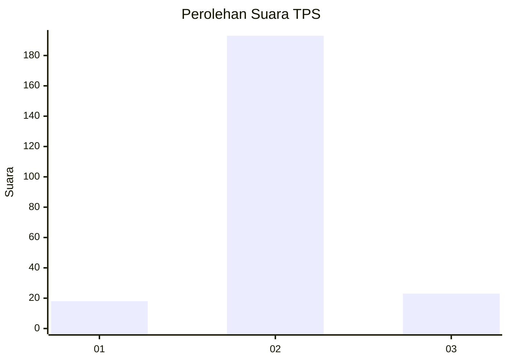
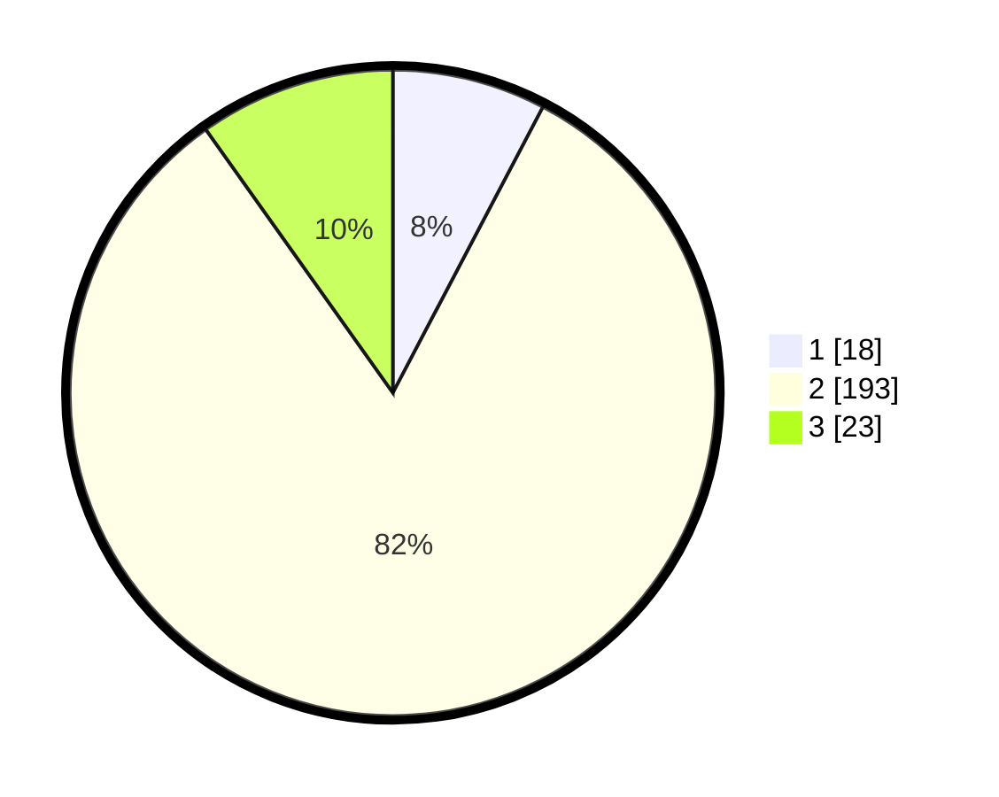

# Hasil

## Grafik

## Tabel

| No. | Nama Paslon    | Suara | Suara (raw) | Persentase |
|:--- |:-------------- | -----:| -----------:| ----------:|
| 1   | ANIES MUHAIMIN | 18    | [18][p-1]   | 7,69       |
| 2   | PRABOWO GIBRAN | 193   | [193][p-2]  | 82,48      |
| 3   | GANJAR MAHFUD  | 23    | [23][p-3]   | 9,83       |

[p-1]: https://github.com/gigit-pemilu/pemilu-2024-35-jawa-timur/blob/main/pilpres/hitung-suara/sub/35-jawa-timur/sub/09-jember/sub/27-kalisat/sub/2004-sumberkalong/sub/004-tps/sub/paslon-1.txt
[p-2]: https://github.com/gigit-pemilu/pemilu-2024-35-jawa-timur/blob/main/pilpres/hitung-suara/sub/35-jawa-timur/sub/09-jember/sub/27-kalisat/sub/2004-sumberkalong/sub/004-tps/sub/paslon-2.txt
[p-3]: https://github.com/gigit-pemilu/pemilu-2024-35-jawa-timur/blob/main/pilpres/hitung-suara/sub/35-jawa-timur/sub/09-jember/sub/27-kalisat/sub/2004-sumberkalong/sub/004-tps/sub/paslon-3.txt

## Foto C Plano

https://sirekap-obj-formc.kpu.go.id/ed68/pemilu/ppwp/35/09/27/20/04/3509272004004-20240219-143518--d6de758f-2f8e-4aa8-8b1c-e7d2853f56fb.jpg

https://sirekap-obj-formc.kpu.go.id/ed68/pemilu/ppwp/35/09/27/20/04/3509272004004-20240219-142742--65866aa9-4cf8-4711-b613-508797798e76.jpg

https://sirekap-obj-formc.kpu.go.id/ed68/pemilu/ppwp/35/09/27/20/04/3509272004004-20240219-142817--2852b760-f1b2-42f7-928b-0c2ce950a576.jpg

## Metadata

| Key        | Value               |
| ---------- | ------------------- |
| Time Stamp | 2024-02-25 13:00:00 |

