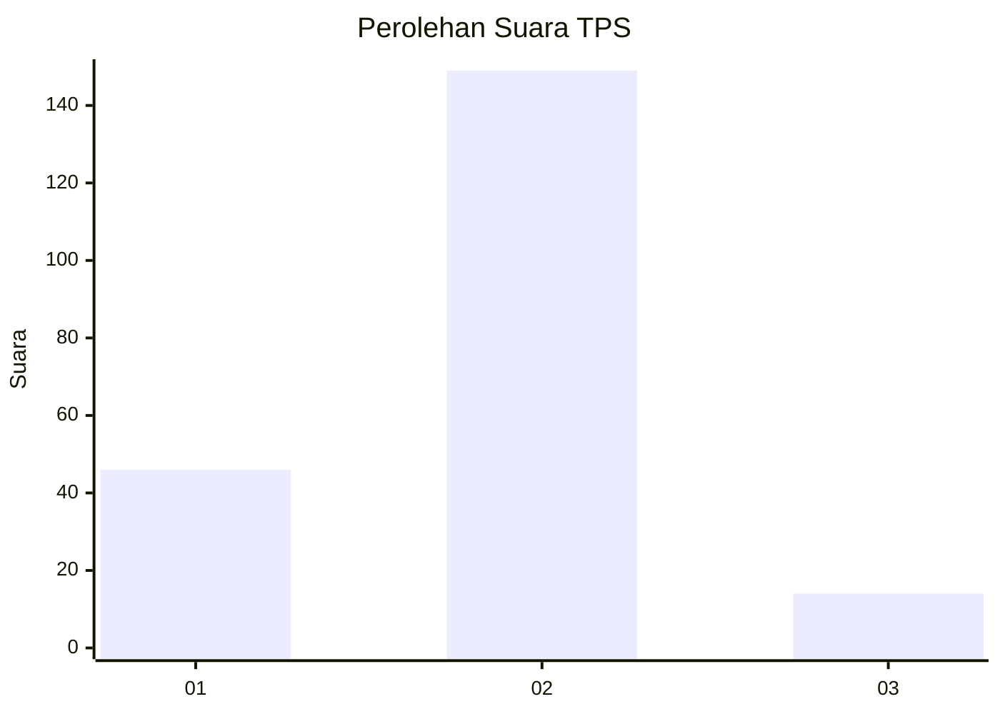

# Hasil

## Grafik

## Tabel

| No. | Nama Paslon    | Suara | Suara (raw) | Persentase |
|:--- |:-------------- | -----:| -----------:| ----------:|
| 1   | ANIES MUHAIMIN | 46    | [46][p-1]   | 22,01      |
| 2   | PRABOWO GIBRAN | 149   | [149][p-2]  | 71,29      |
| 3   | GANJAR MAHFUD  | 14    | [14][p-3]   | 6,70       |

[p-1]: https://github.com/gigit-pemilu/pemilu-2024-35-jawa-timur/blob/main/pilpres/hitung-suara/sub/35-jawa-timur/sub/09-jember/sub/27-kalisat/sub/2004-sumberkalong/sub/005-tps/sub/paslon-1.txt
[p-2]: https://github.com/gigit-pemilu/pemilu-2024-35-jawa-timur/blob/main/pilpres/hitung-suara/sub/35-jawa-timur/sub/09-jember/sub/27-kalisat/sub/2004-sumberkalong/sub/005-tps/sub/paslon-2.txt
[p-3]: https://github.com/gigit-pemilu/pemilu-2024-35-jawa-timur/blob/main/pilpres/hitung-suara/sub/35-jawa-timur/sub/09-jember/sub/27-kalisat/sub/2004-sumberkalong/sub/005-tps/sub/paslon-3.txt

## Foto C Plano

https://sirekap-obj-formc.kpu.go.id/1bdd/pemilu/ppwp/35/09/27/20/04/3509272004005-20240219-143739--a0373dcd-c390-4bee-a87f-2786558796e7.jpg

https://sirekap-obj-formc.kpu.go.id/1bdd/pemilu/ppwp/35/09/27/20/04/3509272004005-20240219-144358--b9815a3c-e435-4dd7-af6f-e49e42ab5ba0.jpg

https://sirekap-obj-formc.kpu.go.id/1bdd/pemilu/ppwp/35/09/27/20/04/3509272004005-20240219-144656--1f1fe357-23cd-4539-877f-b97869adf259.jpg

## Metadata

| Key        | Value               |
| ---------- | ------------------- |
| Time Stamp | 2024-02-24 22:31:28 |

