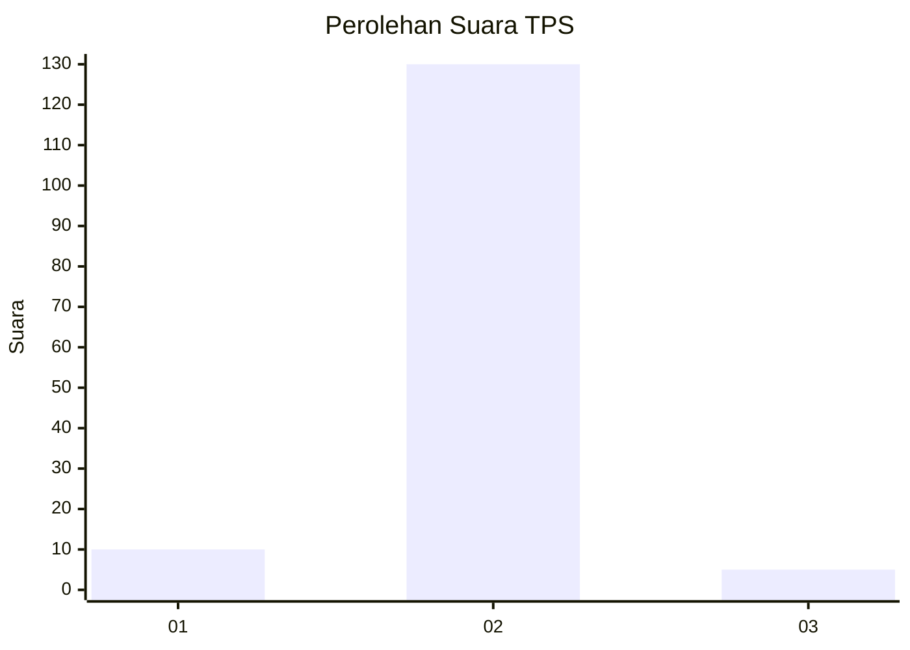
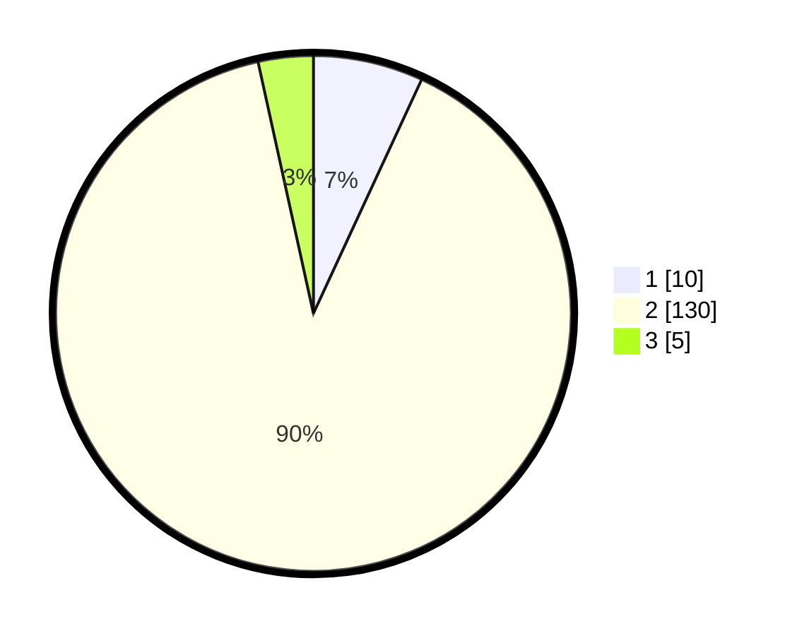

# Hasil

## Grafik

## Tabel

| No. | Nama Paslon    | Suara | Suara (raw) | Persentase |
|:--- |:-------------- | -----:| -----------:| ----------:|
| 1   | ANIES MUHAIMIN | 10    | [10][p-1]   | 6,90       |
| 2   | PRABOWO GIBRAN | 130   | [130][p-2]  | 89,66      |
| 3   | GANJAR MAHFUD  | 5     | [5][p-3]    | 3,45       |

[p-1]: https://github.com/gigit-pemilu/pemilu-2024/blob/main/pilpres/hitung-suara/sub/35-jawa-timur/sub/09-jember/sub/27-kalisat/sub/2004-sumberkalong/sub/007-tps/sub/paslon-1.txt
[p-2]: https://github.com/gigit-pemilu/pemilu-2024/blob/main/pilpres/hitung-suara/sub/35-jawa-timur/sub/09-jember/sub/27-kalisat/sub/2004-sumberkalong/sub/007-tps/sub/paslon-2.txt
[p-3]: https://github.com/gigit-pemilu/pemilu-2024/blob/main/pilpres/hitung-suara/sub/35-jawa-timur/sub/09-jember/sub/27-kalisat/sub/2004-sumberkalong/sub/007-tps/sub/paslon-3.txt

## Foto C Plano

https://sirekap-obj-formc.kpu.go.id/1d33/pemilu/ppwp/35/09/27/20/04/3509272004007-20240219-151431--64524b61-09e3-4c22-99ae-1b38729e899a.jpg

https://sirekap-obj-formc.kpu.go.id/1d33/pemilu/ppwp/35/09/27/20/04/3509272004007-20240219-151704--545bfa4d-c9f4-43d7-96d5-97be2bc55eed.jpg

https://sirekap-obj-formc.kpu.go.id/1d33/pemilu/ppwp/35/09/27/20/04/3509272004007-20240219-151552--ffb98812-afe3-4da2-ae8e-e03c5b8bc223.jpg

## Metadata

| Key        | Value               |
| ---------- | ------------------- |
| Time Stamp | 2024-02-24 22:31:28 |

