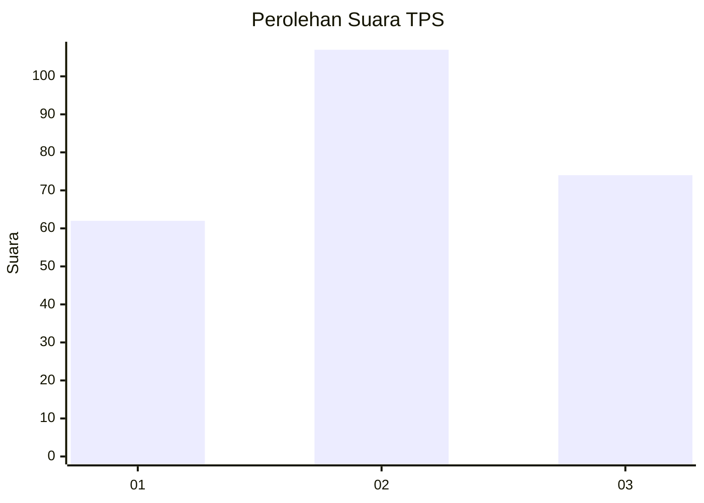
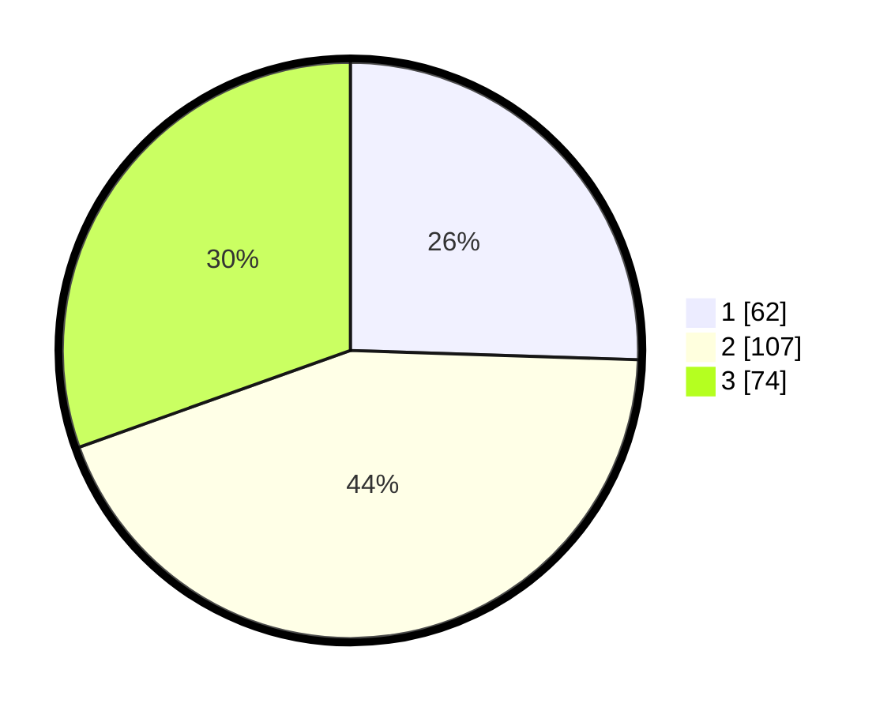

# Hasil

## Grafik

## Tabel

| No. | Nama Paslon    | Suara | Suara (raw) | Persentase |
|:--- |:-------------- | -----:| -----------:| ----------:|
| 1   | ANIES MUHAIMIN | 62    | [62][p-1]   | 25,51      |
| 2   | PRABOWO GIBRAN | 107   | [107][p-2]  | 44,03      |
| 3   | GANJAR MAHFUD  | 74    | [74][p-3]   | 30,45      |

[p-1]: https://github.com/gigit-pemilu/pemilu-2024-35-jawa-timur/blob/main/pilpres/hitung-suara/sub/35-jawa-timur/sub/09-jember/sub/27-kalisat/sub/2004-sumberkalong/sub/008-tps/sub/paslon-1.txt
[p-2]: https://github.com/gigit-pemilu/pemilu-2024-35-jawa-timur/blob/main/pilpres/hitung-suara/sub/35-jawa-timur/sub/09-jember/sub/27-kalisat/sub/2004-sumberkalong/sub/008-tps/sub/paslon-2.txt
[p-3]: https://github.com/gigit-pemilu/pemilu-2024-35-jawa-timur/blob/main/pilpres/hitung-suara/sub/35-jawa-timur/sub/09-jember/sub/27-kalisat/sub/2004-sumberkalong/sub/008-tps/sub/paslon-3.txt

## Foto C Plano

https://sirekap-obj-formc.kpu.go.id/ffd4/pemilu/ppwp/35/09/27/20/04/3509272004008-20240219-151848--7a4cea47-76aa-4e3b-a4d9-9875e65f43bb.jpg

https://sirekap-obj-formc.kpu.go.id/ffd4/pemilu/ppwp/35/09/27/20/04/3509272004008-20240219-151933--d9344ae9-d38f-4319-8a17-6fe3c6d31d4e.jpg

https://sirekap-obj-formc.kpu.go.id/ffd4/pemilu/ppwp/35/09/27/20/04/3509272004008-20240219-152016--3f93c7f4-7fa1-43a2-b36c-d229e89ff65b.jpg

## Metadata

| Key        | Value               |
| ---------- | ------------------- |
| Time Stamp | 2024-02-25 12:00:00 |

