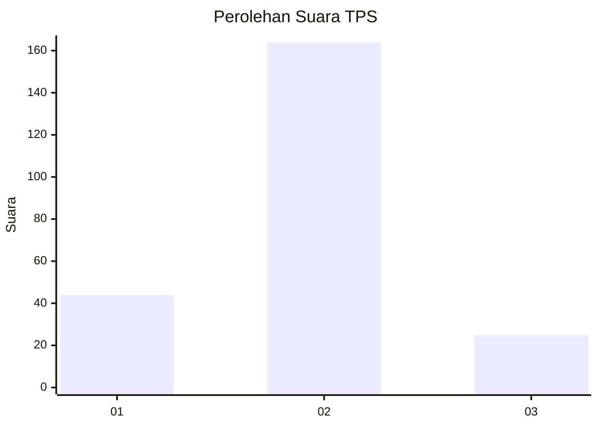
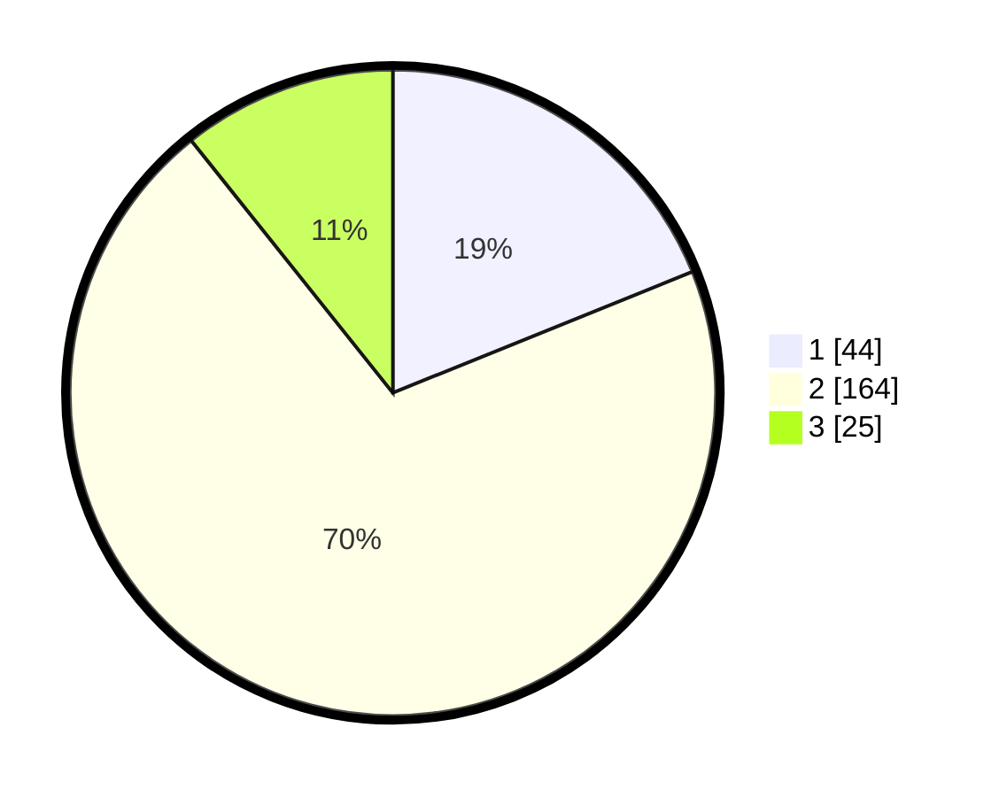

# Hasil

## Grafik

## Tabel

| No. | Nama Paslon    | Suara | Suara (raw) | Persentase |
|:--- |:-------------- | -----:| -----------:| ----------:|
| 1   | ANIES MUHAIMIN | 44    | [44][p-1]   | 18,88      |
| 2   | PRABOWO GIBRAN | 164   | [164][p-2]  | 70,39      |
| 3   | GANJAR MAHFUD  | 25    | [25][p-3]   | 10,73      |

[p-1]: https://github.com/gigit-pemilu/pemilu-2024/blob/main/pilpres/hitung-suara/sub/35-jawa-timur/sub/09-jember/sub/27-kalisat/sub/2004-sumberkalong/sub/010-tps/sub/paslon-1.txt
[p-2]: https://github.com/gigit-pemilu/pemilu-2024/blob/main/pilpres/hitung-suara/sub/35-jawa-timur/sub/09-jember/sub/27-kalisat/sub/2004-sumberkalong/sub/010-tps/sub/paslon-2.txt
[p-3]: https://github.com/gigit-pemilu/pemilu-2024/blob/main/pilpres/hitung-suara/sub/35-jawa-timur/sub/09-jember/sub/27-kalisat/sub/2004-sumberkalong/sub/010-tps/sub/paslon-3.txt

## Foto C Plano

https://sirekap-obj-formc.kpu.go.id/2eb7/pemilu/ppwp/35/09/27/20/04/3509272004010-20240219-153100--51c32ee0-6a30-4b2e-9e93-368b4a0dc968.jpg

https://sirekap-obj-formc.kpu.go.id/2eb7/pemilu/ppwp/35/09/27/20/04/3509272004010-20240219-153153--edbfa473-8091-450f-a160-cc521cd65e2f.jpg

https://sirekap-obj-formc.kpu.go.id/2eb7/pemilu/ppwp/35/09/27/20/04/3509272004010-20240219-153318--ae6ac57b-7978-4600-8c7d-a77b3802f423.jpg

## Metadata

| Key        | Value               |
| ---------- | ------------------- |
| Time Stamp | 2024-02-24 22:31:28 |

