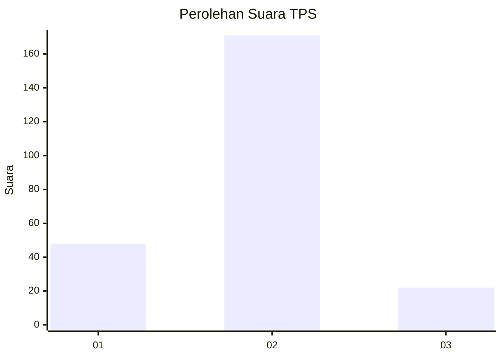

# Hasil

## Grafik

## Tabel

| No. | Nama Paslon    | Suara | Suara (raw) | Persentase |
|:--- |:-------------- | -----:| -----------:| ----------:|
| 1   | ANIES MUHAIMIN | 48    | [48][p-1]   | 19,92      |
| 2   | PRABOWO GIBRAN | 171   | [171][p-2]  | 70,95      |
| 3   | GANJAR MAHFUD  | 22    | [22][p-3]   | 9,13       |

[p-1]: https://github.com/gigit-pemilu/pemilu-2024/blob/main/pilpres/hitung-suara/sub/35-jawa-timur/sub/09-jember/sub/27-kalisat/sub/2004-sumberkalong/sub/011-tps/sub/paslon-1.txt
[p-2]: https://github.com/gigit-pemilu/pemilu-2024/blob/main/pilpres/hitung-suara/sub/35-jawa-timur/sub/09-jember/sub/27-kalisat/sub/2004-sumberkalong/sub/011-tps/sub/paslon-2.txt
[p-3]: https://github.com/gigit-pemilu/pemilu-2024/blob/main/pilpres/hitung-suara/sub/35-jawa-timur/sub/09-jember/sub/27-kalisat/sub/2004-sumberkalong/sub/011-tps/sub/paslon-3.txt

## Foto C Plano

https://sirekap-obj-formc.kpu.go.id/8dba/pemilu/ppwp/35/09/27/20/04/3509272004011-20240219-153526--95df1b4c-05b2-480b-8ce0-9afb03ec5e88.jpg

https://sirekap-obj-formc.kpu.go.id/8dba/pemilu/ppwp/35/09/27/20/04/3509272004011-20240219-153733--e2175fec-c04c-43fa-84b1-3cbf862a0b77.jpg

https://sirekap-obj-formc.kpu.go.id/8dba/pemilu/ppwp/35/09/27/20/04/3509272004011-20240219-153815--eb219324-1a5d-4b9a-8d11-967d8f7db7e5.jpg

## Metadata

| Key        | Value               |
| ---------- | ------------------- |
| Time Stamp | 2024-02-25 11:00:00 |

