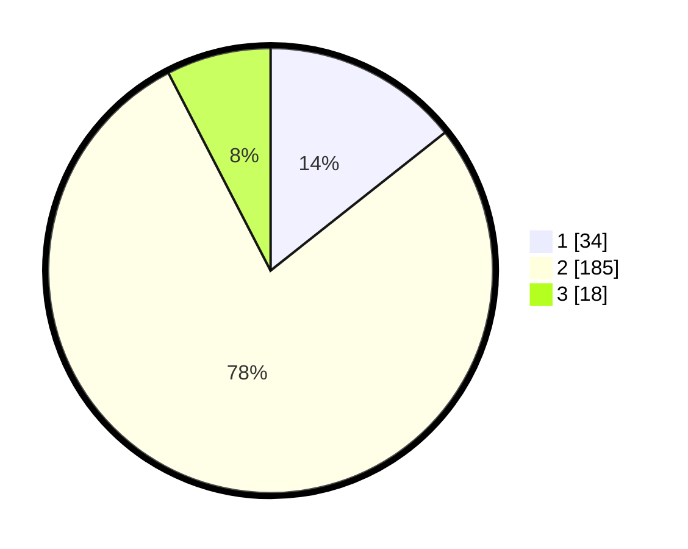

# Hasil

## Grafik

## Tabel

| No. | Nama Paslon    | Suara | Suara (raw) | Persentase |
|:--- |:-------------- | -----:| -----------:| ----------:|
| 1   | ANIES MUHAIMIN | 34    | [34][p-1]   | 14,35      |
| 2   | PRABOWO GIBRAN | 185   | [185][p-2]  | 78,06      |
| 3   | GANJAR MAHFUD  | 18    | [18][p-3]   | 7,59       |

[p-1]: https://github.com/gigit-pemilu/pemilu-2024/blob/main/pilpres/hitung-suara/sub/35-jawa-timur/sub/09-jember/sub/27-kalisat/sub/2005-sumberjeruk/sub/005-tps/sub/paslon-1.txt
[p-2]: https://github.com/gigit-pemilu/pemilu-2024/blob/main/pilpres/hitung-suara/sub/35-jawa-timur/sub/09-jember/sub/27-kalisat/sub/2005-sumberjeruk/sub/005-tps/sub/paslon-2.txt
[p-3]: https://github.com/gigit-pemilu/pemilu-2024/blob/main/pilpres/hitung-suara/sub/35-jawa-timur/sub/09-jember/sub/27-kalisat/sub/2005-sumberjeruk/sub/005-tps/sub/paslon-3.txt

## Foto C Plano

https://sirekap-obj-formc.kpu.go.id/0db5/pemilu/ppwp/35/09/27/20/05/3509272005005-20240214-202433--83848e3c-2ce8-45d0-ae75-cc53d4f5632a.jpg

https://sirekap-obj-formc.kpu.go.id/0db5/pemilu/ppwp/35/09/27/20/05/3509272005005-20240214-200839--55a36b8f-8bf0-4a93-89ff-3cefda18bd21.jpg

https://sirekap-obj-formc.kpu.go.id/0db5/pemilu/ppwp/35/09/27/20/05/3509272005005-20240214-201155--ee6c101c-6beb-4558-84a7-309c60eb3827.jpg

## Metadata

| Key        | Value               |
| ---------- | ------------------- |
| Time Stamp | 2024-02-15 20:30:46 |

