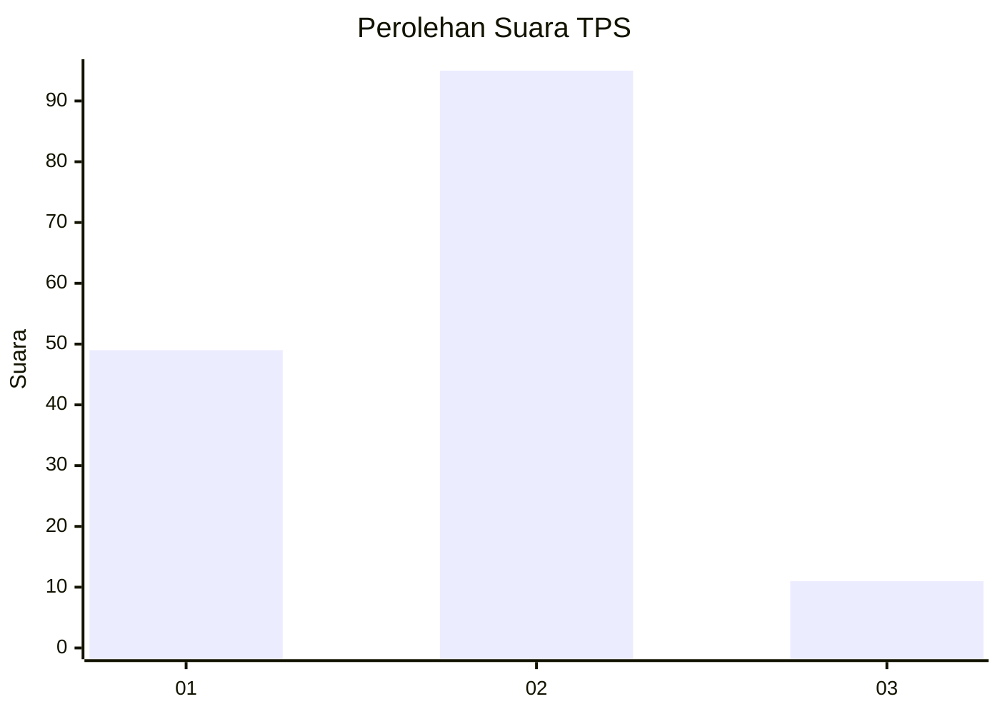
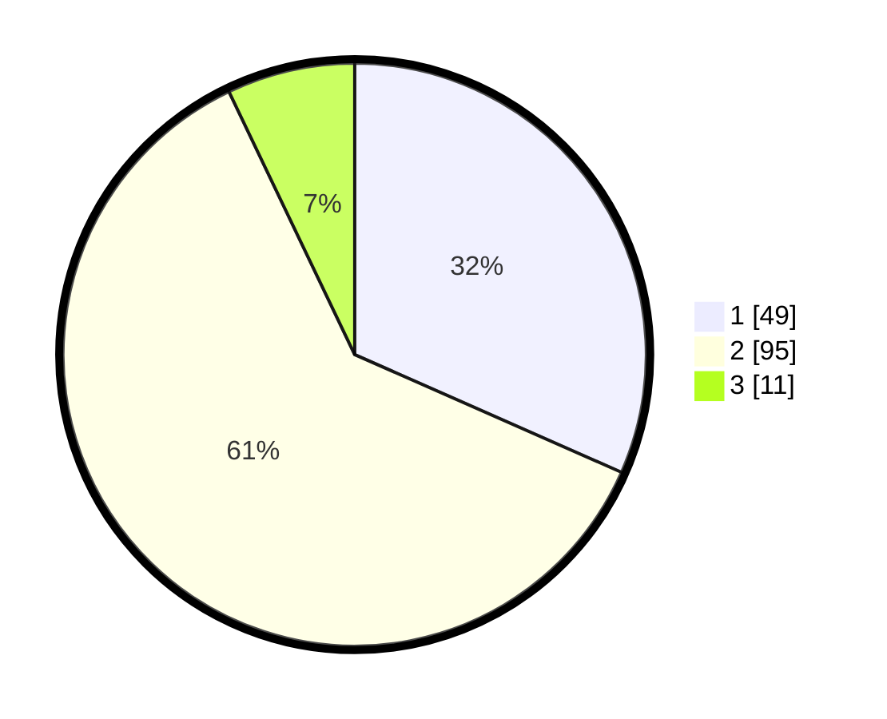

# Hasil

## Grafik

## Tabel

| No. | Nama Paslon    | Suara | Suara (raw) | Persentase |
|:--- |:-------------- | -----:| -----------:| ----------:|
| 1   | ANIES MUHAIMIN | 49    | [49][p-1]   | 31,61      |
| 2   | PRABOWO GIBRAN | 95    | [95][p-2]   | 61,29      |
| 3   | GANJAR MAHFUD  | 11    | [11][p-3]   | 7,10       |

[p-1]: https://github.com/gigit-pemilu/pemilu-2024-35-jawa-timur/blob/main/pilpres/hitung-suara/sub/35-jawa-timur/sub/09-jember/sub/27-kalisat/sub/2005-sumberjeruk/sub/008-tps/sub/paslon-1.txt
[p-2]: https://github.com/gigit-pemilu/pemilu-2024-35-jawa-timur/blob/main/pilpres/hitung-suara/sub/35-jawa-timur/sub/09-jember/sub/27-kalisat/sub/2005-sumberjeruk/sub/008-tps/sub/paslon-2.txt
[p-3]: https://github.com/gigit-pemilu/pemilu-2024-35-jawa-timur/blob/main/pilpres/hitung-suara/sub/35-jawa-timur/sub/09-jember/sub/27-kalisat/sub/2005-sumberjeruk/sub/008-tps/sub/paslon-3.txt

## Foto C Plano

https://sirekap-obj-formc.kpu.go.id/90b3/pemilu/ppwp/35/09/27/20/05/3509272005008-20240220-112811--6280248f-75b0-44a3-acfa-3c314ddcbb93.jpg

https://sirekap-obj-formc.kpu.go.id/90b3/pemilu/ppwp/35/09/27/20/05/3509272005008-20240220-132035--00d4eaa1-5f90-44db-ba3d-f1fef0f442a5.jpg

https://sirekap-obj-formc.kpu.go.id/90b3/pemilu/ppwp/35/09/27/20/05/3509272005008-20240220-113213--1cc0e9e2-78d5-455b-8327-1c5ea8ac5363.jpg

## Metadata

| Key        | Value               |
| ---------- | ------------------- |
| Time Stamp | 2024-02-25 12:00:00 |

