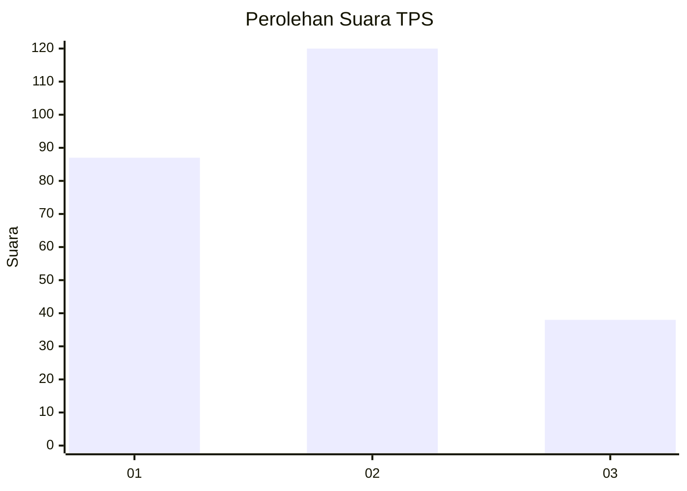
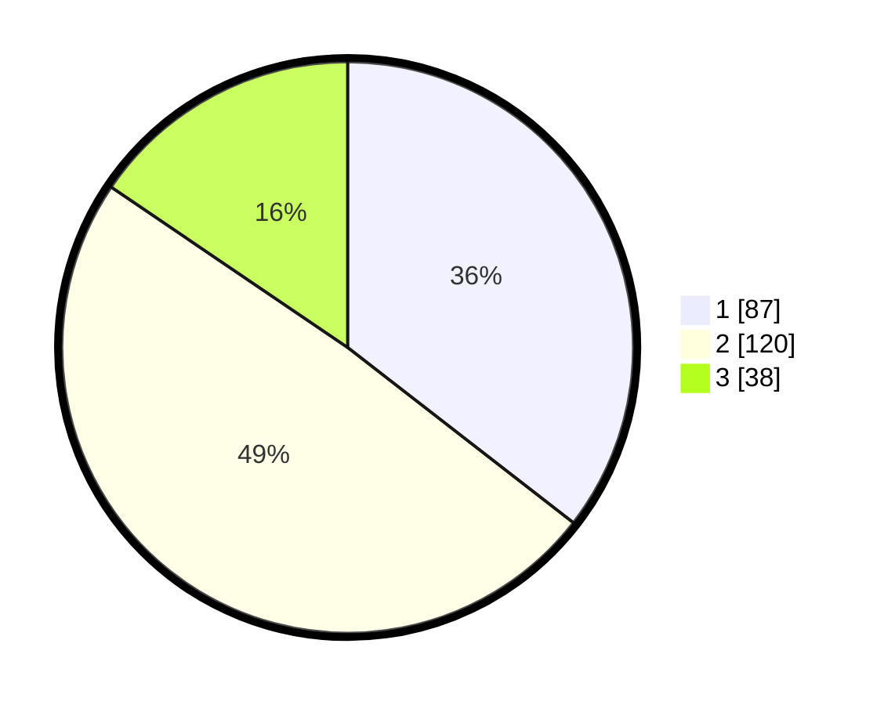

# Hasil

## Grafik

## Tabel

| No. | Nama Paslon    | Suara | Suara (raw) | Persentase |
|:--- |:-------------- | -----:| -----------:| ----------:|
| 1   | ANIES MUHAIMIN | 87    | [87][p-1]   | 35,51      |
| 2   | PRABOWO GIBRAN | 120   | [120][p-2]  | 48,98      |
| 3   | GANJAR MAHFUD  | 38    | [38][p-3]   | 15,51      |

[p-1]: https://github.com/gigit-pemilu/pemilu-2024/blob/main/pilpres/hitung-suara/sub/35-jawa-timur/sub/09-jember/sub/27-kalisat/sub/2005-sumberjeruk/sub/014-tps/sub/paslon-1.txt
[p-2]: https://github.com/gigit-pemilu/pemilu-2024/blob/main/pilpres/hitung-suara/sub/35-jawa-timur/sub/09-jember/sub/27-kalisat/sub/2005-sumberjeruk/sub/014-tps/sub/paslon-2.txt
[p-3]: https://github.com/gigit-pemilu/pemilu-2024/blob/main/pilpres/hitung-suara/sub/35-jawa-timur/sub/09-jember/sub/27-kalisat/sub/2005-sumberjeruk/sub/014-tps/sub/paslon-3.txt

## Foto C Plano

https://sirekap-obj-formc.kpu.go.id/171a/pemilu/ppwp/35/09/27/20/05/3509272005014-20240220-163733--5a9b2d62-5f4c-4e5a-bd35-355f5f2db439.jpg

https://sirekap-obj-formc.kpu.go.id/171a/pemilu/ppwp/35/09/27/20/05/3509272005014-20240220-144312--5b5ea04c-94f1-4c8c-b7cb-1f14a758ac52.jpg

https://sirekap-obj-formc.kpu.go.id/171a/pemilu/ppwp/35/09/27/20/05/3509272005014-20240220-145312--66f58f17-ae26-4e03-9e22-e766a4249c76.jpg

## Metadata

| Key        | Value               |
| ---------- | ------------------- |
| Time Stamp | 2024-02-24 22:31:28 |

