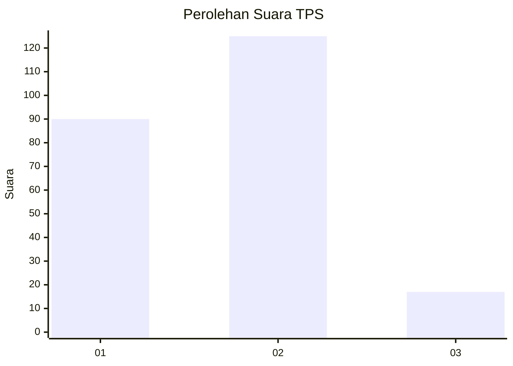

# Hasil

## Grafik

## Tabel

| No. | Nama Paslon    | Suara | Suara (raw) | Persentase |
|:--- |:-------------- | -----:| -----------:| ----------:|
| 1   | ANIES MUHAIMIN | 90    | [90][p-1]   | 38,79      |
| 2   | PRABOWO GIBRAN | 125   | [125][p-2]  | 53,88      |
| 3   | GANJAR MAHFUD  | 17    | [17][p-3]   | 7,33       |

[p-1]: https://github.com/gigit-pemilu/pemilu-2024-35-jawa-timur/blob/main/pilpres/hitung-suara/sub/35-jawa-timur/sub/09-jember/sub/27-kalisat/sub/2006-glagahwero/sub/004-tps/sub/paslon-1.txt
[p-2]: https://github.com/gigit-pemilu/pemilu-2024-35-jawa-timur/blob/main/pilpres/hitung-suara/sub/35-jawa-timur/sub/09-jember/sub/27-kalisat/sub/2006-glagahwero/sub/004-tps/sub/paslon-2.txt
[p-3]: https://github.com/gigit-pemilu/pemilu-2024-35-jawa-timur/blob/main/pilpres/hitung-suara/sub/35-jawa-timur/sub/09-jember/sub/27-kalisat/sub/2006-glagahwero/sub/004-tps/sub/paslon-3.txt

## Foto C Plano

https://sirekap-obj-formc.kpu.go.id/c1b8/pemilu/ppwp/35/09/27/20/06/3509272006004-20240220-170508--99d5f2a0-b56b-4d36-bd2b-b7d20931564a.jpg

https://sirekap-obj-formc.kpu.go.id/c1b8/pemilu/ppwp/35/09/27/20/06/3509272006004-20240215-015946--3970877a-26ee-4b7b-a6ed-274f7e6d32e3.jpg

https://sirekap-obj-formc.kpu.go.id/c1b8/pemilu/ppwp/35/09/27/20/06/3509272006004-20240215-020209--f6e47f01-3c36-4447-9f68-72488b6fcc46.jpg

## Metadata

| Key        | Value               |
| ---------- | ------------------- |
| Time Stamp | 2024-02-20 18:00:00 |

