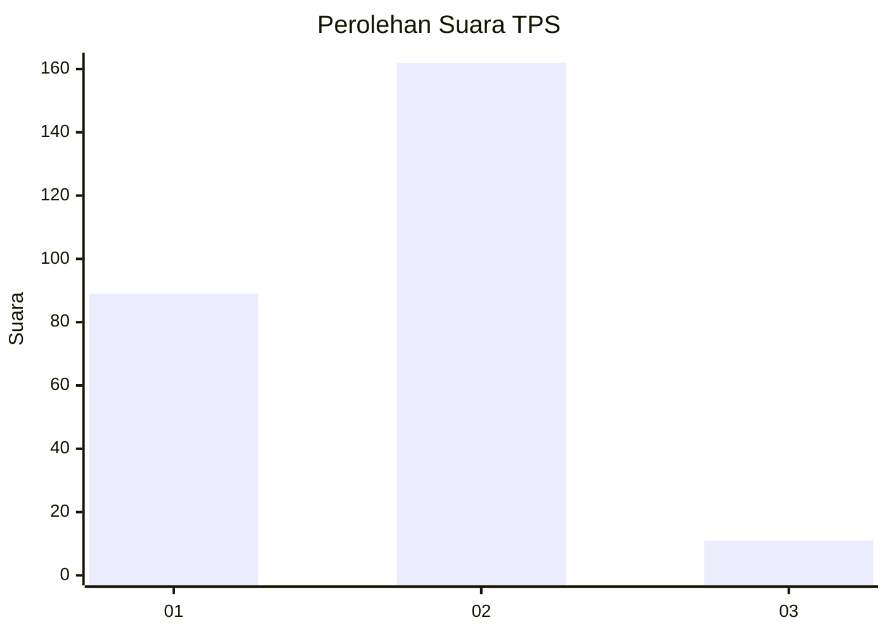
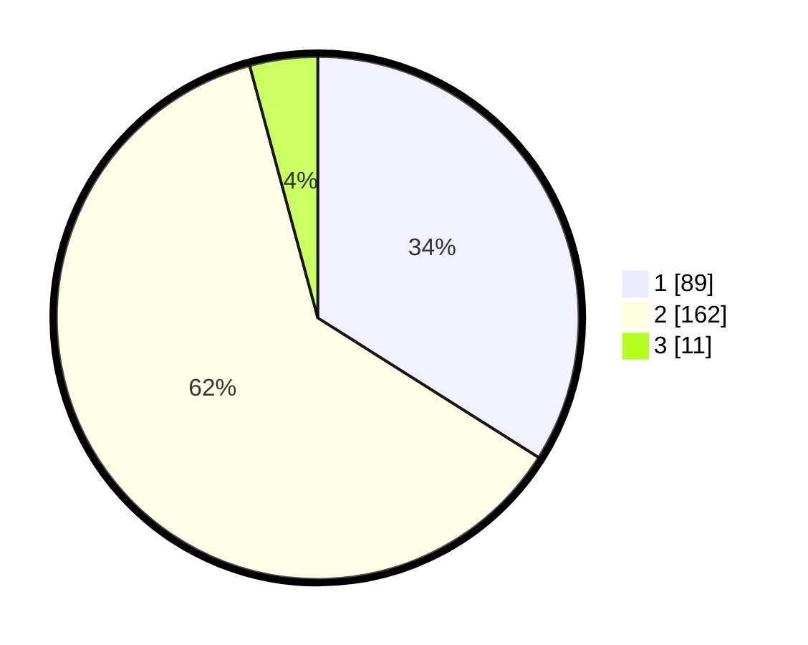

# Hasil

## Grafik

## Tabel

| No. | Nama Paslon    | Suara | Suara (raw) | Persentase |
|:--- |:-------------- | -----:| -----------:| ----------:|
| 1   | ANIES MUHAIMIN | 89    | [89][p-1]   | 33,97      |
| 2   | PRABOWO GIBRAN | 162   | [162][p-2]  | 61,83      |
| 3   | GANJAR MAHFUD  | 11    | [11][p-3]   | 4,20       |

[p-1]: https://github.com/gigit-pemilu/pemilu-2024-35-jawa-timur/blob/main/pilpres/hitung-suara/sub/35-jawa-timur/sub/09-jember/sub/27-kalisat/sub/2006-glagahwero/sub/009-tps/sub/paslon-1.txt
[p-2]: https://github.com/gigit-pemilu/pemilu-2024-35-jawa-timur/blob/main/pilpres/hitung-suara/sub/35-jawa-timur/sub/09-jember/sub/27-kalisat/sub/2006-glagahwero/sub/009-tps/sub/paslon-2.txt
[p-3]: https://github.com/gigit-pemilu/pemilu-2024-35-jawa-timur/blob/main/pilpres/hitung-suara/sub/35-jawa-timur/sub/09-jember/sub/27-kalisat/sub/2006-glagahwero/sub/009-tps/sub/paslon-3.txt

## Foto C Plano

https://sirekap-obj-formc.kpu.go.id/f5b8/pemilu/ppwp/35/09/27/20/06/3509272006009-20240220-170213--aca01595-2cf0-4d62-a8e8-96c088fe6f8c.jpg

https://sirekap-obj-formc.kpu.go.id/f5b8/pemilu/ppwp/35/09/27/20/06/3509272006009-20240220-170507--5b8ba7a2-085d-4130-980c-801705ad6104.jpg

https://sirekap-obj-formc.kpu.go.id/f5b8/pemilu/ppwp/35/09/27/20/06/3509272006009-20240214-224319--c7a2a581-54a1-4e36-9789-5d46408e1116.jpg

## Metadata

| Key        | Value               |
| ---------- | ------------------- |
| Time Stamp | 2024-02-25 16:00:00 |

